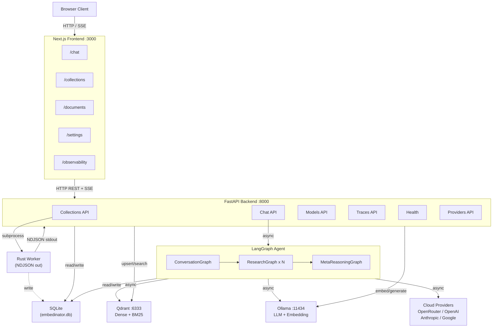

# Spec 01: Vision & System Architecture -- Feature Specification Context

## Feature Description

The Embedinator is a self-hosted agentic RAG system that lets users embed, index, and intelligently query their own documents entirely on their own hardware with zero cloud dependencies. It combines a three-layer LangGraph agent (ConversationGraph, ResearchGraph, MetaReasoningGraph) with a Rust ingestion worker, Python backend, Qdrant vector storage, SQLite metadata store, and a Next.js frontend. A single `docker compose up` brings the full system online.

This spec covers the system's purpose, high-level architecture, core components, service inventory, and inter-service communication patterns. It defines the foundational structure on which all other specs are built.

## Requirements

### Functional Requirements

1. **Self-Hosted Deployment**: The entire system must run on user-owned hardware with no mandatory cloud dependencies. Ollama is the default LLM/embedding provider.
2. **Docker Compose Launch**: A single `docker compose up` must bring all services online (FastAPI backend, Qdrant, Ollama, Next.js frontend).
3. **Six Services**: The system consists of six discrete services that communicate through well-defined protocols:
   - Next.js Frontend (port 3000) -- stateless UI rendering, SSE consumption
   - FastAPI Backend (port 8000) -- API gateway, agent orchestration, ingestion; persists to SQLite (WAL mode)
   - Qdrant (port 6333 HTTP, 6334 gRPC) -- vector storage, hybrid search; persists to `data/qdrant_db/`
   - Ollama (port 11434) -- LLM inference, embedding generation; persists to `ollama_models` volume
   - Rust Worker (subprocess, no port) -- document parsing, NDJSON streaming; stateless
   - SQLite (embedded, no port) -- metadata, parent chunks, traces, settings; persists to `data/embedinator.db`
4. **Three-Layer Agent**: The LangGraph agent must be structured as three nested state machines: ConversationGraph (session lifecycle), ResearchGraph (per-sub-question tool loop), MetaReasoningGraph (retrieval failure recovery).
5. **Hybrid Retrieval Pipeline**: Dense vector + BM25 search, cross-encoder reranking, parent/child chunking with structural breadcrumbs, query-adaptive retrieval depth.
6. **Multi-Provider LLM Support**: Ollama as default; OpenRouter, OpenAI, Anthropic, Google AI as optional cloud providers. Provider Hub UI for key management.
7. **SSE Streaming**: Chat responses streamed token-by-token via Server-Sent Events for sub-500ms first-token latency.

### Non-Functional Requirements

1. **Latency**: First token visible in browser within 200-500ms of query submission.
2. **Ingestion Performance**: Rust worker provides 5-20x throughput improvement over Python for PDF parsing.
3. **Observability**: Every query produces a `query_traces` record capturing collections searched, chunks retrieved with scores, meta-reasoning triggers, and end-to-end latency.
4. **Data Safety**: All data stays local by default. API keys for cloud providers encrypted with Fernet before SQLite storage.

## Key Technical Details

### Service Inventory

| Service | Port | Role | Persistence |
|---------|------|------|-------------|
| Next.js Frontend | 3000 | UI rendering, SSE consumption | None (stateless) |
| FastAPI Backend | 8000 | API gateway, agent orchestration, ingestion | SQLite (WAL mode) |
| Qdrant | 6333 (HTTP), 6334 (gRPC) | Vector storage, hybrid search | `data/qdrant_db/` |
| Ollama | 11434 | LLM inference, embedding generation | `ollama_models` volume |
| Rust Worker | N/A (subprocess) | Document parsing, NDJSON streaming | None (stateless) |
| SQLite | N/A (embedded) | Metadata, parent chunks, traces, settings | `data/embedinator.db` |

### Inter-Service Communication

| From | To | Protocol | Data Format | Direction |
|------|----|----------|-------------|-----------|
| Browser | Next.js | HTTP, SSE | JSON, event-stream | Bidirectional |
| Next.js | FastAPI | HTTP REST, SSE | JSON | Bidirectional |
| FastAPI | Qdrant | HTTP | JSON (REST API) | Bidirectional |
| FastAPI | Ollama | HTTP | JSON (REST API) | Bidirectional |
| FastAPI | Cloud Providers | HTTPS | JSON (provider SDKs) | Bidirectional |
| FastAPI | Rust Worker | stdin/stdout | NDJSON (line-delimited) | Unidirectional (worker to Python) |
| FastAPI | SQLite | Function calls | SQL via `aiosqlite` | Bidirectional |

### Three-Layer Agent Summary

| Layer | Scope | Trigger | Max Duration |
|-------|-------|---------|-------------|
| ConversationGraph | Full session lifecycle | Every chat message | No limit (session-scoped) |
| ResearchGraph | Single sub-question | `Send()` from fan_out | `MAX_ITERATIONS` tool loops |
| MetaReasoningGraph | Retrieval failure recovery | Confidence below threshold | 2 meta-attempts max |

## Dependencies

### Core Python Packages
- `fastapi >= 0.135` -- API framework
- `uvicorn >= 0.34` -- ASGI server
- `langgraph >= 1.0.10` -- Agent graph orchestration
- `langchain >= 1.2.10` -- LLM abstraction, tool binding
- `qdrant-client >= 1.17.0` -- Qdrant vector database client
- `pydantic >= 2.12` -- Settings, structured output schemas
- `pydantic-settings >= 2.8` -- Environment variable configuration
- `aiosqlite >= 0.21` -- Async SQLite access
- `httpx >= 0.28` -- Async HTTP client
- `structlog >= 24.0` -- Structured JSON logging

### Infrastructure
- `qdrant/qdrant` (Docker) -- latest
- `ollama/ollama` (Docker) -- latest
- SQLite 3.45+

### Frontend
- `next` 16 -- React framework, App Router, Turbopack
- `react` 19
- `typescript` 5.7
- `tailwindcss` 4

## Acceptance Criteria

1. Architecture diagram accurately represents all six services and their communication paths.
2. Every service in the inventory has a defined port (or "N/A"), role, and persistence mechanism.
3. The three-layer agent hierarchy is clearly specified with scope, trigger, and max duration for each layer.
4. Inter-service communication table covers all data flows with protocol and data format.
5. Docker Compose configuration brings all services online with a single command.
6. System defaults to Ollama for all inference with no mandatory cloud dependency.

## Architecture Reference

### System Architecture Mermaid Diagram



### Configuration Schema (backend/config.py)

```python
from pydantic_settings import BaseSettings, SettingsConfigDict

class Settings(BaseSettings):
    # Server
    host: str = "0.0.0.0"
    port: int = 8000
    log_level: str = "INFO"
    debug: bool = False

    # Qdrant
    qdrant_host: str = "localhost"
    qdrant_port: int = 6333

    # Providers
    ollama_base_url: str = "http://localhost:11434"
    default_provider: str = "ollama"
    default_llm_model: str = "llama3.2"
    default_embed_model: str = "nomic-embed-text"
    api_key_encryption_secret: str = ""

    # SQLite
    sqlite_path: str = "data/embedinator.db"

    # Ingestion
    rust_worker_path: str = "ingestion-worker/target/release/embedinator-worker"
    upload_dir: str = "data/uploads"
    max_upload_size_mb: int = 100
    parent_chunk_size: int = 3000
    child_chunk_size: int = 500
    embed_batch_size: int = 16
    embed_max_workers: int = 4
    qdrant_upsert_batch_size: int = 50

    # Agent
    max_iterations: int = 10
    max_tool_calls: int = 8
    confidence_threshold: float = 0.6
    meta_reasoning_max_attempts: int = 2

    # Retrieval
    hybrid_dense_weight: float = 0.7
    hybrid_sparse_weight: float = 0.3
    top_k_retrieval: int = 20
    top_k_rerank: int = 5
    reranker_model: str = "cross-encoder/ms-marco-MiniLM-L-6-v2"

    # Accuracy & Robustness
    groundedness_check_enabled: bool = True
    citation_alignment_threshold: float = 0.3
    circuit_breaker_failure_threshold: int = 5
    circuit_breaker_cooldown_secs: int = 30
    retry_max_attempts: int = 3
    retry_backoff_initial_secs: float = 1.0

    # Rate Limiting
    rate_limit_chat_per_minute: int = 30
    rate_limit_ingest_per_minute: int = 10
    rate_limit_default_per_minute: int = 120

    # CORS
    cors_origins: str = "http://localhost:3000,http://127.0.0.1:3000"

    model_config = SettingsConfigDict(env_file=".env")
```
