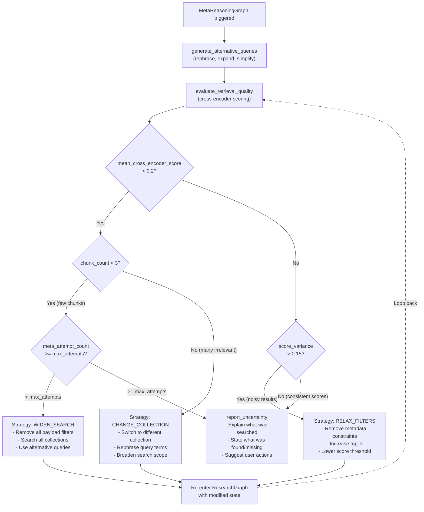
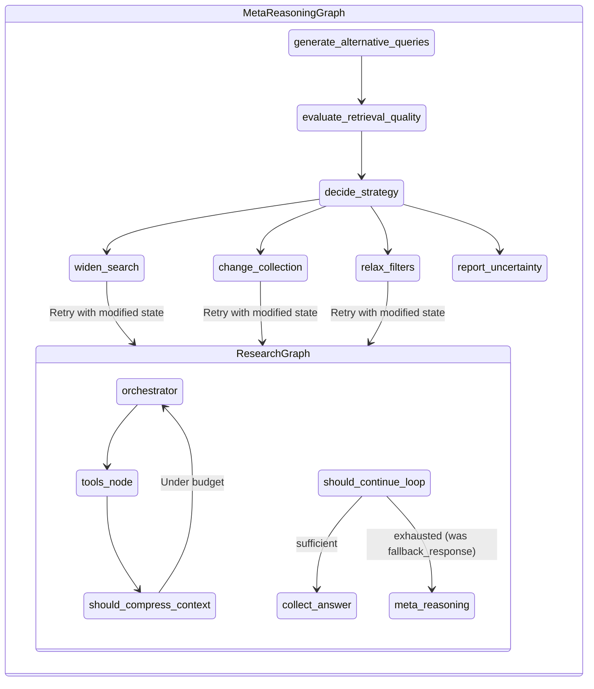

# Spec 04: MetaReasoningGraph -- Feature Specification Context

## Feature Description

The MetaReasoningGraph is Layer 3 of the three-layer LangGraph agent architecture and the primary architectural differentiator of The Embedinator. It is triggered when the ResearchGraph's `should_continue_loop` edge returns `"exhausted"` — either from budget exhaustion (iteration/tool limits) or tool exhaustion (`_no_new_tools` flag, F4 pattern) — while confidence remains below threshold. Rather than falling back immediately to an "I don't know" response, the system enters a meta-reasoning phase to diagnose why retrieval failed and attempt recovery.

**Files**:
- `backend/agent/meta_reasoning_graph.py` — StateGraph definition + compile
- `backend/agent/meta_reasoning_nodes.py` — Node function implementations
- `backend/agent/meta_reasoning_edges.py` — Conditional edge functions

The MetaReasoningGraph generates alternative query formulations, evaluates retrieval quality using the project's `Reranker` class (not LLM self-assessment), classifies the failure mode, selects a recovery strategy, and re-enters the ResearchGraph with modified state. A `meta_attempt_count` prevents infinite recursion — maximum `settings.meta_reasoning_max_attempts` (default 2) attempts before `report_uncertainty` is forced.

## Requirements

### Functional Requirements

1. **Alternative Query Generation**: Produce 3 rephrased, expanded, or simplified variants of the original sub-question using an LLM call. Strategies: synonym replacement, sub-component breakdown, scope broadening.
2. **Retrieval Quality Evaluation**: Run the cross-encoder to score all retrieved chunks against the sub-question. Compute mean relevance score and per-chunk relevance scores. This is a quantitative signal (not LLM self-assessment).
3. **Strategy Decision**: Based on mean relevance score and chunk count, select one of three recovery strategies:
   - **WIDEN_SEARCH**: When `mean_cross_encoder_score < 0.2 AND chunk_count < 3`. Remove all payload filters, search all collections, use alternative queries.
   - **CHANGE_COLLECTION**: When `mean_cross_encoder_score < 0.2 AND chunk_count >= 3`. Chunks retrieved but irrelevant. Switch to different collection, rephrase query terms, broaden search scope.
   - **RELAX_FILTERS**: When `mean_cross_encoder_score >= 0.2 AND score_variance > 0.15`. Moderate mean relevance but high variance indicates some relevant chunks mixed with noise — metadata filters are over-restricting. Remove metadata constraints, increase top_k, lower score threshold. (`score_variance` = standard deviation of `chunk_relevance_scores`; threshold 0.15 is configurable.)
4. **Uncertainty Reporting**: When all strategies have been attempted (detected by `meta_attempt_count >= settings.meta_reasoning_max_attempts`) or when no strategy applies, generate an honest "I don't know" response that explains what was searched, what was found/missing, and suggests user actions.
5. **Retry Loop**: After selecting a strategy, modify the ResearchState and re-enter the ResearchGraph with new parameters. Maximum `settings.meta_reasoning_max_attempts` (default 2) attempts.

### Non-Functional Requirements

1. The graph must use the cross-encoder for quality evaluation, not LLM self-assessment. This produces quantitative, reproducible scores.
2. Node functions are stateless and pure.
3. The meta_attempt_count must prevent infinite recursion.
4. The uncertainty report must never fabricate an answer or say "based on the available context" and then guess.

## Key Technical Details

### Trigger Condition (from ResearchGraph)

The `should_continue_loop` edge in `backend/agent/research_edges.py` returns `"exhausted"` when any of these conditions is met while confidence is below threshold:

```python
# Budget exhaustion
if (state["iteration_count"] >= settings.max_iterations or
    state["tool_call_count"] >= settings.max_tool_calls):
    return "exhausted"

# Tool exhaustion (F4) — orchestrator produced no new tool calls
if state.get("_no_new_tools", False):
    return "exhausted"
```

Currently `"exhausted"` routes to `fallback_response`. With MetaReasoningGraph, this route must be updated to route to `meta_reasoning` instead, which internally falls back to `report_uncertainty` if recovery fails.

**CONFIDENCE SCALE GOTCHA**: `settings.confidence_threshold` is `int` 0–100 but `state["confidence_score"]` is `float` 0.0–1.0. The edge divides by 100: `threshold = settings.confidence_threshold / 100`.

### Nodes

| Node | Responsibility | Reads from State | Writes to State | Side Effects |
|------|---------------|------------------|-----------------|-------------|
| `generate_alternative_queries` | Produce rephrased, expanded, or simplified variants of the original sub-question | `sub_question`, `retrieved_chunks` | `alternative_queries` | LLM call |
| `evaluate_retrieval_quality` | Run cross-encoder to score all retrieved chunks against the query; compute mean relevance | `sub_question`, `retrieved_chunks` | `mean_relevance_score`, `chunk_relevance_scores` | Cross-encoder inference |
| `decide_strategy` | Based on mean relevance, chunk count, and score variance, select a recovery strategy | `mean_relevance_score`, `chunk_relevance_scores`, `retrieved_chunks`, `meta_attempt_count` | `recovery_strategy`, `modified_state` | None |
| `report_uncertainty` | If no strategy recovers, generate an honest "I don't know" response with explanation | `sub_question`, `retrieved_chunks`, `mean_relevance_score`, `meta_attempt_count`, `alternative_queries` | `answer`, `uncertainty_reason` | LLM call |

### Strategy Decision Logic

```
# score_variance = std_dev(chunk_relevance_scores)

mean_cross_encoder_score < 0.2 AND chunk_count < 3:
    -> WIDEN_SEARCH (relax filters, search all collections, use alternative queries)
    -> modified_state: {selected_collections: ALL, top_k_retrieval: 40, alternative_queries: [...]}

mean_cross_encoder_score < 0.2 AND chunk_count >= 3:
    -> CHANGE_COLLECTION (chunks retrieved but irrelevant; change collection, rephrase)
    -> modified_state: {selected_collections: ROTATE, sub_question: alternative_queries[0]}

mean_cross_encoder_score >= 0.2 AND score_variance > 0.15:
    -> RELAX_FILTERS (moderate relevance but noisy; remove metadata constraints, increase top_k)
    -> modified_state: {top_k_retrieval: 40, payload_filters: NONE, top_k_rerank: 10}

mean_cross_encoder_score >= 0.2 AND score_variance <= 0.15:
    -> report_uncertainty (decent relevance, low variance — already found best available)

all strategies failed (meta_attempt_count >= settings.meta_reasoning_max_attempts):
    -> report_uncertainty with specific failure reason
```

### Decision Flowchart



### State Schema

Already defined in `backend/agent/state.py` (spec-01). Uses Python 3.14+ modern syntax:

```python
class MetaReasoningState(TypedDict):
    sub_question: str
    retrieved_chunks: list[RetrievedChunk]
    alternative_queries: list[str]
    mean_relevance_score: float
    chunk_relevance_scores: list[float]
    meta_attempt_count: int
    recovery_strategy: str | None
    modified_state: dict | None
    answer: str | None
    uncertainty_reason: str | None
```

Note: Do NOT use `List[...]` or `Optional[...]` from `typing` — the project uses Python 3.14+ built-in generics and union syntax (`list[...]`, `str | None`).

### Prompt Templates

All prompt constants must be added to `backend/agent/prompts.py` (established convention — all existing prompts live there, not inline in graph/node files).

**generate_alternative_queries prompt:**

```python
GENERATE_ALT_QUERIES_SYSTEM = """The retrieval system failed to find sufficient evidence
for the following question. Generate 3 alternative query formulations that might
retrieve better results.

Strategies to try:
1. Rephrase using different terminology (synonyms, technical vs. plain language)
2. Break into simpler sub-components
3. Broaden the scope (remove specific constraints)

Original question: {sub_question}
Retrieved chunks (low relevance): {chunk_summaries}
"""
```

**report_uncertainty prompt:**

```python
REPORT_UNCERTAINTY_SYSTEM = """Generate an honest response explaining that the system
could not find sufficient evidence to answer the question.

Include:
1. What collections were searched
2. What was found (if anything partially relevant)
3. Why the results were insufficient
4. Suggestions for the user (different query, different collection, upload more docs)

Do NOT fabricate an answer. Do NOT say "based on the available context" and then guess.
"""
```

## Dependencies

- **Spec 01 (Vision)**: State schema (`MetaReasoningState` in `backend/agent/state.py`), Pydantic models (`RetrievedChunk` in `backend/agent/schemas.py`), config (`Settings` in `backend/config.py` — notably `meta_reasoning_max_attempts`, `confidence_threshold`), errors
- **Spec 02 (ConversationGraph)**: Outer layer. Flow: ConversationGraph → ResearchGraph → MetaReasoningGraph. No direct interaction, but MetaReasoningGraph results ultimately flow back through ResearchGraph to ConversationGraph.
- **Spec 03 (ResearchGraph)**: MetaReasoningGraph is triggered by `should_continue_loop` edge returning `"exhausted"`. The routing in `research_edges.py` must be updated: `"exhausted"` → `meta_reasoning` (instead of current `fallback_response`). After recovery, MetaReasoningGraph modifies ResearchState and re-enters ResearchGraph. The existing `fallback_response` node in `research_nodes.py` is replaced by `report_uncertainty` for the meta-reasoning path.
- **Existing modules**: `Reranker` from `backend/retrieval/reranker.py` (wraps `sentence_transformers.CrossEncoder` — use `Reranker`, not raw `CrossEncoder`), prompts in `backend/agent/prompts.py`
- **Libraries**: `langgraph >= 1.0.10`, `langchain >= 1.2.10`, `sentence-transformers >= 5.2.3`, `structlog >= 24.0`
- **Services**: Ollama/cloud LLM (alternative query generation, uncertainty reporting), cross-encoder model via `Reranker` (retrieval quality evaluation)

## Acceptance Criteria

1. MetaReasoningGraph is a valid LangGraph `StateGraph` that compiles without errors.
2. `generate_alternative_queries` produces exactly 3 alternative query formulations.
3. `evaluate_retrieval_quality` uses the `Reranker` class (not LLM) to compute mean relevance score and per-chunk scores. Must call `reranker.rerank(query, chunks, top_k=len(chunks))` to score ALL chunks (not just top-k).
4. `decide_strategy` correctly selects WIDEN_SEARCH, CHANGE_COLLECTION, or RELAX_FILTERS based on the decision logic (using `mean_relevance_score`, `len(retrieved_chunks)`, and `std_dev(chunk_relevance_scores)`).
5. `decide_strategy` forces `report_uncertainty` when `meta_attempt_count >= settings.meta_reasoning_max_attempts`.
6. `report_uncertainty` produces an honest response that does not fabricate an answer.
7. The `modified_state` produced by `decide_strategy` contains concrete ResearchState field overrides for each strategy (documented in Strategy Decision Logic).
8. Maximum `settings.meta_reasoning_max_attempts` (default 2) attempts are enforced.
9. The graph correctly routes between strategy nodes and report_uncertainty based on evaluation signals.
10. The `should_continue_loop` edge in `research_edges.py` is updated to route `"exhausted"` → MetaReasoningGraph instead of `fallback_response`.

## Architecture Reference

### How MetaReasoningGraph Fits in the Three-Layer Architecture



**Integration mechanism**: MetaReasoningGraph is compiled as a subgraph and invoked from a `meta_reasoning` node in the ResearchGraph. The `should_continue_loop` edge's `"exhausted"` route is updated from `fallback_response` to `meta_reasoning`. The `meta_reasoning` node invokes the compiled MetaReasoningGraph, passing relevant ResearchState fields. If recovery succeeds, it returns `modified_state` which the ResearchGraph uses to re-enter the orchestrator loop. If `report_uncertainty` is reached, its output becomes the final answer.

### Node Interface Contracts

Node functions follow the established convention from spec-03:
- Accept `state: MetaReasoningState` + optionally `config: RunnableConfig = None`
- Return `dict` (partial state update), NOT the full `MetaReasoningState`
- Dependencies (LLM, Reranker) are resolved from `config["configurable"]`, NOT passed as keyword arguments
- `config` param type: use `config: RunnableConfig = None` (NOT `RunnableConfig | None` — LangGraph quirk)

```python
async def generate_alternative_queries(
    state: MetaReasoningState,
    config: RunnableConfig = None,
) -> dict:
    """Produce rephrased query variants.
    LLM is resolved from config["configurable"]["llm"].
    Reads: state["sub_question"], state["retrieved_chunks"]
    Writes: {"alternative_queries": list[str]}
    """
    ...

async def evaluate_retrieval_quality(
    state: MetaReasoningState,
    config: RunnableConfig = None,
) -> dict:
    """Score ALL chunks with cross-encoder via Reranker.
    Reranker is resolved from config["configurable"]["reranker"].
    IMPORTANT: Call reranker.rerank(query, chunks, top_k=len(chunks)) to score
    all chunks, not just the default top-5.
    Reads: state["sub_question"], state["retrieved_chunks"]
    Writes: {"mean_relevance_score": float, "chunk_relevance_scores": list[float]}
    """
    ...

async def decide_strategy(
    state: MetaReasoningState,
) -> dict:
    """Select recovery strategy based on evaluation signals.
    Uses: mean_relevance_score, len(retrieved_chunks), std_dev(chunk_relevance_scores),
          meta_attempt_count vs settings.meta_reasoning_max_attempts.
    Reads: state["mean_relevance_score"], state["chunk_relevance_scores"],
           state["retrieved_chunks"], state["meta_attempt_count"]
    Writes: {"recovery_strategy": str, "modified_state": dict, "meta_attempt_count": int}
    """
    ...

async def report_uncertainty(
    state: MetaReasoningState,
    config: RunnableConfig = None,
) -> dict:
    """Generate honest I-don't-know response via LLM.
    LLM is resolved from config["configurable"]["llm"].
    Reads: state["sub_question"], state["retrieved_chunks"],
           state["mean_relevance_score"], state["meta_attempt_count"],
           state["alternative_queries"]
    Writes: {"answer": str, "uncertainty_reason": str}
    """
    ...
```

### Key Design Decision: Why MetaReasoningGraph Exists

Single-loop agentic RAG systems fail silently: the agent exhausts its tool budget, generates a hallucinated or "I don't know" response, and offers the user no path to improvement. The MetaReasoningGraph adds a dedicated diagnostic phase. When the ResearchGraph fails to meet confidence threshold, instead of falling back immediately, the system asks: "Why did retrieval fail?" The cross-encoder evaluation (via `Reranker`) gives quantitative signals: if retrieved chunks have low mean relevance scores with few chunks, the problem is insufficient coverage (WIDEN_SEARCH). If low relevance with many chunks, the problem is collection routing (CHANGE_COLLECTION). If moderate relevance but high score variance, the problem is noise from over-restrictive filters (RELAX_FILTERS). Each diagnosis maps to a concrete recovery action with specific ResearchState modifications.
