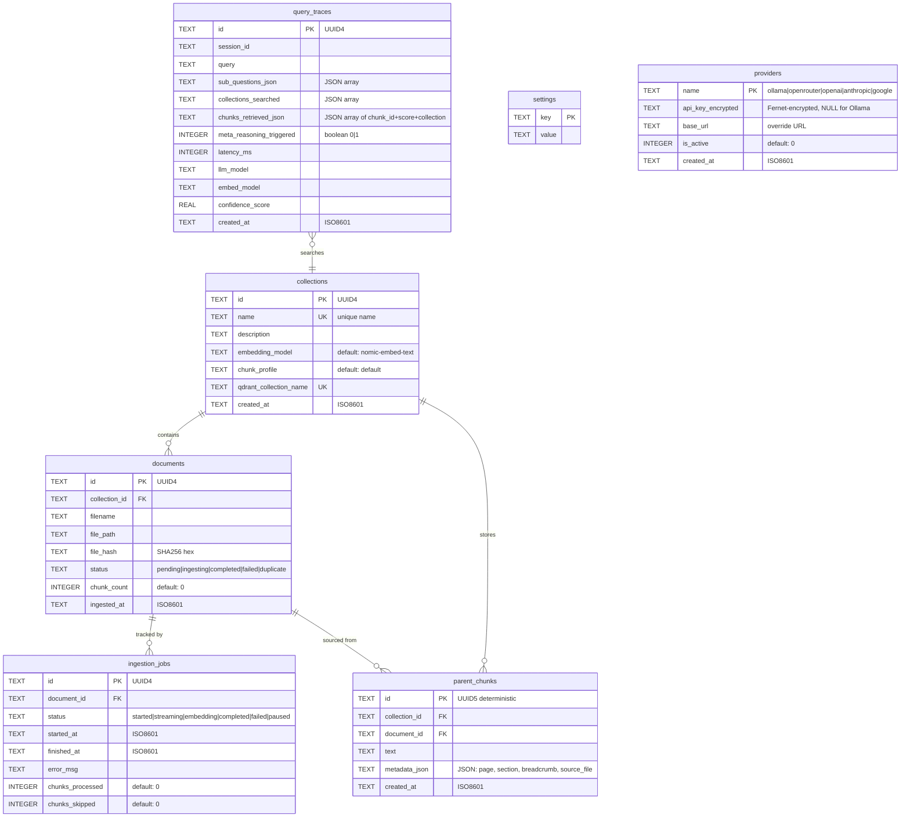

# The Embedinator — Data Model

**Version**: 1.0
**Date**: 2026-03-10
**Source**: `claudedocs/architecture-design.md` Section 10 (Storage Architecture)

---

## Entity-Relationship Diagram



---

## SQLite Schema

**File**: `data/embedinator.db`
**Journal mode**: WAL (Write-Ahead Logging)
**Foreign keys**: Enabled

### `collections`

| Column | Type | Constraints | Description |
|---|---|---|---|
| `id` | TEXT | PRIMARY KEY | UUID4 |
| `name` | TEXT | NOT NULL, UNIQUE | Human-readable collection name |
| `description` | TEXT | — | Optional description |
| `embedding_model` | TEXT | NOT NULL, DEFAULT `'nomic-embed-text'` | Model used for embedding documents |
| `chunk_profile` | TEXT | NOT NULL, DEFAULT `'default'` | Chunking configuration profile |
| `qdrant_collection_name` | TEXT | NOT NULL, UNIQUE | Corresponding Qdrant collection name |
| `created_at` | TEXT | NOT NULL | ISO8601 timestamp |

### `documents`

| Column | Type | Constraints | Description |
|---|---|---|---|
| `id` | TEXT | PRIMARY KEY | UUID4 |
| `collection_id` | TEXT | NOT NULL, FK → collections(id) | Parent collection |
| `filename` | TEXT | NOT NULL | Original uploaded filename |
| `file_path` | TEXT | NOT NULL | Path in uploads directory |
| `file_hash` | TEXT | NOT NULL | SHA256 hex digest |
| `status` | TEXT | NOT NULL | `pending`, `ingesting`, `completed`, `failed`, `duplicate` |
| `chunk_count` | INTEGER | DEFAULT 0 | Number of child chunks generated |
| `ingested_at` | TEXT | — | ISO8601, set on completion |

**Unique constraint**: `(collection_id, file_hash)` — prevents duplicate uploads per collection.

### `ingestion_jobs`

| Column | Type | Constraints | Description |
|---|---|---|---|
| `id` | TEXT | PRIMARY KEY | UUID4 |
| `document_id` | TEXT | NOT NULL, FK → documents(id) | Associated document |
| `status` | TEXT | NOT NULL | `started`, `streaming`, `embedding`, `completed`, `failed`, `paused` |
| `started_at` | TEXT | NOT NULL | ISO8601 |
| `finished_at` | TEXT | — | ISO8601, set on completion/failure |
| `error_msg` | TEXT | — | Error details if failed |
| `chunks_processed` | INTEGER | DEFAULT 0 | Successfully processed chunks |
| `chunks_skipped` | INTEGER | DEFAULT 0 | Skipped chunks (duplicates, errors) |

### `parent_chunks`

| Column | Type | Constraints | Description |
|---|---|---|---|
| `id` | TEXT | PRIMARY KEY | UUID5 deterministic: `uuid5(NAMESPACE, f"{source_file}:{page}:{chunk_index}")` |
| `collection_id` | TEXT | NOT NULL, FK → collections(id) | Parent collection |
| `document_id` | TEXT | NOT NULL, FK → documents(id) | Source document |
| `text` | TEXT | NOT NULL | Full parent chunk text (2000-4000 chars) |
| `metadata_json` | TEXT | NOT NULL | JSON: `{page, section, breadcrumb, source_file}` |
| `created_at` | TEXT | NOT NULL | ISO8601 |

**Indexes**:
- `idx_parent_chunks_collection` on `(collection_id)`
- `idx_parent_chunks_document` on `(document_id)`

### `query_traces`

| Column | Type | Constraints | Description |
|---|---|---|---|
| `id` | TEXT | PRIMARY KEY | UUID4 |
| `session_id` | TEXT | NOT NULL | Chat session identifier |
| `query` | TEXT | NOT NULL | User's query text |
| `sub_questions_json` | TEXT | — | JSON array of decomposed sub-questions |
| `collections_searched` | TEXT | — | JSON array of collection names |
| `chunks_retrieved_json` | TEXT | — | JSON array of `{chunk_id, score, collection}` |
| `meta_reasoning_triggered` | INTEGER | DEFAULT 0 | Boolean: 1 if MetaReasoningGraph activated |
| `latency_ms` | INTEGER | — | End-to-end query time in milliseconds |
| `llm_model` | TEXT | — | LLM model used for generation |
| `embed_model` | TEXT | — | Embedding model used for query |
| `confidence_score` | REAL | — | Computed confidence (0.0-1.0) |
| `created_at` | TEXT | NOT NULL | ISO8601 |

**Indexes**:
- `idx_traces_session` on `(session_id)`
- `idx_traces_created` on `(created_at)`

### `settings`

| Column | Type | Constraints | Description |
|---|---|---|---|
| `key` | TEXT | PRIMARY KEY | Setting name |
| `value` | TEXT | NOT NULL | Setting value (string-encoded) |

### `providers`

| Column | Type | Constraints | Description |
|---|---|---|---|
| `name` | TEXT | PRIMARY KEY | `ollama`, `openrouter`, `openai`, `anthropic`, `google` |
| `api_key_encrypted` | TEXT | — | Fernet-encrypted API key (NULL for Ollama) |
| `base_url` | TEXT | — | Override URL (e.g., custom Ollama endpoint) |
| `is_active` | INTEGER | DEFAULT 0 | 1 if provider is configured and reachable |
| `created_at` | TEXT | DEFAULT `datetime('now')` | ISO8601 |

---

## Qdrant Collection Schema

Each user-defined collection maps to one Qdrant collection. Child chunks are stored as vector points.

### Vector Configuration

| Vector Name | Type | Dimensions | Distance | Source |
|---|---|---|---|---|
| `dense` | Named vector | Model-dependent (768 for nomic-embed-text) | Cosine | Ollama embedding model |
| `sparse` | Sparse vector | — | BM25 (IDF modifier) | Qdrant built-in BM25 |

### Point Payload Schema

Each child chunk point in Qdrant carries this payload:

```json
{
  "text": "The raw child chunk text (without breadcrumb prefix)",
  "parent_id": "550e8400-e29b-41d4-a716-446655440000",
  "breadcrumb": "Chapter 2 > 2.3 Authentication",
  "source_file": "arca_api_spec_v2.pdf",
  "page": 3,
  "chunk_index": 7,
  "doc_type": "prose",
  "chunk_hash": "a3f5c2d8...",
  "embedding_model": "nomic-embed-text",
  "collection_name": "arca-specs",
  "ingested_at": "2026-03-03T10:00:00Z"
}
```

| Field | Type | Description |
|---|---|---|
| `text` | string | Raw child chunk text (breadcrumb NOT included) |
| `parent_id` | string | UUID5 linking to `parent_chunks.id` in SQLite |
| `breadcrumb` | string | Document hierarchy path (used as metadata filter) |
| `source_file` | string | Original filename |
| `page` | integer | Source page number |
| `chunk_index` | integer | Sequential index within document |
| `doc_type` | string | `"prose"` or `"code"` |
| `chunk_hash` | string | SHA256 of chunk text (for dedup) |
| `embedding_model` | string | Model used to generate this vector |
| `collection_name` | string | Parent collection name |
| `ingested_at` | string | ISO8601 timestamp |

### Qdrant-to-SQLite Relationship

```
Qdrant child_chunk.parent_id  →  SQLite parent_chunks.id
SQLite parent_chunks.document_id  →  SQLite documents.id
SQLite documents.collection_id  →  SQLite collections.id
SQLite collections.qdrant_collection_name  →  Qdrant collection name
```

The child chunk in Qdrant holds the vector and minimal payload. The parent chunk in SQLite holds the full context text passed to the LLM. This split keeps Qdrant storage efficient while providing rich context for answer generation.

### Point ID Generation

Deterministic UUID5: `uuid5(NAMESPACE, f"{source_file}:{page}:{chunk_index}")`

This enables idempotent re-ingestion — the same logical chunk always gets the same point ID. Qdrant upserts with matching IDs overwrite in place, so re-ingesting a corrected document requires no delete-then-insert logic.

---

## Design Rationale

**SQLite over PostgreSQL**: Zero-config deployment. WAL journal mode allows concurrent readers with a single writer. Single-file backup/restore. For a self-hosted single-user system, SQLite's write serialization is not a constraint. See ADR-001.

**Parent chunks in SQLite (not Qdrant payload)**: Indexed access, foreign key relationships, and atomic writes. Parent text can be 2000-4000 chars — storing it in Qdrant payload would bloat vector storage. SQLite provides efficient retrieval by `parent_id` with indexing.

**JSON columns**: `metadata_json`, `sub_questions_json`, `chunks_retrieved_json`, and `collections_searched` use JSON-encoded TEXT columns. This avoids additional join tables for data that is always read/written as a unit and never queried at the field level (except for basic filtering).

---

*Extracted from `claudedocs/architecture-design.md` Section 10 (Storage Architecture).*
