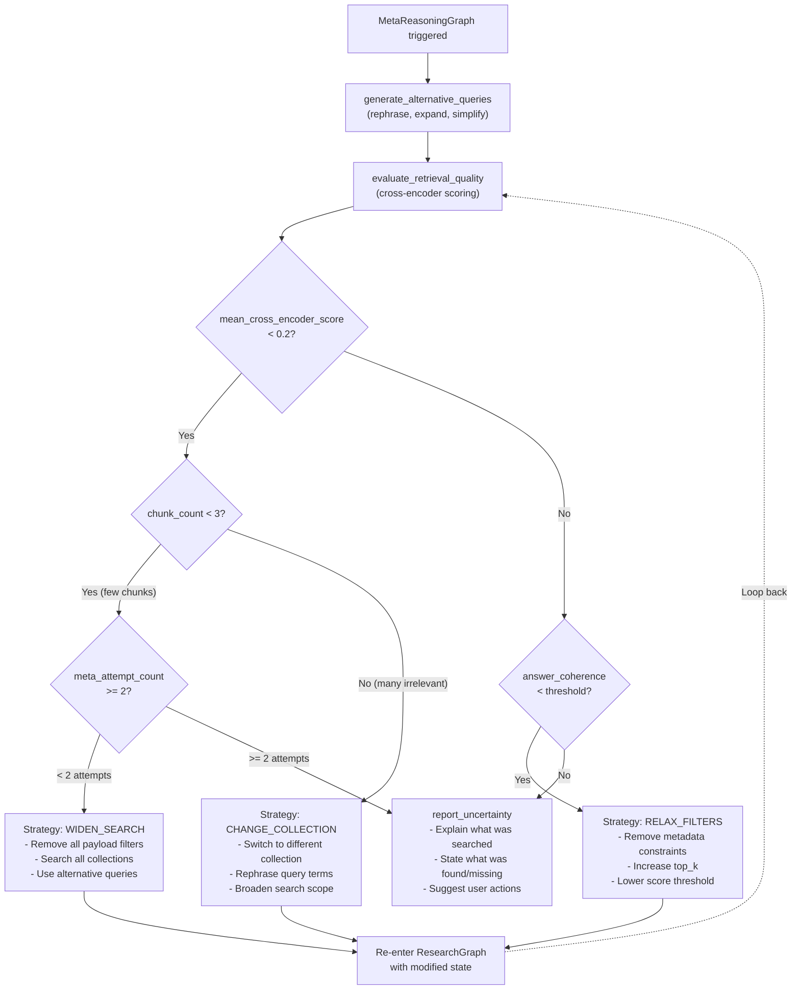

# Spec 04: MetaReasoningGraph -- Feature Specification Context

## Feature Description

The MetaReasoningGraph is Layer 3 of the three-layer LangGraph agent architecture and the primary architectural differentiator of The Embedinator. It is triggered when the ResearchGraph has exhausted its iteration budget without reaching the confidence threshold. Rather than falling back immediately to an "I don't know" response, the system enters a meta-reasoning phase to diagnose why retrieval failed and attempt recovery.

**File**: `backend/agent/meta_reasoning_graph.py`

The MetaReasoningGraph generates alternative query formulations, evaluates retrieval quality using a cross-encoder (not LLM self-assessment), classifies the failure mode, selects a recovery strategy, and re-enters the ResearchGraph with modified state. A `meta_attempt_count` prevents infinite recursion -- maximum two meta-reasoning attempts before `report_uncertainty` is forced.

## Requirements

### Functional Requirements

1. **Alternative Query Generation**: Produce 3 rephrased, expanded, or simplified variants of the original sub-question using an LLM call. Strategies: synonym replacement, sub-component breakdown, scope broadening.
2. **Retrieval Quality Evaluation**: Run the cross-encoder to score all retrieved chunks against the sub-question. Compute mean relevance score and per-chunk relevance scores. This is a quantitative signal (not LLM self-assessment).
3. **Strategy Decision**: Based on mean relevance score and chunk count, select one of three recovery strategies:
   - **WIDEN_SEARCH**: When `mean_cross_encoder_score < 0.2 AND chunk_count < 3`. Remove all payload filters, search all collections, use alternative queries.
   - **CHANGE_COLLECTION**: When `mean_cross_encoder_score < 0.2 AND chunk_count >= 3`. Chunks retrieved but irrelevant. Switch to different collection, rephrase query terms, broaden search scope.
   - **RELAX_FILTERS**: When `mean_cross_encoder_score >= 0.2 AND answer_coherence < threshold`. Moderate relevance but insufficient coherence. Remove metadata constraints, increase top_k, lower score threshold.
4. **Uncertainty Reporting**: When all strategies have been attempted (detected by `meta_attempt_count >= 2`) or when no strategy applies, generate an honest "I don't know" response that explains what was searched, what was found/missing, and suggests user actions.
5. **Retry Loop**: After selecting a strategy, modify the ResearchState and re-enter the ResearchGraph with new parameters. Maximum 2 meta-reasoning attempts.

### Non-Functional Requirements

1. The graph must use the cross-encoder for quality evaluation, not LLM self-assessment. This produces quantitative, reproducible scores.
2. Node functions are stateless and pure.
3. The meta_attempt_count must prevent infinite recursion.
4. The uncertainty report must never fabricate an answer or say "based on the available context" and then guess.

## Key Technical Details

### Trigger Condition (from ResearchGraph)

```python
if (state["iteration_count"] >= MAX_ITERATIONS or
    state["tool_call_count"] >= MAX_TOOL_CALLS) and
   state["confidence_score"] < CONFIDENCE_THRESHOLD:
    # Route to MetaReasoningGraph
```

### Nodes

| Node | Responsibility | Reads from State | Writes to State | Side Effects |
|------|---------------|------------------|-----------------|-------------|
| `generate_alternative_queries` | Produce rephrased, expanded, or simplified variants of the original sub-question | `sub_question`, `retrieved_chunks` | `alternative_queries` | LLM call |
| `evaluate_retrieval_quality` | Run cross-encoder to score all retrieved chunks against the query; compute mean relevance | `sub_question`, `retrieved_chunks` | `mean_relevance_score`, `chunk_relevance_scores` | Cross-encoder inference |
| `decide_strategy` | Based on mean relevance and chunk count, select a recovery strategy | `mean_relevance_score`, `chunk_relevance_scores`, `meta_attempt_count` | `recovery_strategy`, `modified_state` | None |
| `report_uncertainty` | If no strategy recovers, generate an honest "I don't know" response with explanation | `sub_question`, `mean_relevance_score`, `recovery_attempts` | `answer`, `uncertainty_reason` | None |

### Strategy Decision Logic

```
mean_cross_encoder_score < 0.2 AND chunk_count < 3:
    -> WIDEN_SEARCH (relax filters, search all collections, use alternative queries)

mean_cross_encoder_score < 0.2 AND chunk_count >= 3:
    -> CHANGE_COLLECTION (chunks retrieved but irrelevant; change collection, rephrase)

mean_cross_encoder_score >= 0.2 AND answer_coherence < threshold:
    -> RELAX_FILTERS (moderate relevance, remove metadata constraints, increase top_k)

all strategies failed (meta_attempt_count >= 2):
    -> report_uncertainty with specific failure reason
```

### Decision Flowchart



### State Schema

```python
class MetaReasoningState(TypedDict):
    sub_question: str
    retrieved_chunks: List[RetrievedChunk]
    alternative_queries: List[str]
    mean_relevance_score: float
    chunk_relevance_scores: List[float]
    meta_attempt_count: int
    recovery_strategy: Optional[str]
    modified_state: Optional[dict]
    answer: Optional[str]
    uncertainty_reason: Optional[str]
```

### Prompt Templates

**generate_alternative_queries prompt:**

```python
GENERATE_ALT_QUERIES_SYSTEM = """The retrieval system failed to find sufficient evidence
for the following question. Generate 3 alternative query formulations that might
retrieve better results.

Strategies to try:
1. Rephrase using different terminology (synonyms, technical vs. plain language)
2. Break into simpler sub-components
3. Broaden the scope (remove specific constraints)

Original question: {sub_question}
Retrieved chunks (low relevance): {chunk_summaries}
"""
```

**report_uncertainty prompt:**

```python
REPORT_UNCERTAINTY_SYSTEM = """Generate an honest response explaining that the system
could not find sufficient evidence to answer the question.

Include:
1. What collections were searched
2. What was found (if anything partially relevant)
3. Why the results were insufficient
4. Suggestions for the user (different query, different collection, upload more docs)

Do NOT fabricate an answer. Do NOT say "based on the available context" and then guess.
"""
```

## Dependencies

- **Spec 01 (Vision)**: State schema (`MetaReasoningState`), Pydantic models (`RetrievedChunk`), config (`Settings`), errors
- **Spec 03 (ResearchGraph)**: MetaReasoningGraph is triggered by ResearchGraph when confidence is below threshold. After recovery, MetaReasoningGraph modifies state and re-enters ResearchGraph.
- **Libraries**: `langgraph >= 1.0.10`, `langchain >= 1.2.10`, `sentence-transformers >= 5.2.3`
- **Services**: Ollama/cloud LLM (alternative query generation, uncertainty reporting), cross-encoder model (retrieval quality evaluation)

## Acceptance Criteria

1. MetaReasoningGraph is a valid LangGraph `StateGraph` that compiles without errors.
2. `generate_alternative_queries` produces exactly 3 alternative query formulations.
3. `evaluate_retrieval_quality` uses the cross-encoder (not LLM) to compute mean relevance score.
4. `decide_strategy` correctly selects WIDEN_SEARCH, CHANGE_COLLECTION, or RELAX_FILTERS based on the decision logic.
5. `decide_strategy` forces `report_uncertainty` when `meta_attempt_count >= 2`.
6. `report_uncertainty` produces an honest response that does not fabricate an answer.
7. The `modified_state` produced by `decide_strategy` correctly modifies ResearchState for retry.
8. Maximum 2 meta-reasoning attempts are enforced.
9. The graph correctly routes between strategy nodes and report_uncertainty based on evaluation signals.

## Architecture Reference

### How MetaReasoningGraph Fits in the Three-Layer Architecture

```mermaid
stateDiagram-v2
    state ResearchGraph {
        orchestrator --> tools
        tools --> should_compress_context
        should_compress_context --> orchestrator : Under budget
        orchestrator --> MetaReasoningGraph : Low confidence + budget exhausted
    }

    state MetaReasoningGraph {
        generate_alternative_queries --> evaluate_retrieval_quality
        evaluate_retrieval_quality --> decide_strategy
        decide_strategy --> widen_search
        decide_strategy --> change_collection
        decide_strategy --> relax_filters
        decide_strategy --> report_uncertainty
        widen_search --> ResearchGraph : Retry with modified state
        change_collection --> ResearchGraph : Retry with modified state
        relax_filters --> ResearchGraph : Retry with modified state
    }
```

### Node Interface Contracts

```python
async def generate_alternative_queries(
    state: MetaReasoningState,
    *,
    llm: BaseChatModel,
) -> MetaReasoningState:
    """Produce rephrased query variants.
    Reads: state["sub_question"], state["retrieved_chunks"]
    Writes: state["alternative_queries"]
    """
    ...

async def evaluate_retrieval_quality(
    state: MetaReasoningState,
    *,
    reranker: CrossEncoder,
) -> MetaReasoningState:
    """Score all chunks with cross-encoder.
    Reads: state["sub_question"], state["retrieved_chunks"]
    Writes: state["mean_relevance_score"], state["chunk_relevance_scores"]
    """
    ...

async def decide_strategy(
    state: MetaReasoningState,
) -> MetaReasoningState:
    """Select recovery strategy based on evaluation.
    Reads: state["mean_relevance_score"], state["chunk_relevance_scores"],
           state["meta_attempt_count"]
    Writes: state["recovery_strategy"], state["modified_state"]
    """
    ...

async def report_uncertainty(
    state: MetaReasoningState,
) -> MetaReasoningState:
    """Generate honest I-don't-know response.
    Reads: state["sub_question"], state["mean_relevance_score"]
    Writes: state["answer"], state["uncertainty_reason"]
    """
    ...
```

### Key Design Decision: Why MetaReasoningGraph Exists

Single-loop agentic RAG systems fail silently: the agent exhausts its tool budget, generates a hallucinated or "I don't know" response, and offers the user no path to improvement. The MetaReasoningGraph adds a dedicated diagnostic phase. When the ResearchGraph fails to meet confidence threshold, instead of falling back immediately, the system asks: "Why did retrieval fail?" The cross-encoder evaluation gives a quantitative signal: if retrieved chunks have low relevance scores, the problem is query-to-collection routing. If scores are moderate but coherence is low, the problem is filter over-restriction. Each diagnosis maps to a concrete recovery action.
