# The Embedinator — System Architecture Design

**Version**: 2.0
**Date**: 2026-03-03
**Status**: Design Specification — Implementation Ready

---

## Table of Contents

1. [Vision Statement](#vision-statement)
2. [System Architecture Overview](#system-architecture-overview)
3. [Three-Layer LangGraph Agent Architecture](#three-layer-langgraph-agent-architecture)
4. [Layer 1: ConversationGraph](#layer-1-conversationgraph)
5. [Layer 2: ResearchGraph](#layer-2-researchgraph)
6. [Layer 3: MetaReasoningGraph](#layer-3-metareasoninggraph)
7. [Accuracy, Precision & Robustness Enhancements](#accuracy-precision--robustness-enhancements)
8. [Ingestion Pipeline](#ingestion-pipeline)
9. [Rust Ingestion Worker](#rust-ingestion-worker)
10. [Storage Architecture](#storage-architecture)
11. [API Reference](#api-reference)
12. [Frontend Architecture](#frontend-architecture)
13. [Provider Architecture](#provider-architecture)
14. [Component Interface Contracts](#component-interface-contracts)
15. [Error Handling Specification](#error-handling-specification)
16. [Security Specification](#security-specification)
17. [Performance Targets & Budgets](#performance-targets--budgets)
18. [Logging & Observability Specification](#logging--observability-specification)
19. [Testing Strategy](#testing-strategy)
20. [Project Directory Structure](#project-directory-structure)
21. [Key Design Decisions](#key-design-decisions)
22. [Inherited Techniques](#inherited-techniques)
23. [Build Phases Roadmap](#build-phases-roadmap)
24. [Dependencies](#dependencies)
25. [Configuration](#configuration)
26. [Docker Strategy](#docker-strategy)
27. [Implementation Notes for Developers](#implementation-notes-for-developers)

---

## Vision Statement

The Embedinator is a self-hosted agentic RAG system that lets you embed, index, and intelligently query your own documents — entirely on your own hardware, with zero cloud dependencies.

At its core is a three-layer LangGraph agent that doesn't just retrieve and answer: it reasons about its own retrieval quality, autonomously switches strategy when results are poor, and verifies that every claim in its answers is grounded in the retrieved evidence. A Rust ingestion worker parses documents at native speed while Python orchestrates embedding, indexing, and the agent loop. A Next.js frontend gives users full control — choose your collections, pick your LLM and embedding models, upload documents, and watch query traces to understand exactly how answers were produced.

The retrieval pipeline combines parent/child chunking with structural breadcrumbs, hybrid dense + BM25 search, cross-encoder reranking, and query-adaptive retrieval depth — each layer adding precision on top of the last. The system defaults to Ollama for all inference, Qdrant for vector storage, and SQLite for metadata. A single `TUI installation` brings it all online.

---

## System Architecture Overview

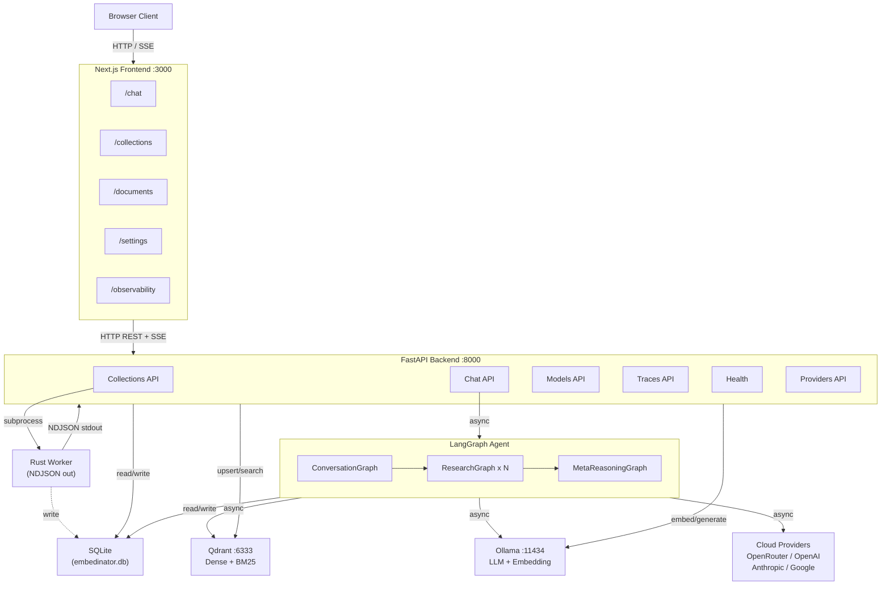

### Service Inventory

| Service | Port | Role | Persistence |
|---------|------|------|-------------|
| Next.js Frontend | 3000 | UI rendering, SSE consumption | None (stateless) |
| FastAPI Backend | 8000 | API gateway, agent orchestration, ingestion | SQLite (WAL mode) |
| Qdrant | 6333 (HTTP), 6334 (gRPC) | Vector storage, hybrid search | `data/qdrant_db/` |
| Ollama | 11434 | LLM inference, embedding generation | `ollama_models` volume |
| Rust Worker | N/A (subprocess) | Document parsing, NDJSON streaming | None (stateless) |
| SQLite | N/A (embedded) | Metadata, parent chunks, traces, settings | `data/embedinator.db` |

### Inter-Service Communication

| From | To | Protocol | Data Format | Direction |
|------|----|----------|-------------|-----------|
| Browser | Next.js | HTTP, SSE | JSON, event-stream | Bidirectional |
| Next.js | FastAPI | HTTP REST, SSE | JSON | Bidirectional |
| FastAPI | Qdrant | HTTP | JSON (REST API) | Bidirectional |
| FastAPI | Ollama | HTTP | JSON (REST API) | Bidirectional |
| FastAPI | Cloud Providers | HTTPS | JSON (provider SDKs) | Bidirectional |
| FastAPI | Rust Worker | stdin/stdout | NDJSON (line-delimited) | Unidirectional (worker to Python) |
| FastAPI | SQLite | Function calls | SQL via `aiosqlite` | Bidirectional |

---

## Three-Layer LangGraph Agent Architecture

The agent is the core intellectual component of The Embedinator. It is structured as three nested LangGraph state machines, each with increasing depth of reasoning.

```mermaid
stateDiagram-v2
    [*] --> ConversationGraph

    state ConversationGraph {
        [*] --> init_session
        init_session --> classify_intent
        classify_intent --> route_intent
        route_intent --> rewrite_query : RAG query
        route_intent --> collection_mgmt : Collection command
        route_intent --> request_clarification : Ambiguous

        request_clarification --> classify_intent : User responds

        rewrite_query --> fan_out
        fan_out --> ResearchGraph : Send() x N sub-questions
        ResearchGraph --> aggregate_answers
        aggregate_answers --> verify_groundedness
        verify_groundedness --> validate_citations
        validate_citations --> format_response
        format_response --> [*]
    }

    state ResearchGraph {
        [*] --> orchestrator
        orchestrator --> tools : Tool calls
        tools --> should_compress_context
        should_compress_context --> compress_context : Over budget
        should_compress_context --> orchestrator : Under budget
        compress_context --> orchestrator
        orchestrator --> collect_answer : Sufficient confidence
        orchestrator --> MetaReasoningGraph : Low confidence + budget exhausted
        orchestrator --> fallback_response : Tools exhausted
        collect_answer --> [*]
        fallback_response --> [*]
    }

    state MetaReasoningGraph {
        [*] --> generate_alternative_queries
        generate_alternative_queries --> evaluate_retrieval_quality
        evaluate_retrieval_quality --> decide_strategy
        decide_strategy --> widen_search : Low score + few chunks
        decide_strategy --> change_collection : Low score + many chunks
        decide_strategy --> relax_filters : Moderate score
        decide_strategy --> report_uncertainty : All strategies failed
        widen_search --> ResearchGraph : Retry with new state
        change_collection --> ResearchGraph : Retry with new state
        relax_filters --> ResearchGraph : Retry with new state
        report_uncertainty --> [*]
    }
```

### Layer Responsibility Summary

| Layer | Scope | Trigger | Max Duration |
|-------|-------|---------|-------------|
| ConversationGraph | Full session lifecycle | Every chat message | No limit (session-scoped) |
| ResearchGraph | Single sub-question | `Send()` from fan_out | `MAX_ITERATIONS` tool loops |
| MetaReasoningGraph | Retrieval failure recovery | Confidence below threshold | 2 meta-attempts max |

---

## Layer 1: ConversationGraph

**File**: `backend/agent/conversation_graph.py`

The outermost graph manages the full conversation lifecycle. It is the entry point for every chat request.

### Nodes

| Node | Responsibility | Reads from State | Writes to State | Side Effects |
|------|---------------|------------------|-----------------|-------------|
| `init_session` | Load or create session state, restore conversation history from SQLite | `session_id` | `messages`, `selected_collections` | SQLite read (session history) |
| `classify_intent` | Determine if the message is a RAG query, a collection management command, or ambiguous | `messages` | `intent` (internal) | None |
| `rewrite_query` | Use Pydantic structured output to decompose the query into sub-questions | `messages`, `selected_collections` | `query_analysis` | LLM call (structured output) |
| `request_clarification` | LangGraph interrupt — pauses graph and yields clarification questions to UI | `query_analysis` | N/A (interrupt) | Graph checkpoint to SQLite |
| `route_intent` | Branch: send to RAG path, collection management handler, or clarification | `intent` | N/A (routing) | None |
| `fan_out` | Spawn one ResearchGraph per sub-question using LangGraph `Send()` API | `query_analysis`, `selected_collections`, `llm_model`, `embed_model` | N/A (spawns subgraphs) | None |
| `aggregate_answers` | Merge parallel ResearchGraph results, deduplicate citations, rank by relevance | `sub_answers` | `final_response` (draft), `citations` | None |
| `verify_groundedness` | Run Grounded Answer Verification: check each claim against retrieved chunks via NLI prompt; flag unsupported claims | `final_response`, `citations`, `sub_answers` | `groundedness_result`, `confidence_score` | LLM call (verification) |
| `validate_citations` | Cross-encoder alignment check: verify each inline citation points to a chunk that actually supports the claim | `final_response`, `citations` | `citations` (corrected) | Cross-encoder inference |
| `summarize_history` | Compress conversation history when token budget is approached | `messages` | `messages` (compressed) | LLM call (summarization) |
| `format_response` | Apply citation annotations, confidence indicator, stream-format final answer for SSE delivery | `final_response`, `citations`, `groundedness_result`, `confidence_score` | `final_response` (formatted) | None |

### Node Error Handling

| Node | Failure Mode | Recovery |
|------|-------------|----------|
| `init_session` | SQLite read failure | Create fresh session, log warning |
| `classify_intent` | LLM call failure | Default to RAG query intent |
| `rewrite_query` | Structured output parse failure | Retry once with simplified prompt; fall back to single-question mode |
| `fan_out` | No sub-questions generated | Use original query as sole sub-question |
| `aggregate_answers` | One or more ResearchGraphs failed | Aggregate available answers, note gaps |
| `verify_groundedness` | LLM call failure | Skip verification, set `groundedness_result = None`, log warning |
| `validate_citations` | Cross-encoder failure | Pass citations through unvalidated |

### Structured Output: QueryAnalysis

The `rewrite_query` node calls the LLM with a Pydantic-enforced output schema:

```python
class QueryAnalysis(BaseModel):
    is_clear: bool
    sub_questions: List[str]              # max 5 decomposed sub-questions
    clarification_needed: Optional[str]   # human-readable clarification prompt
    collections_hint: List[str]           # suggested collection names to search
    complexity_tier: Literal[             # drives adaptive retrieval depth
        "factoid", "lookup", "comparison", "analytical", "multi_hop"
    ]
```

If `is_clear` is False and `clarification_needed` is set, the graph routes to `request_clarification` (interrupt). The interrupt serializes graph state to SQLite and waits for the next HTTP request carrying the user's answer.

### Prompt Templates

**classify_intent system prompt:**

```python
CLASSIFY_INTENT_SYSTEM = """You are an intent classifier for a RAG system.
Given the user's message and conversation history, classify the intent as one of:
- "rag_query": The user is asking a question that requires searching documents
- "collection_mgmt": The user wants to manage collections (create, delete, list)
- "ambiguous": The intent is unclear and needs clarification

Respond with a JSON object: {"intent": "rag_query"|"collection_mgmt"|"ambiguous", "reason": "..."}
"""

CLASSIFY_INTENT_USER = """Conversation history:
{history}

User message: {message}
Selected collections: {collections}
"""
```

**rewrite_query system prompt:**

```python
REWRITE_QUERY_SYSTEM = """You are a query analyzer for a document retrieval system.
Given the user's question and available collections, produce a structured analysis.

Rules:
1. Decompose complex questions into 1-5 focused sub-questions
2. Each sub-question should be answerable from a single document section
3. Identify which collections are most likely to contain relevant information
4. Classify the complexity tier to optimize retrieval depth
5. If the question is ambiguous or requires clarification, set is_clear=false

Complexity tiers:
- factoid: Single fact retrieval ("What port does X use?")
- lookup: Specific document section ("How do I configure X?")
- comparison: Cross-document comparison ("Compare X and Y approaches")
- analytical: Deep analysis requiring synthesis ("Why does X fail when Y?")
- multi_hop: Chained reasoning across multiple evidence steps ("If X causes Y, and Y affects Z, then...")
"""

REWRITE_QUERY_USER = """User question: {question}
Available collections: {collections}
Conversation context: {context}
"""
```

**verify_groundedness system prompt:**

```python
VERIFY_GROUNDEDNESS_SYSTEM = """Given ONLY the retrieved context below, evaluate each claim
in the proposed answer. For each claim, respond with:
- SUPPORTED: the context contains evidence for this claim
- UNSUPPORTED: no evidence found in the retrieved context
- CONTRADICTED: the context contradicts this claim

Be strict. If the context merely discusses a related topic but does not
explicitly support the specific claim, mark it UNSUPPORTED.

Retrieved Context:
{context}

Proposed Answer:
{answer}
"""
```

**format_response system prompt:**

```python
FORMAT_RESPONSE_SYSTEM = """Format the answer for the user with inline citations.

Rules:
1. Insert citation markers [1], [2], etc. where claims are supported by specific chunks
2. Each citation must reference a real chunk from the provided list
3. If the groundedness check flagged unsupported claims, annotate them with [unverified]
4. If the groundedness check flagged contradicted claims, remove them and note the contradiction
5. End with a confidence summary if confidence < 0.7

Chunks available for citation:
{chunks_with_ids}

Groundedness result:
{groundedness_result}
"""
```

### State Schema

```python
class ConversationState(TypedDict):
    session_id: str
    messages: List[BaseMessage]
    query_analysis: Optional[QueryAnalysis]
    sub_answers: List[SubAnswer]
    selected_collections: List[str]
    llm_model: str
    embed_model: str
    final_response: Optional[str]
    citations: List[Citation]
    groundedness_result: Optional[GroundednessResult]
    confidence_score: float            # computed from retrieval signals, not LLM self-assessment
    iteration_count: int
```

### Chat Query Sequence Diagram

Full flow from browser click to streamed response:

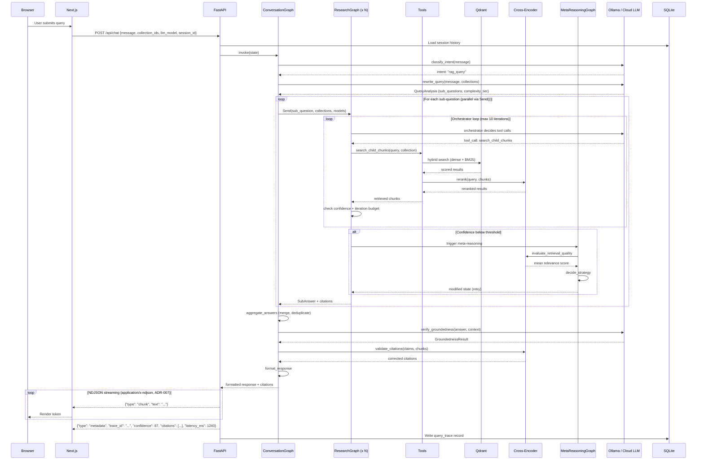

---

## Layer 2: ResearchGraph

**File**: `backend/agent/research_graph.py`

One ResearchGraph instance is spawned per sub-question via `Send()`. Instances run concurrently. Each instance manages its own tool-call loop with deduplication and safety limits.

### Nodes

| Node | Responsibility | Reads from State | Writes to State | Side Effects |
|------|---------------|------------------|-----------------|-------------|
| `orchestrator` | Decide which tool(s) to call next based on current retrieved context | `sub_question`, `retrieved_chunks`, `tool_call_count`, `iteration_count` | `pending_tool_calls` (internal) | LLM call |
| `tools` | Execute the chosen tool call(s), update state with results | `pending_tool_calls`, `retrieval_keys` | `retrieved_chunks`, `retrieval_keys`, `tool_call_count` | Qdrant search, cross-encoder |
| `should_compress_context` | Check token count against model-appropriate tokenizer | `retrieved_chunks`, `llm_model` | N/A (routing decision) | Token counting |
| `compress_context` | Summarize retrieved chunks when context window is approached | `retrieved_chunks` | `retrieved_chunks` (compressed), `context_compressed` | LLM call |
| `fallback_response` | Generate graceful "insufficient information" response when tools exhausted | `sub_question`, `retrieved_chunks` | `answer` | None |
| `collect_answer` | Package final answer + citations for return to ConversationGraph | `sub_question`, `retrieved_chunks`, `answer` | `answer`, `citations`, `confidence_score` | None |

### Available Tools

| Tool | Description | Input | Output | Side Effects |
|------|-------------|-------|--------|-------------|
| `search_child_chunks` | Hybrid dense+BM25 search in Qdrant on child chunk collection | `query: str, collection: str, top_k: int, filters: Optional[dict]` | `List[RetrievedChunk]` | Qdrant search + cross-encoder rerank |
| `retrieve_parent_chunks` | Fetch parent chunks from SQLite by parent_id list | `parent_ids: List[str]` | `List[ParentChunk]` | SQLite read |
| `cross_encoder_rerank` | Score (query, chunk) pairs with cross-encoder, return ranked list | `query: str, chunks: List[RetrievedChunk], top_k: int` | `List[RetrievedChunk]` (reranked) | Cross-encoder inference |
| `filter_by_collection` | Constrain search to a named collection | `collection_name: str` | State modification | None |
| `filter_by_metadata` | Apply Qdrant payload filter (doc_type, page range, source_file) | `filters: dict` | State modification | None |
| `semantic_search_all_collections` | Fan-out search across all enabled collections simultaneously | `query: str, top_k: int` | `List[RetrievedChunk]` (merged, normalized) | Qdrant multi-collection search |

### Orchestrator Prompt Template

```python
ORCHESTRATOR_SYSTEM = """You are a research orchestrator for a RAG system. Your goal is to
find the best evidence to answer the given sub-question.

Available tools:
{tool_descriptions}

Already retrieved chunks (count: {chunk_count}):
{chunk_summaries}

Rules:
1. Call search_child_chunks first with the sub-question as the query
2. If initial results are insufficient, try rephrasing the query
3. Use filter_by_metadata to narrow results if you get too many irrelevant chunks
4. Use retrieve_parent_chunks to get full context for promising child chunks
5. Stop when you have enough evidence OR when you've exhausted useful search angles
6. Never repeat the same search query + collection combination

Iteration: {iteration} / {max_iterations}
Tool calls used: {tool_call_count} / {max_tool_calls}
"""

ORCHESTRATOR_USER = """Sub-question: {sub_question}
Target collections: {collections}
Current confidence: {confidence_score}
"""
```

### Loop Control

The orchestrator iterates until one of these conditions is met:

- `MAX_ITERATIONS = 10` total loop iterations reached
- `MAX_TOOL_CALLS = 8` total tool calls reached
- Orchestrator determines answer is sufficient (confidence above threshold)
- No new tool calls are generated (tool exhaustion)

**Deduplication** is maintained via `retrieval_keys: Set[str]`. The key is `f"{query_normalized}:{parent_id}"`. Any (query, parent chunk) pair already seen in this ResearchGraph instance is skipped, preventing redundant embedding calls and duplicate citations.

**Tokenizer selection**: The system uses the appropriate tokenizer for the active embedding/LLM model. For Ollama models, token counting uses `tiktoken` approximation or the model's own tokenizer endpoint — not the GPT-specific `cl100k_base` encoding, which is invalid for non-GPT models.

### State Schema

```python
class ResearchState(TypedDict):
    sub_question: str
    session_id: str
    selected_collections: List[str]
    llm_model: str
    embed_model: str
    retrieved_chunks: List[RetrievedChunk]
    retrieval_keys: Set[str]
    tool_call_count: int
    iteration_count: int
    confidence_score: float
    answer: Optional[str]
    citations: List[Citation]
    context_compressed: bool
```

---

## Layer 3: MetaReasoningGraph

**File**: `backend/agent/meta_reasoning_graph.py`

The MetaReasoningGraph is the primary differentiator of The Embedinator. It is triggered when the ResearchGraph has exhausted its iteration budget without reaching confidence threshold. Rather than falling back immediately, the system enters a meta-reasoning phase to diagnose the retrieval failure and attempt recovery.

### Trigger Condition

```python
if (state["iteration_count"] >= MAX_ITERATIONS or
    state["tool_call_count"] >= MAX_TOOL_CALLS) and
   state["confidence_score"] < CONFIDENCE_THRESHOLD:
    # Route to MetaReasoningGraph
```

### Nodes

| Node | Responsibility | Reads from State | Writes to State | Side Effects |
|------|---------------|------------------|-----------------|-------------|
| `generate_alternative_queries` | Produce rephrased, expanded, or simplified variants of the original sub-question | `sub_question`, `retrieved_chunks` | `alternative_queries` | LLM call |
| `evaluate_retrieval_quality` | Run cross-encoder to score all retrieved chunks against the query; compute mean relevance | `sub_question`, `retrieved_chunks` | `mean_relevance_score`, `chunk_relevance_scores` | Cross-encoder inference |
| `decide_strategy` | Based on mean relevance and chunk count, select a recovery strategy | `mean_relevance_score`, `chunk_relevance_scores`, `meta_attempt_count` | `recovery_strategy`, `modified_state` | None |
| `report_uncertainty` | If no strategy recovers, generate an honest "I don't know" response with explanation | `sub_question`, `mean_relevance_score`, `recovery_attempts` | `answer`, `uncertainty_reason` | None |

### MetaReasoningGraph Decision Flowchart

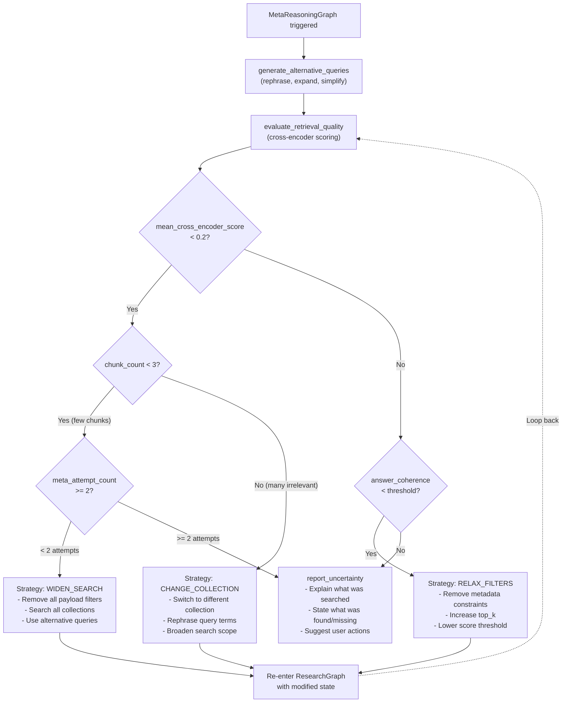

### Strategy Decision Logic

```
mean_cross_encoder_score < 0.2 AND chunk_count < 3:
    -> widen search (relax filters, search all collections)

mean_cross_encoder_score < 0.2 AND chunk_count >= 3:
    -> chunks retrieved but irrelevant -> change collection or rephrase query

mean_cross_encoder_score >= 0.2 AND answer_coherence < threshold:
    -> relax metadata filters (less restrictive payload filtering)

all strategies failed (detected by attempt counter):
    -> report_uncertainty with specific failure reason
```

The MetaReasoningGraph retries with the new strategy by re-entering the ResearchGraph with modified state. A `meta_attempt_count` prevents infinite recursion — maximum two meta-reasoning attempts before `report_uncertainty` is forced.

### Prompt Templates

**generate_alternative_queries prompt:**

```python
GENERATE_ALT_QUERIES_SYSTEM = """The retrieval system failed to find sufficient evidence
for the following question. Generate 3 alternative query formulations that might
retrieve better results.

Strategies to try:
1. Rephrase using different terminology (synonyms, technical vs. plain language)
2. Break into simpler sub-components
3. Broaden the scope (remove specific constraints)

Original question: {sub_question}
Retrieved chunks (low relevance): {chunk_summaries}
"""
```

**report_uncertainty prompt:**

```python
REPORT_UNCERTAINTY_SYSTEM = """Generate an honest response explaining that the system
could not find sufficient evidence to answer the question.

Include:
1. What collections were searched
2. What was found (if anything partially relevant)
3. Why the results were insufficient
4. Suggestions for the user (different query, different collection, upload more docs)

Do NOT fabricate an answer. Do NOT say "based on the available context" and then guess.
"""
```

### State Schema

```python
class MetaReasoningState(TypedDict):
    sub_question: str
    retrieved_chunks: List[RetrievedChunk]
    alternative_queries: List[str]
    mean_relevance_score: float
    chunk_relevance_scores: List[float]
    meta_attempt_count: int
    recovery_strategy: Optional[str]
    modified_state: Optional[dict]
    answer: Optional[str]
    uncertainty_reason: Optional[str]
```

---

## Accuracy, Precision & Robustness Enhancements

These cross-cutting mechanisms operate across the agent layers to ensure the system produces reliable, well-grounded answers and degrades gracefully under failure.

### Grounded Answer Verification (GAV)

**Location**: `backend/agent/nodes.py` — `verify_groundedness` node in ConversationGraph, between `aggregate_answers` and `format_response`.

After the agent generates an answer, a verification pass checks every factual claim against the retrieved context. This catches the most damaging RAG failure mode: confident, cited, wrong answers.

**Implementation approach:**

```python
# Verification prompt (low-temperature, separate LLM call)
VERIFY_PROMPT = """Given ONLY the retrieved context below, evaluate each claim
in the proposed answer. For each claim, respond with:
- SUPPORTED: the context contains evidence for this claim
- UNSUPPORTED: no evidence found in the retrieved context
- CONTRADICTED: the context contradicts this claim

Retrieved Context:
{context}

Proposed Answer:
{answer}
"""
```

**Behavior:**
- Claims marked `SUPPORTED` pass through unchanged
- Claims marked `UNSUPPORTED` are annotated with `[unverified]` in the final answer
- Claims marked `CONTRADICTED` are removed and a note is appended explaining the contradiction
- If >50% of claims are unsupported, the answer is flagged and the user is warned that evidence was insufficient

**Structured output schema:**

```python
class ClaimVerification(BaseModel):
    claim: str
    verdict: Literal["supported", "unsupported", "contradicted"]
    evidence_chunk_id: Optional[str]   # which chunk supports/contradicts
    explanation: str                    # brief reasoning

class GroundednessResult(BaseModel):
    verifications: List[ClaimVerification]
    overall_grounded: bool             # True if >50% claims supported
    confidence_adjustment: float       # modifier applied to confidence score
```

This node adds one additional LLM call per answer but eliminates the most common RAG trust failure.

---

### Citation-Chunk Alignment Validation

**Location**: integrated into the `validate_citations` node in ConversationGraph.

Each inline citation `[1]`, `[2]` etc. is checked against its source chunk. If the cited chunk does not contain the information attributed to it, the citation is corrected (remapped to the actual supporting chunk) or removed.

**Why this matters:** Without validation, the LLM can generate "phantom citations" — references that look authoritative but point to chunks that contain unrelated information. Users trust inline citations implicitly. Invalid citations are worse than no citations.

**Process:**
1. For each citation in the answer, extract the claim and the referenced chunk
2. Run a lightweight cross-encoder score: `cross_encoder.predict([(claim_text, chunk_text)])`
3. If score < `CITATION_ALIGNMENT_THRESHOLD` (default 0.3), the citation is invalid
4. Invalid citations are either remapped to the highest-scoring chunk or stripped

**Implementation detail:**

```python
async def validate_citations(
    state: ConversationState,
    reranker: CrossEncoder,
) -> ConversationState:
    """Verify each citation points to a chunk that supports the claim."""
    corrected_citations: List[Citation] = []

    for citation in state["citations"]:
        claim_text = citation.claim_text
        chunk_text = citation.chunk.text

        score = reranker.predict([(claim_text, chunk_text)])[0]

        if score >= CITATION_ALIGNMENT_THRESHOLD:
            corrected_citations.append(citation)
        else:
            # Try to remap to the best matching chunk
            all_chunks = [sa.chunks for sa in state["sub_answers"]]
            flat_chunks = [c for sublist in all_chunks for c in sublist]
            pairs = [(claim_text, c.text) for c in flat_chunks]
            scores = reranker.predict(pairs)
            best_idx = int(scores.argmax())
            best_score = scores[best_idx]

            if best_score >= CITATION_ALIGNMENT_THRESHOLD:
                citation.chunk = flat_chunks[best_idx]
                corrected_citations.append(citation)
            # else: citation is dropped entirely

    state["citations"] = corrected_citations
    return state
```

---

### Query-Adaptive Retrieval Depth

**Location**: `backend/agent/nodes.py` — integrated into the `rewrite_query` node, extending `QueryAnalysis`.

Not all queries need the same retrieval effort. A simple factoid question ("What port does the WSAA service use?") needs 3-5 chunks and 2 iterations. A complex analytical question ("Compare the authentication flows across all web services") needs 20-30 chunks and the full iteration budget.

**Extended schema:**

```python
class QueryAnalysis(BaseModel):
    is_clear: bool
    sub_questions: List[str]
    clarification_needed: Optional[str]
    collections_hint: List[str]
    complexity_tier: Literal["factoid", "lookup", "comparison", "analytical", "multi_hop"]
```

**Tier-based parameters:**

| Tier | top_k | max_iterations | max_tool_calls | Confidence Threshold | Description |
|------|-------|---------------|----------------|---------------------|-------------|
| `factoid` | 5 | 3 | 3 | 0.7 | Single fact retrieval |
| `lookup` | 10 | 5 | 5 | 0.6 | Specific document section |
| `comparison` | 15 | 7 | 6 | 0.55 | Cross-document comparison |
| `analytical` | 25 | 10 | 8 | 0.5 | Deep analysis, synthesis |
| `multi_hop` | 30 | 10 | 8 | 0.45 | Chained reasoning, multiple evidence steps |

**Benefits:**
- Simple queries resolve 2-3x faster (fewer unnecessary tool calls)
- Complex queries get the depth they need without hitting premature limits
- Token usage drops significantly on average workloads (most queries are factoid/lookup)

---

### Computed Confidence Scoring

**Location**: `backend/agent/nodes.py` — `collect_answer` node in ResearchGraph.

The `confidence_score` in `ResearchState` must be computed from measurable signals, not LLM self-assessment. LLMs consistently rate themselves 8-9/10 regardless of actual answer quality.

**Confidence formula:**

```python
def compute_confidence(state: ResearchState) -> float:
    # 1. Retrieval relevance: mean cross-encoder score of top-k chunks used
    retrieval_score = mean(state.rerank_scores[:state.top_k_used])

    # 2. Coverage: what fraction of sub-questions have at least one supporting chunk?
    coverage_score = chunks_with_support / total_sub_questions

    # 3. Consistency: do retrieved chunks agree with each other?
    #    (low if chunks contradict — detected by cross-encoder on chunk pairs)
    consistency_score = 1.0 - contradiction_ratio

    # 4. Depth: how many unique parent chunks were used? (more = broader evidence)
    depth_score = min(unique_parents_used / EXPECTED_DEPTH, 1.0)

    # Weighted combination
    confidence = (
        0.35 * retrieval_score +
        0.30 * coverage_score +
        0.20 * consistency_score +
        0.15 * depth_score
    )
    return round(confidence, 3)
```

This score drives two decisions:
- **MetaReasoningGraph trigger**: if `confidence < CONFIDENCE_THRESHOLD` after iterations are exhausted
- **User-facing confidence indicator**: displayed in the chat UI as a visual signal (green/yellow/red)

**Confidence display mapping:**

| Score Range | Color | Label | Icon |
|------------|-------|-------|------|
| 0.7 - 1.0 | Green | High confidence | Solid circle |
| 0.4 - 0.69 | Yellow | Moderate confidence | Half circle |
| 0.0 - 0.39 | Red | Low confidence | Empty circle |

---

### Circuit Breaker & Retry

**Location**: `backend/storage/qdrant_client.py`, `backend/ingestion/embedder.py` — wraps all external service calls.

All HTTP calls to Ollama and Qdrant use a circuit breaker pattern to prevent cascading failures and long hangs.

**Implementation using `tenacity`:**

```python
from tenacity import retry, stop_after_attempt, wait_exponential_jitter, CircuitBreakerError

# Retry: 3 attempts, exponential backoff (1s -> 2s -> 4s) with +/-0.5s jitter
@retry(
    stop=stop_after_attempt(3),
    wait=wait_exponential_jitter(initial=1, max=10, jitter=0.5),
    reraise=True
)
async def call_ollama_embed(text: str, model: str) -> List[float]:
    ...
```

**Circuit breaker state transitions:**

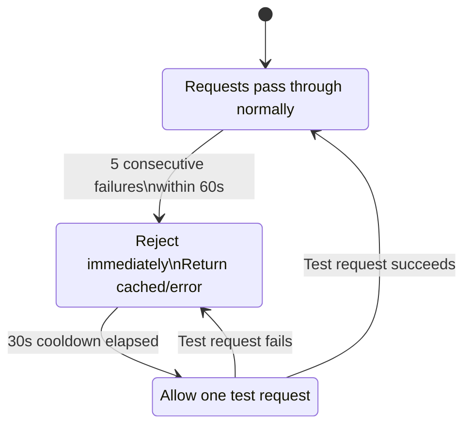

**Graceful degradation modes:**

| Scenario | Behavior |
|----------|----------|
| Ollama down during **chat** | Return error: "Inference service unavailable. Check Ollama status." with self-diagnosis link to `/observability` |
| Ollama down during **ingestion** | Pause ingestion job, set status to `paused`, retry automatically when circuit closes |
| Qdrant unreachable during **chat** | Return error with last-known collection status from SQLite |
| Qdrant unreachable during **ingestion** | Buffer upserts in-memory (up to 1000 points), flush when connection recovers |

---

### Embedding Integrity Validation

**Location**: `backend/ingestion/embedder.py` — post-embedding check before Qdrant upsert.

Before any vector reaches Qdrant, it passes through validation:

```python
def validate_embedding(embedding: List[float], expected_dim: int) -> bool:
    if len(embedding) != expected_dim:
        return False                       # dimension mismatch
    if any(math.isnan(x) for x in embedding):
        return False                       # NaN detected
    if all(x == 0.0 for x in embedding):
        return False                       # zero vector
    magnitude = math.sqrt(sum(x*x for x in embedding))
    if magnitude < 1e-6:
        return False                       # near-zero magnitude
    return True
```

**On validation failure:**
- The chunk is logged to `ingestion_jobs.error_log` with the failure reason
- The chunk is skipped (not upserted) — one bad embedding does not abort the batch
- A summary count of skipped chunks is reported in the ingestion job status

This prevents silent corruption of the vector index, which in both analyzed reference systems would go undetected until queries returned garbage results.

---

## Ingestion Pipeline

**File**: `backend/ingestion/pipeline.py`

### Ingestion Pipeline Sequence Diagram

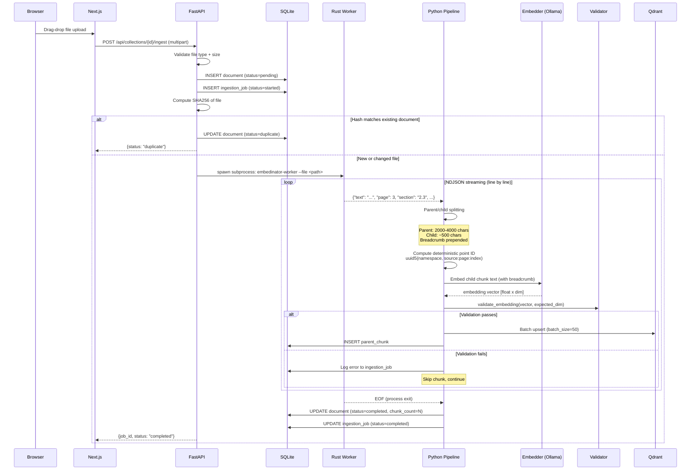

### Flow Diagram

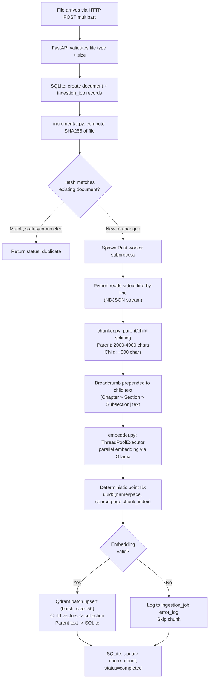

### Incremental Ingestion

The `incremental.py` module maintains SHA256 hashes in the `documents` table. On every ingest request:

1. Compute SHA256 of the uploaded file.
2. Query `documents` for matching `file_hash` in the same collection.
3. If match found and status is `completed`, return early with `status=duplicate`.
4. If match found and status is `failed`, allow re-ingestion (retry semantics).
5. If file changed (hash differs), delete old Qdrant points by source filter, then re-ingest.

This makes re-ingestion idempotent and safe for scheduled batch pipelines.

### Worked Example: 200-Page PDF Ingestion

**Input**: A 200-page technical PDF (average 3000 chars/page = 600,000 chars total)

**Step 1: Rust Worker Parsing**
- Rust worker extracts text page-by-page
- Output: approximately 600 NDJSON lines (roughly 3 chunks per page, each 800-1200 chars of raw text)
- Time: ~2-5 seconds for 200 pages

**Step 2: Parent/Child Splitting**
- Parent chunk target: 3000 chars -> approximately 200 parent chunks (one per page)
- Child chunk target: 500 chars -> approximately 1200 child chunks (6 children per parent on average)
- Each child gets breadcrumb prefix (adds ~50 chars)

**Step 3: Embedding**
- 1200 child chunks to embed
- Batch size: 16 chunks per Ollama API call
- Embedding calls: 1200 / 16 = 75 API calls
- At ~100ms per call with `nomic-embed-text`: ~7.5 seconds
- With ThreadPoolExecutor (4 workers): ~2 seconds wall clock

**Step 4: Qdrant Upsert**
- 1200 points to upsert
- Batch size: 50 points per upsert call
- Upsert calls: 1200 / 50 = 24 API calls
- At ~20ms per call: ~0.5 seconds

**Step 5: SQLite Writes**
- 200 parent chunk INSERT statements (batched in transaction)
- Time: <100ms

**Total estimated time**: ~10-15 seconds for a 200-page PDF

### Incremental Re-Ingestion: 1 Page Changed

When a user re-uploads the same PDF with one page modified:

1. SHA256 hash differs from stored hash -> triggers re-ingestion
2. Old Qdrant points deleted via source_file filter: `DELETE points WHERE source_file = "document.pdf"`
3. Full re-parse and re-embed (the Rust worker cannot diff pages; it re-parses the whole file)
4. Deterministic UUID5 point IDs mean unchanged chunks get the same IDs -> Qdrant upserts overwrite in place
5. Net result: only the changed page produces genuinely new vectors; all other vectors are identical overwrites

**Optimization note**: Full re-parse is acceptable because Rust parsing is fast (2-5 seconds for 200 pages). The bottleneck is embedding, which could be optimized with per-chunk content hashing in a future version. For now, the simplicity of "delete all, re-ingest all" with deterministic IDs is the correct trade-off.

---

## Rust Ingestion Worker

**Binary**: `ingestion-worker/` (Cargo workspace)

The Rust worker handles the CPU-intensive phase of document parsing. Python's GIL and PyMuPDF's C bindings are replaced by a native Rust binary that streams parsed chunks to stdout as NDJSON, one JSON object per line.

### Why Rust

- PDF parsing is CPU-bound and benefits from Rust's zero-cost abstractions and absence of GIL.
- Streaming NDJSON output decouples parsing speed from embedding speed — Python can begin embedding chunk N while Rust is still parsing chunk N+5.
- The binary is a standalone artifact with no Python runtime dependency, simplifying deployment.
- Measured throughput: Rust PDF extraction is 5-20x faster than PyMuPDF for large documents (100+ pages).

### CLI Interface

```
embedinator-worker --file <path> [--type <pdf|markdown|text|code>]

Options:
  --file   Path to the input file (required)
  --type   Document type (optional; auto-detected from extension if omitted)

Output:
  NDJSON stream to stdout, one chunk per line.
  Errors and diagnostics to stderr.
  Exit code 0 on success, non-zero on failure.
```

### Output Schema (per line)

```json
{
  "text": "The chunk text content...",
  "page": 3,
  "section": "2.3 Authentication",
  "heading_path": ["Chapter 2: API Reference", "2.3 Authentication"],
  "doc_type": "prose",
  "chunk_profile": "default",
  "chunk_index": 7
}
```

### Module Structure

| File | Responsibility |
|------|---------------|
| `main.rs` | CLI argument parsing, file type dispatch, stdout NDJSON serialization |
| `pdf.rs` | PDF text extraction using `pdfium-render` or `pdf-extract` crate; page-by-page iteration |
| `markdown.rs` | Markdown parsing with `pulldown-cmark`; heading-boundary chunk splitting at H1/H2/H3 |
| `text.rs` | Plain text chunking; paragraph and sentence boundary detection |
| `heading_tracker.rs` | Stateful `HeadingTracker` struct; maintains Chapter > Section > Subsection hierarchy |
| `types.rs` | `Chunk` struct, `DocType` enum, serde serialization |

### Cargo.toml Dependencies

```toml
[dependencies]
serde = { version = "1", features = ["derive"] }
serde_json = "1"
pulldown-cmark = "0.12"
pdf-extract = "0.8"          # fallback; pdfium-render preferred if pdfium bundled
clap = { version = "4", features = ["derive"] }
regex = "1"
```

### Error Handling

The Rust worker communicates errors via:
- **stderr**: Human-readable error messages (parsing failures, file not found)
- **Exit code**: 0 on success, 1 on file error, 2 on parse error
- **Partial output**: If parsing fails mid-document, all successfully parsed chunks are still streamed. The Python pipeline reads what it can and logs the error.

---

## Storage Architecture

### Qdrant Collections

Each user-defined collection maps to one Qdrant collection. Child chunks are stored as vectors. Parent chunks are stored in SQLite (see below).

**Vector payload schema (per child chunk point):**

```json
{
  "text": "The raw child chunk text (without breadcrumb prefix)",
  "parent_id": "550e8400-e29b-41d4-a716-446655440000",
  "breadcrumb": "Chapter 2 > 2.3 Authentication",
  "source_file": "arca_api_spec_v2.pdf",
  "page": 3,
  "chunk_index": 7,
  "doc_type": "prose",
  "chunk_hash": "a3f5c2d8...",
  "embedding_model": "nomic-embed-text",
  "collection_name": "arca-specs",
  "ingested_at": "2026-03-03T10:00:00Z"
}
```

**Hybrid retrieval configuration:**

Qdrant named vectors are configured with:
- `dense` vector: from Ollama embedding model (e.g., `nomic-embed-text`, 768 dims)
- `sparse` vector: BM25 computed via `qdrant-client` sparse vector support

Both are searched in a single `search` call with configurable fusion weights. Score normalization is applied per-collection before merging multi-collection results (inherited from GRAVITEA min-max normalization).

**Qdrant collection initialization:**

```python
from qdrant_client.models import (
    VectorParams, SparseVectorParams, Distance,
    SparseIndexParams, BM25Modifier,
)

async def create_qdrant_collection(
    client: QdrantClient,
    collection_name: str,
    dense_dim: int,
) -> None:
    await client.create_collection(
        collection_name=collection_name,
        vectors_config={
            "dense": VectorParams(
                size=dense_dim,
                distance=Distance.COSINE,
            ),
        },
        sparse_vectors_config={
            "sparse": SparseVectorParams(
                modifier=BM25Modifier.IDF,
            ),
        },
    )
```

### Data Model ER Diagram

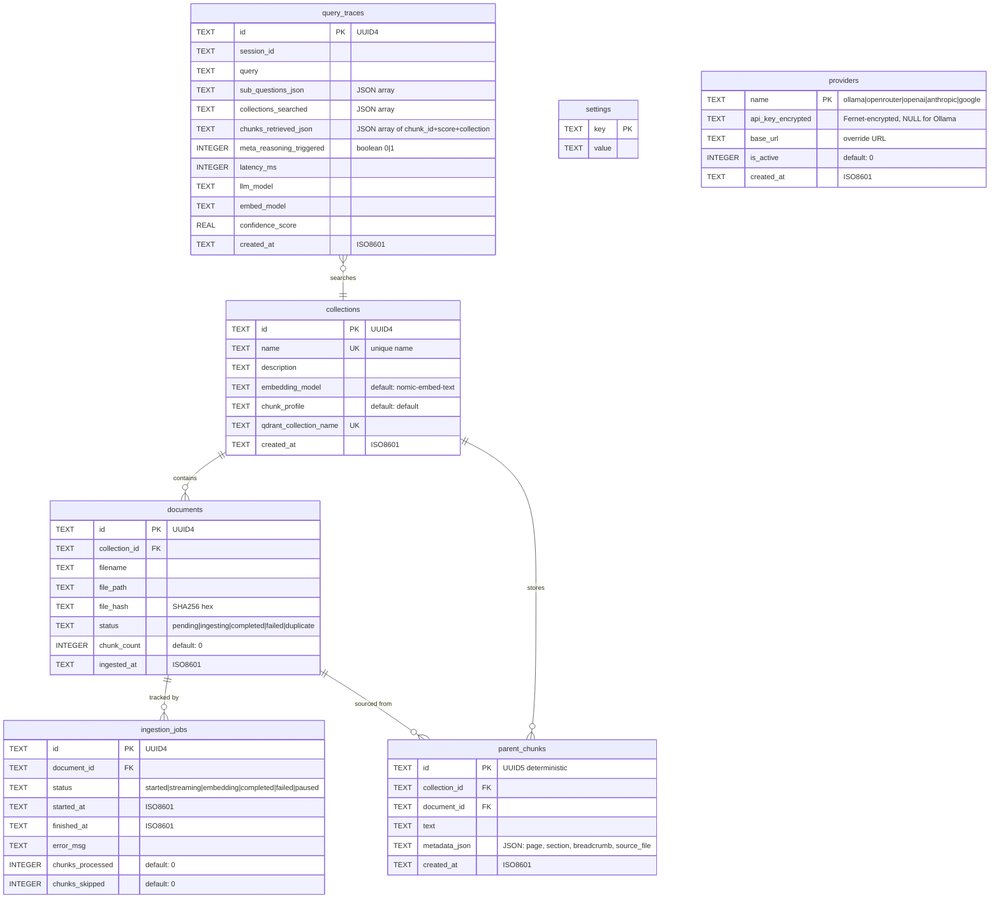

### Qdrant-to-SQLite Relationship

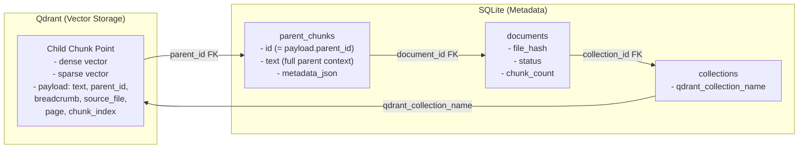

### SQLite Schema

**File**: `data/embedinator.db`

```sql
-- Collection registry
CREATE TABLE collections (
    id          TEXT PRIMARY KEY,   -- UUID4
    name        TEXT NOT NULL UNIQUE,
    description TEXT,
    embedding_model     TEXT NOT NULL DEFAULT 'nomic-embed-text',
    chunk_profile       TEXT NOT NULL DEFAULT 'default',
    qdrant_collection_name  TEXT NOT NULL UNIQUE,
    created_at  TEXT NOT NULL       -- ISO8601
);

-- Document tracking
CREATE TABLE documents (
    id              TEXT PRIMARY KEY,   -- UUID4
    collection_id   TEXT NOT NULL REFERENCES collections(id),
    filename        TEXT NOT NULL,
    file_path       TEXT NOT NULL,
    file_hash       TEXT NOT NULL,      -- SHA256 hex
    status          TEXT NOT NULL,      -- pending|ingesting|completed|failed|duplicate
    chunk_count     INTEGER DEFAULT 0,
    ingested_at     TEXT,               -- ISO8601, set on completion
    UNIQUE(collection_id, file_hash)
);

-- Ingestion job tracking
CREATE TABLE ingestion_jobs (
    id              TEXT PRIMARY KEY,   -- UUID4
    document_id     TEXT NOT NULL REFERENCES documents(id),
    status          TEXT NOT NULL,      -- started|streaming|embedding|completed|failed|paused
    started_at      TEXT NOT NULL,
    finished_at     TEXT,
    error_msg       TEXT,
    chunks_processed INTEGER DEFAULT 0,
    chunks_skipped  INTEGER DEFAULT 0
);

-- Parent chunk store (replaces JSON file store)
CREATE TABLE parent_chunks (
    id              TEXT PRIMARY KEY,   -- UUID5 deterministic
    collection_id   TEXT NOT NULL REFERENCES collections(id),
    document_id     TEXT NOT NULL REFERENCES documents(id),
    text            TEXT NOT NULL,
    metadata_json   TEXT NOT NULL,      -- JSON: page, section, breadcrumb, source_file
    created_at      TEXT NOT NULL
);
CREATE INDEX idx_parent_chunks_collection ON parent_chunks(collection_id);
CREATE INDEX idx_parent_chunks_document ON parent_chunks(document_id);

-- Query trace log (observability)
CREATE TABLE query_traces (
    id                      TEXT PRIMARY KEY,
    session_id              TEXT NOT NULL,
    query                   TEXT NOT NULL,
    sub_questions_json      TEXT,       -- JSON array of decomposed questions
    collections_searched    TEXT,       -- JSON array of collection names
    chunks_retrieved_json   TEXT,       -- JSON array of {chunk_id, score, collection}
    meta_reasoning_triggered INTEGER DEFAULT 0,  -- boolean
    latency_ms              INTEGER,
    llm_model               TEXT,
    embed_model             TEXT,
    confidence_score        REAL,
    created_at              TEXT NOT NULL
);
CREATE INDEX idx_traces_session ON query_traces(session_id);
CREATE INDEX idx_traces_created ON query_traces(created_at);

-- System settings key-value store
CREATE TABLE settings (
    key     TEXT PRIMARY KEY,
    value   TEXT NOT NULL
);

-- Provider registry
CREATE TABLE providers (
    name       TEXT PRIMARY KEY,     -- 'ollama', 'openrouter', 'openai', 'anthropic', 'google'
    api_key_encrypted TEXT,          -- Fernet-encrypted API key (NULL for Ollama)
    base_url   TEXT,                 -- Override URL (e.g., Ollama non-default endpoint)
    is_active  INTEGER DEFAULT 0,   -- 1 if provider is configured and reachable
    created_at TEXT DEFAULT (datetime('now'))
);

-- Pragma for concurrent read performance
PRAGMA journal_mode=WAL;
PRAGMA foreign_keys=ON;
```

**Why SQLite over PostgreSQL**: Zero-config self-hosted deployment. WAL journal mode allows concurrent readers with a single writer. Single-file backup (`cp embedinator.db embedinator.db.bak`). For a local RAG system with one active user, SQLite's write serialization is not a constraint. Adding PostgreSQL would require a separate service, credentials management, and migration tooling — complexity with no benefit at this scale.

---

## API Reference

**Base URL**: `http://localhost:8000/api`

### Collections

| Method | Path | Body / Params | Response | Status Codes |
|--------|------|---------------|----------|-------------|
| `GET` | `/collections` | -- | `List[CollectionSchema]` | 200 |
| `POST` | `/collections` | `CreateCollectionRequest` | `CollectionSchema` | 201, 400, 409 |
| `DELETE` | `/collections/{id}` | -- | `{status: "deleted"}` | 200, 404 |

**Pydantic schemas:**

```python
class CreateCollectionRequest(BaseModel):
    name: str = Field(..., min_length=1, max_length=100, pattern=r"^[a-z0-9][a-z0-9_-]*$")
    description: Optional[str] = Field(None, max_length=500)
    embedding_model: str = "nomic-embed-text"
    chunk_profile: str = "default"

class CollectionSchema(BaseModel):
    id: str
    name: str
    description: Optional[str]
    embedding_model: str
    chunk_profile: str
    qdrant_collection_name: str
    document_count: int
    total_chunks: int
    created_at: str
```

**Example: Create Collection**

```
POST /api/collections
Content-Type: application/json

{
  "name": "arca-specs",
  "description": "ARCA web service API specifications",
  "embedding_model": "nomic-embed-text"
}

--- Response 201 ---
{
  "id": "a1b2c3d4-...",
  "name": "arca-specs",
  "description": "ARCA web service API specifications",
  "embedding_model": "nomic-embed-text",
  "chunk_profile": "default",
  "qdrant_collection_name": "arca-specs",
  "document_count": 0,
  "total_chunks": 0,
  "created_at": "2026-03-03T10:00:00Z"
}
```

**Error responses:**

| Status | Condition | Body |
|--------|----------|------|
| 400 | Invalid name format | `{"detail": "Collection name must be lowercase alphanumeric with hyphens/underscores"}` |
| 409 | Name already exists | `{"detail": "Collection 'arca-specs' already exists"}` |
| 404 | Collection not found (DELETE) | `{"detail": "Collection not found"}` |

### Documents

| Method | Path | Body / Params | Response | Status Codes |
|--------|------|---------------|----------|-------------|
| `GET` | `/collections/{id}/documents` | -- | `List[DocumentSchema]` | 200, 404 |
| `POST` | `/collections/{id}/ingest` | multipart file | `IngestionResponse` | 202, 400, 404, 413 |
| `GET` | `/collections/{id}/ingest/{job_id}` | -- | `IngestionJobSchema` | 200, 404 |
| `DELETE` | `/collections/{id}/documents/{doc_id}` | -- | `{status: "deleted"}` | 200, 404 |

**Pydantic schemas:**

```python
class DocumentSchema(BaseModel):
    id: str
    collection_id: str
    filename: str
    file_hash: str
    status: Literal["pending", "ingesting", "completed", "failed", "duplicate"]
    chunk_count: int
    ingested_at: Optional[str]

class IngestionResponse(BaseModel):
    job_id: str
    document_id: str
    status: Literal["started", "duplicate"]

class IngestionJobSchema(BaseModel):
    id: str
    document_id: str
    status: Literal["started", "streaming", "embedding", "completed", "failed", "paused"]
    started_at: str
    finished_at: Optional[str]
    error_msg: Optional[str]
    chunks_processed: int
    chunks_skipped: int
```

**Example: Upload Document**

```
POST /api/collections/a1b2c3d4-.../ingest
Content-Type: multipart/form-data
File: arca_api_spec_v2.pdf

--- Response 202 ---
{
  "job_id": "e5f6g7h8-...",
  "document_id": "i9j0k1l2-...",
  "status": "started"
}
```

**Error responses:**

| Status | Condition | Body |
|--------|----------|------|
| 400 | Unsupported file type | `{"detail": "Unsupported file type '.exe'. Allowed: .pdf, .md, .txt, .py, .js, .ts, .rs, .go, .java"}` |
| 404 | Collection not found | `{"detail": "Collection not found"}` |
| 413 | File too large | `{"detail": "File exceeds maximum size of 100MB"}` |

### Chat

| Method | Path | Body / Params | Response | Status Codes |
|--------|------|---------------|----------|-------------|
| `POST` | `/chat` | `ChatRequest` | SSE stream | 200, 400, 503 |

**Pydantic schemas:**

```python
class ChatRequest(BaseModel):
    message: str = Field(..., min_length=1, max_length=10000)
    collection_ids: List[str] = Field(..., min_length=1)
    llm_model: str = "llama3.2"
    embed_model: str = "nomic-embed-text"
    session_id: Optional[str] = None  # auto-generated if omitted
```

**SSE event types emitted by `/api/chat`:**

```
data: {"type": "session", "session_id": "abc-123"}
data: {"type": "status", "node": "classify_intent"}
data: {"type": "status", "node": "rewrite_query", "sub_questions": ["q1", "q2"]}
data: {"type": "token", "content": "The "}
data: {"type": "token", "content": "answer"}
data: {"type": "citation", "index": 1, "chunk_id": "uuid", "source": "file.pdf", "page": 3, "breadcrumb": "Ch2 > 2.3"}
data: {"type": "meta_reasoning", "strategy": "widen_search", "attempt": 1}
data: {"type": "confidence", "score": 0.82, "level": "high"}
data: {"type": "groundedness", "supported": 4, "unsupported": 1, "contradicted": 0}
data: {"type": "done", "latency_ms": 1240, "trace_id": "xyz-456"}
data: {"type": "error", "message": "Inference service unavailable", "code": "OLLAMA_UNAVAILABLE"}
```

**Example: Chat Request**

```
POST /api/chat
Content-Type: application/json

{
  "message": "What authentication methods does the ARCA WSAA service support?",
  "collection_ids": ["a1b2c3d4-..."],
  "llm_model": "llama3.2",
  "session_id": "existing-session-id"
}

--- Response 200 (SSE stream) ---
data: {"type": "session", "session_id": "existing-session-id"}
data: {"type": "status", "node": "rewrite_query", "sub_questions": ["What authentication methods does WSAA support?", "How is WSAA authentication configured?"]}
data: {"type": "token", "content": "The WSAA service supports "}
data: {"type": "token", "content": "certificate-based authentication"}
data: {"type": "citation", "index": 1, "chunk_id": "550e8400-...", "source": "arca_api_spec_v2.pdf", "page": 12, "breadcrumb": "Ch3 > 3.1 Authentication"}
data: {"type": "token", "content": " using X.509 certificates [1]."}
data: {"type": "confidence", "score": 0.85, "level": "high"}
data: {"type": "done", "latency_ms": 2340, "trace_id": "trace-789"}
```

### Models

| Method | Path | Response | Status Codes |
|--------|------|----------|-------------|
| `GET` | `/models/llm` | `List[ModelInfo]` | 200, 503 |
| `GET` | `/models/embed` | `List[ModelInfo]` | 200, 503 |

```python
class ModelInfo(BaseModel):
    name: str
    provider: str               # "ollama", "openrouter", etc.
    size: Optional[str]         # "7B", "13B", etc.
    quantization: Optional[str] # "Q4_K_M", "Q8_0", etc.
    context_length: Optional[int]
    dims: Optional[int]         # embedding dimensions (embed models only)
```

### Providers

| Method | Path | Body | Response | Status Codes |
|--------|------|------|----------|-------------|
| `GET` | `/providers` | -- | `List[ProviderSchema]` | 200 |
| `PUT` | `/providers/{name}/key` | `{"api_key": "sk-..."}` | `{status: "saved"}` | 200, 400 |
| `DELETE` | `/providers/{name}/key` | -- | `{status: "deleted"}` | 200, 404 |
| `GET` | `/providers/{name}/models` | -- | `List[ModelInfo]` | 200, 503 |

```python
class ProviderSchema(BaseModel):
    name: str
    is_active: bool
    has_key: bool         # True if encrypted key stored (never returns the key)
    base_url: Optional[str]
    model_count: int      # number of available models
```

### Settings

| Method | Path | Body | Response | Status Codes |
|--------|------|------|----------|-------------|
| `GET` | `/settings` | -- | `SettingsSchema` | 200 |
| `PUT` | `/settings` | `SettingsSchema` (partial) | `SettingsSchema` | 200, 400 |

```python
class SettingsSchema(BaseModel):
    default_llm_model: str
    default_embed_model: str
    default_provider: str
    parent_chunk_size: int
    child_chunk_size: int
    max_iterations: int
    max_tool_calls: int
    confidence_threshold: float
    groundedness_check_enabled: bool
    citation_alignment_threshold: float
```

### Observability

| Method | Path | Params | Response | Status Codes |
|--------|------|--------|----------|-------------|
| `GET` | `/traces` | `?page=1&limit=50&session_id=` | Paginated `List[QueryTraceSchema]` | 200 |
| `GET` | `/traces/{id}` | -- | `QueryTraceDetailSchema` | 200, 404 |
| `GET` | `/health` | -- | `HealthResponse` | 200 |
| `GET` | `/stats` | -- | `SystemStatsSchema` | 200 |

```python
class QueryTraceSchema(BaseModel):
    id: str
    session_id: str
    query: str
    collections_searched: List[str]
    meta_reasoning_triggered: bool
    latency_ms: int
    llm_model: str
    confidence_score: Optional[float]
    created_at: str

class QueryTraceDetailSchema(QueryTraceSchema):
    sub_questions: List[str]
    chunks_retrieved: List[dict]  # [{chunk_id, score, collection, source_file}]
    embed_model: str

class HealthResponse(BaseModel):
    qdrant: Literal["ok", "error"]
    ollama: Literal["ok", "error"]
    sqlite: Literal["ok", "error"]
    qdrant_latency_ms: Optional[int]
    ollama_latency_ms: Optional[int]
    timestamp: str

class SystemStatsSchema(BaseModel):
    total_collections: int
    total_documents: int
    total_chunks: int
    total_queries: int
    avg_latency_ms: float
    avg_confidence: float
    meta_reasoning_rate: float  # percentage of queries triggering meta-reasoning
```

---

## Frontend Architecture

**Framework**: Next.js 14 (App Router), React 19, TypeScript 5.7
**Port**: 3000
**API communication**: `fetch` + `EventSource` for SSE, SWR for data fetching

### Frontend Component Tree

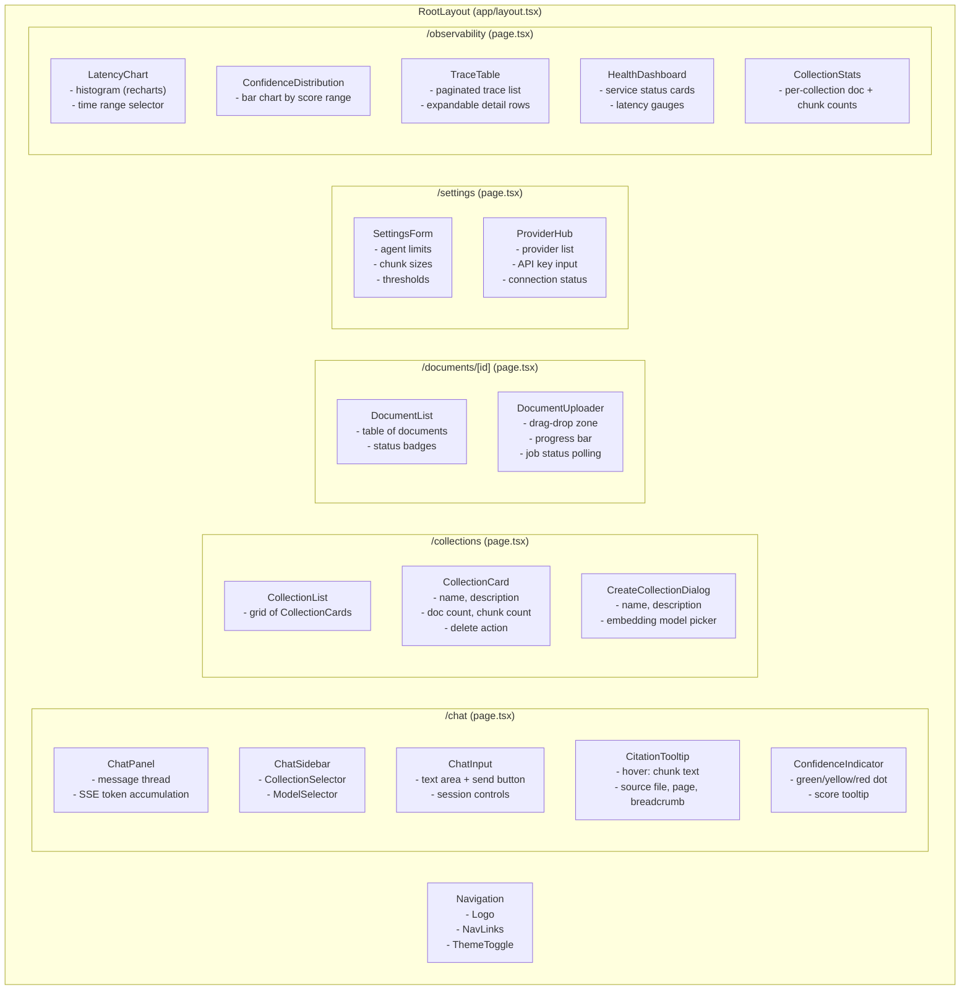

### Pages

| Route | Component | Purpose |
|-------|-----------|---------|
| `/chat` | `ChatPanel` + `ModelSelector` | Main RAG interface with streaming response, citation tooltips, collection multi-select |
| `/collections` | `CollectionCard` + `DocumentUploader` | Create/delete collections, upload files, view ingestion job progress |
| `/documents/[collectionId]` | Document list | Per-collection document status, remove documents |
| `/settings` | Settings form + Provider Hub | Ollama endpoints, default models, chunk profiles, agent safety limits, provider API keys |
| `/observability` | Latency chart + trace table | Query latency histogram, collection sizes, recent query traces with tool call breakdown, confidence distribution |

### Page Wireframes

**`/chat` Page:**

```
+------------------------------------------+------------------------------+
| [Logo] Chat | Collections | Docs | ...   |                              |
+------------------------------------------+                              |
|                                          | Collections:                 |
|  [ User message bubble ]                 |   [x] arca-specs             |
|                                          |   [ ] internal-docs          |
|  [ Assistant response bubble      ]      |   [ ] code-reference         |
|  [ with inline citations [1] [2] ]       |                              |
|  [ Confidence: ●●● 0.85          ]       | LLM Model:                   |
|                                          |   [llama3.2        v]        |
|  [ User message bubble ]                 |                              |
|                                          | Embed Model:                 |
|  [ Assistant streaming...         ]      |   [nomic-embed-text v]       |
|  [ █                              ]      |                              |
|                                          +------------------------------+
+------------------------------------------+
| [Type your message...          ] [Send]  |
+------------------------------------------+
```

**`/collections` Page:**

```
+------------------------------------------------------------------+
| [Logo] Chat | Collections | Docs | Settings | Observability       |
+------------------------------------------------------------------+
|  [+ Create Collection]                                            |
|                                                                   |
|  +--------------------+  +--------------------+  +-------------+  |
|  | arca-specs         |  | internal-docs      |  | code-ref    |  |
|  | API specifications |  | Internal guides    |  | Source code |  |
|  | 12 docs | 3,400 ch |  | 5 docs | 1,200 ch |  | 8 docs     |  |
|  | nomic-embed-text   |  | nomic-embed-text   |  | nomic-...  |  |
|  | [Upload] [Delete]  |  | [Upload] [Delete]  |  | [Upload]   |  |
|  +--------------------+  +--------------------+  +-------------+  |
+------------------------------------------------------------------+
```

**`/observability` Page:**

```
+------------------------------------------------------------------+
|  Service Health:  Qdrant [OK 3ms]  Ollama [OK 12ms]  SQLite [OK] |
+------------------------------------------------------------------+
|  Query Latency (last 24h)          |  Confidence Distribution     |
|  |    ___                          |  | ██████████ 0.8-1.0 (45%) |
|  |   |   |___                      |  | ████████   0.6-0.8 (30%) |
|  |   |   |   |___                  |  | ████       0.4-0.6 (15%) |
|  |   |   |   |   |___             |  | ██         0.2-0.4 (8%)  |
|  |___|___|___|___|___|___          |  | █          0.0-0.2 (2%)  |
|  0s  1s  2s  3s  4s  5s+          |                              |
+------------------------------------------------------------------+
|  Recent Traces (page 1 of 12)                                     |
|  +-------+------------------+-------+--------+------+----------+  |
|  | Time  | Query            | Model | Latency| Conf | MetaReas |  |
|  +-------+------------------+-------+--------+------+----------+  |
|  | 10:32 | What auth met... | ll3.2 | 2340ms | 0.85 |    No    |  |
|  | 10:28 | Compare WSAA ... | ll3.2 | 4120ms | 0.62 |   Yes    |  |
|  | 10:15 | How to config... | ll3.2 | 1180ms | 0.91 |    No    |  |
|  +-------+------------------+-------+--------+------+----------+  |
+------------------------------------------------------------------+
```

### Key Components

| Component | File | Responsibility |
|-----------|------|---------------|
| `ChatPanel` | `components/ChatPanel.tsx` | Message thread, SSE token accumulation, inline citation rendering |
| `CollectionCard` | `components/CollectionCard.tsx` | Collection metadata display, delete action, document count |
| `DocumentUploader` | `components/DocumentUploader.tsx` | Drag-drop file upload, progress polling via `/ingest/{job_id}` |
| `ModelSelector` | `components/ModelSelector.tsx` | Dropdowns for LLM and embedding model populated from `/api/models/*` |
| `CitationTooltip` | `components/CitationTooltip.tsx` | Hover tooltip showing chunk text, source file, page, breadcrumb |
| `ConfidenceIndicator` | `components/ConfidenceIndicator.tsx` | Visual confidence dot (green/yellow/red) with score tooltip |
| `ProviderHub` | `components/ProviderHub.tsx` | Provider list, API key management, connection status |
| `TraceTable` | `components/TraceTable.tsx` | Paginated query trace list with expandable detail rows |
| `LatencyChart` | `components/LatencyChart.tsx` | Histogram of query latencies (recharts) |

### TypeScript Component Interfaces

```typescript
// Chat components
interface ChatPanelProps {
  sessionId: string | null;
  selectedCollections: string[];
  llmModel: string;
  embedModel: string;
  onSessionCreated: (sessionId: string) => void;
}

interface ChatMessage {
  role: "user" | "assistant";
  content: string;
  citations?: Citation[];
  confidence?: { score: number; level: "high" | "moderate" | "low" };
  groundedness?: { supported: number; unsupported: number; contradicted: number };
  isStreaming?: boolean;
}

interface Citation {
  index: number;
  chunkId: string;
  source: string;
  page: number;
  breadcrumb: string;
  text?: string;  // populated on hover via lazy fetch
}

// Collection components
interface CollectionCardProps {
  collection: Collection;
  onDelete: (id: string) => void;
  onNavigate: (id: string) => void;
}

interface Collection {
  id: string;
  name: string;
  description: string | null;
  embeddingModel: string;
  chunkProfile: string;
  documentCount: number;
  totalChunks: number;
  createdAt: string;
}

// Document components
interface DocumentUploaderProps {
  collectionId: string;
  onUploadComplete: () => void;
}

interface DocumentUploaderState {
  file: File | null;
  uploading: boolean;
  jobId: string | null;
  jobStatus: IngestionJobStatus | null;
  error: string | null;
}

type IngestionJobStatus = "started" | "streaming" | "embedding" | "completed" | "failed" | "paused";

// Model selector
interface ModelSelectorProps {
  type: "llm" | "embed";
  value: string;
  onChange: (model: string) => void;
}

// Provider hub
interface ProviderHubProps {
  onProviderChange: () => void;
}

interface Provider {
  name: string;
  isActive: boolean;
  hasKey: boolean;
  baseUrl: string | null;
  modelCount: number;
}

// Observability
interface TraceTableProps {
  page: number;
  limit: number;
  sessionFilter?: string;
  onPageChange: (page: number) => void;
}

interface QueryTrace {
  id: string;
  sessionId: string;
  query: string;
  collectionsSearched: string[];
  metaReasoningTriggered: boolean;
  latencyMs: number;
  llmModel: string;
  confidenceScore: number | null;
  createdAt: string;
}
```

### State Management

| State Type | Mechanism | Scope |
|-----------|-----------|-------|
| Server data (collections, documents, models, traces) | SWR with `useSWR()` hooks | Cached, auto-revalidated |
| Chat session | React `useState` + `useRef` for SSE stream | Per-page, not persisted |
| Selected collections | URL query params (`?collections=a,b`) | Shareable, bookmarkable |
| Selected models | URL query params (`?llm=llama3.2&embed=nomic`) | Shareable, bookmarkable |
| Upload progress | React `useState` with polling interval | Per-upload lifecycle |
| Settings form | React Hook Form with SWR cache | Form-local, submitted on save |

### API Client

**File**: `frontend/lib/api.ts`

All API calls are centralized in `api.ts`. The module exports typed async functions (e.g., `getCollections()`, `ingestFile()`, `streamChat()`). The `streamChat()` function returns an `EventSource` or `ReadableStream` over the SSE endpoint and calls provided callbacks for each event type (token, citation, done).

```typescript
// frontend/lib/api.ts

const API_BASE = process.env.NEXT_PUBLIC_API_URL || "http://localhost:8000";

export async function getCollections(): Promise<Collection[]> {
  const res = await fetch(`${API_BASE}/api/collections`);
  if (!res.ok) throw new ApiError(res.status, await res.text());
  return res.json();
}

export async function createCollection(data: CreateCollectionRequest): Promise<Collection> {
  const res = await fetch(`${API_BASE}/api/collections`, {
    method: "POST",
    headers: { "Content-Type": "application/json" },
    body: JSON.stringify(data),
  });
  if (!res.ok) throw new ApiError(res.status, await res.text());
  return res.json();
}

export function streamChat(
  request: ChatRequest,
  callbacks: {
    onToken: (content: string) => void;
    onCitation: (citation: Citation) => void;
    onStatus: (node: string, data?: Record<string, unknown>) => void;
    onConfidence: (score: number, level: string) => void;
    onDone: (latencyMs: number, traceId: string) => void;
    onError: (message: string, code: string) => void;
  }
): AbortController {
  const controller = new AbortController();

  fetch(`${API_BASE}/api/chat`, {
    method: "POST",
    headers: { "Content-Type": "application/json" },
    body: JSON.stringify(request),
    signal: controller.signal,
  }).then(async (res) => {
    const reader = res.body!.getReader();
    const decoder = new TextDecoder();
    let buffer = "";

    while (true) {
      const { done, value } = await reader.read();
      if (done) break;

      buffer += decoder.decode(value, { stream: true });
      const lines = buffer.split("\n");
      buffer = lines.pop() || "";

      for (const line of lines) {
        if (!line.startsWith("data: ")) continue;
        const event = JSON.parse(line.slice(6));

        switch (event.type) {
          case "token": callbacks.onToken(event.content); break;
          case "citation": callbacks.onCitation(event); break;
          case "status": callbacks.onStatus(event.node, event); break;
          case "confidence": callbacks.onConfidence(event.score, event.level); break;
          case "done": callbacks.onDone(event.latency_ms, event.trace_id); break;
          case "error": callbacks.onError(event.message, event.code); break;
        }
      }
    }
  });

  return controller;
}
```

---

## Provider Architecture

### Provider Registry Flow

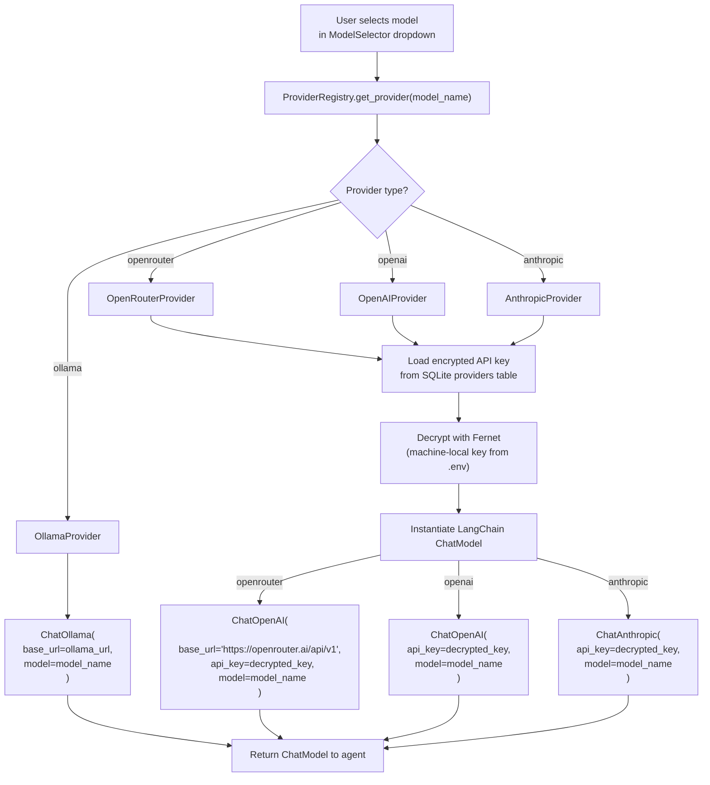

### Provider Implementation

**Backend architecture:**

```python
# backend/providers/base.py
class LLMProvider(ABC):
    @abstractmethod
    async def chat(self, messages: List[BaseMessage], model: str, **kwargs) -> AsyncIterator[str]:
        """Stream chat completion tokens."""
        ...

    @abstractmethod
    async def list_models(self) -> List[ModelInfo]:
        """List available models from this provider."""
        ...

    @abstractmethod
    async def health_check(self) -> bool:
        """Check if the provider is reachable."""
        ...

class EmbeddingProvider(ABC):
    @abstractmethod
    async def embed(self, texts: List[str], model: str) -> List[List[float]]:
        """Generate embeddings for a batch of texts."""
        ...

    @abstractmethod
    async def get_dimensions(self, model: str) -> int:
        """Return the embedding dimensions for a model."""
        ...

# backend/providers/ollama.py
class OllamaProvider(LLMProvider, EmbeddingProvider): ...

# backend/providers/openrouter.py
class OpenRouterProvider(LLMProvider): ...

# backend/providers/openai.py
class OpenAIProvider(LLMProvider, EmbeddingProvider): ...

# backend/providers/anthropic.py
class AnthropicProvider(LLMProvider): ...

# backend/providers/registry.py
class ProviderRegistry:
    """Resolves model name -> provider + credentials at runtime."""
    def get_provider(self, model_name: str) -> LLMProvider: ...
    def get_embedding_provider(self, model_name: str) -> EmbeddingProvider: ...
    def list_all_models(self) -> List[ModelInfo]: ...
```

LangChain abstracts this cleanly: `ChatOllama`, `ChatOpenAI` (also works with OpenRouter via `base_url`), `ChatAnthropic`, and `ChatGoogleGenerativeAI` all implement the same `BaseChatModel` interface. The `ProviderRegistry` selects the right one based on the user's model choice.

**API key storage:**
- Keys are stored in the SQLite `providers` table with `name` and `api_key_encrypted` columns
- Encrypted at rest using `cryptography.fernet` with a machine-local key derived from a secret in `.env`
- Never exposed in API responses — the frontend shows masked characters
- Keys are only decrypted in-memory at the moment of an LLM call

**Provider hardware requirements (for local Ollama):**

| Model Size | RAM Needed | GPU Recommended | Example Models |
|---|---|---|---|
| 7-8B params | 8 GB | Optional (CPU fine) | `llama3.2`, `mistral`, `qwen2.5:7b` |
| 13-14B params | 16 GB | 8 GB VRAM | `llama3.2:13b`, `qwen2.5:14b` |
| 32-34B params | 32 GB | 16 GB VRAM | `qwen2.5:32b`, `deepseek-coder:33b` |
| 70B+ params | 64 GB+ | 24 GB+ VRAM | `llama3.1:70b` |
| Embeddings | 2-4 GB | Not needed | `nomic-embed-text`, `all-minilm` |

---

## Component Interface Contracts

This section defines the exact function signatures, input/output types, error conditions, and injected dependencies for each major module. These contracts serve as the implementation specification.

### Agent Nodes (`backend/agent/nodes.py`)

```python
from backend.agent.state import ConversationState, ResearchState, MetaReasoningState
from backend.agent.schemas import (
    QueryAnalysis, SubAnswer, Citation, GroundednessResult,
    ClaimVerification, RetrievedChunk,
)
from langchain_core.messages import BaseMessage
from sentence_transformers import CrossEncoder

# --- ConversationGraph nodes ---

async def init_session(
    state: ConversationState,
    *,
    db: SQLiteDB,                      # injected
) -> ConversationState:
    """Load or create session. Restores message history from SQLite.
    Reads: state["session_id"]
    Writes: state["messages"], state["selected_collections"]
    Raises: SessionLoadError (caught internally, falls back to fresh session)
    """
    ...

async def classify_intent(
    state: ConversationState,
    *,
    llm: BaseChatModel,               # injected via ProviderRegistry
) -> dict:
    """Classify user intent as rag_query, collection_mgmt, or ambiguous.
    Reads: state["messages"]
    Returns: {"intent": Literal["rag_query", "collection_mgmt", "ambiguous"]}
    Raises: LLMCallError (caught, defaults to "rag_query")
    """
    ...

async def rewrite_query(
    state: ConversationState,
    *,
    llm: BaseChatModel,
) -> ConversationState:
    """Decompose query into sub-questions with structured output.
    Reads: state["messages"], state["selected_collections"]
    Writes: state["query_analysis"]
    Raises: StructuredOutputParseError (retry once, then single-question fallback)
    """
    ...

async def fan_out(
    state: ConversationState,
) -> List[Send]:
    """Spawn ResearchGraph instances via LangGraph Send().
    Reads: state["query_analysis"], state["selected_collections"],
           state["llm_model"], state["embed_model"]
    Returns: List[Send] — one per sub-question
    """
    ...

async def aggregate_answers(
    state: ConversationState,
) -> ConversationState:
    """Merge sub-answers, deduplicate citations, rank by relevance.
    Reads: state["sub_answers"]
    Writes: state["final_response"], state["citations"]
    """
    ...

async def verify_groundedness(
    state: ConversationState,
    *,
    llm: BaseChatModel,
) -> ConversationState:
    """NLI-based claim verification against retrieved context.
    Reads: state["final_response"], state["citations"], state["sub_answers"]
    Writes: state["groundedness_result"], state["confidence_score"]
    Raises: LLMCallError (caught, sets groundedness_result=None)
    """
    ...

async def validate_citations(
    state: ConversationState,
    *,
    reranker: CrossEncoder,
) -> ConversationState:
    """Cross-encoder alignment check for each citation.
    Reads: state["final_response"], state["citations"]
    Writes: state["citations"] (corrected)
    Raises: RerankerError (caught, passes citations through unvalidated)
    """
    ...

async def format_response(
    state: ConversationState,
) -> ConversationState:
    """Apply citation annotations, confidence indicator, SSE formatting.
    Reads: state["final_response"], state["citations"],
           state["groundedness_result"], state["confidence_score"]
    Writes: state["final_response"] (formatted)
    """
    ...

# --- ResearchGraph nodes ---

async def orchestrator(
    state: ResearchState,
    *,
    llm: BaseChatModel,
) -> ResearchState:
    """Decide which tools to call based on current context.
    Reads: state["sub_question"], state["retrieved_chunks"],
           state["tool_call_count"], state["iteration_count"]
    Writes: internal tool_call decisions
    Raises: LLMCallError (triggers fallback_response)
    """
    ...

async def collect_answer(
    state: ResearchState,
    *,
    llm: BaseChatModel,
) -> ResearchState:
    """Generate answer from retrieved chunks, compute confidence.
    Reads: state["sub_question"], state["retrieved_chunks"]
    Writes: state["answer"], state["citations"], state["confidence_score"]
    """
    ...

async def compress_context(
    state: ResearchState,
    *,
    llm: BaseChatModel,
) -> ResearchState:
    """Summarize retrieved chunks when context window is approached.
    Reads: state["retrieved_chunks"], state["llm_model"]
    Writes: state["retrieved_chunks"] (compressed), state["context_compressed"]
    """
    ...

async def fallback_response(
    state: ResearchState,
) -> ResearchState:
    """Generate graceful insufficient-information response.
    Reads: state["sub_question"], state["retrieved_chunks"]
    Writes: state["answer"]
    """
    ...

# --- MetaReasoningGraph nodes ---

async def generate_alternative_queries(
    state: MetaReasoningState,
    *,
    llm: BaseChatModel,
) -> MetaReasoningState:
    """Produce rephrased query variants.
    Reads: state["sub_question"], state["retrieved_chunks"]
    Writes: state["alternative_queries"]
    """
    ...

async def evaluate_retrieval_quality(
    state: MetaReasoningState,
    *,
    reranker: CrossEncoder,
) -> MetaReasoningState:
    """Score all chunks with cross-encoder.
    Reads: state["sub_question"], state["retrieved_chunks"]
    Writes: state["mean_relevance_score"], state["chunk_relevance_scores"]
    """
    ...

async def decide_strategy(
    state: MetaReasoningState,
) -> MetaReasoningState:
    """Select recovery strategy based on evaluation.
    Reads: state["mean_relevance_score"], state["chunk_relevance_scores"],
           state["meta_attempt_count"]
    Writes: state["recovery_strategy"], state["modified_state"]
    """
    ...

async def report_uncertainty(
    state: MetaReasoningState,
) -> MetaReasoningState:
    """Generate honest I-don't-know response.
    Reads: state["sub_question"], state["mean_relevance_score"]
    Writes: state["answer"], state["uncertainty_reason"]
    """
    ...
```

### Agent Tools (`backend/agent/tools.py`)

```python
from langchain_core.tools import tool
from backend.retrieval.searcher import HybridSearcher
from backend.retrieval.reranker import Reranker
from backend.storage.parent_store import ParentStore
from backend.agent.schemas import RetrievedChunk, ParentChunk

@tool
async def search_child_chunks(
    query: str,
    collection: str,
    top_k: int = 20,
    filters: Optional[dict] = None,
) -> List[RetrievedChunk]:
    """Hybrid dense+BM25 search with cross-encoder reranking.
    Raises: QdrantConnectionError, EmbeddingError
    """
    ...

@tool
async def retrieve_parent_chunks(
    parent_ids: List[str],
) -> List[ParentChunk]:
    """Fetch parent chunks from SQLite by ID list.
    Raises: DatabaseError
    """
    ...

@tool
async def cross_encoder_rerank(
    query: str,
    chunks: List[RetrievedChunk],
    top_k: int = 5,
) -> List[RetrievedChunk]:
    """Score and rerank (query, chunk) pairs.
    Raises: RerankerError
    """
    ...

@tool
async def filter_by_metadata(
    filters: dict,
) -> dict:
    """Apply Qdrant payload filter constraints.
    Valid filter keys: doc_type, page_min, page_max, source_file
    Raises: InvalidFilterError
    """
    ...

@tool
async def semantic_search_all_collections(
    query: str,
    top_k: int = 20,
) -> List[RetrievedChunk]:
    """Fan-out search across all collections with score normalization.
    Raises: QdrantConnectionError, EmbeddingError
    """
    ...
```

### Ingestion Pipeline (`backend/ingestion/pipeline.py`)

```python
from backend.ingestion.embedder import BatchEmbedder
from backend.ingestion.chunker import ChunkSplitter
from backend.ingestion.incremental import IncrementalChecker
from backend.storage.qdrant_client import QdrantStorage
from backend.storage.sqlite_db import SQLiteDB

class IngestionPipeline:
    def __init__(
        self,
        db: SQLiteDB,
        qdrant: QdrantStorage,
        embedder: BatchEmbedder,
        chunker: ChunkSplitter,
        incremental: IncrementalChecker,
        rust_worker_path: str,
    ) -> None: ...

    async def ingest_file(
        self,
        file_path: str,
        collection_id: str,
        document_id: str,
        job_id: str,
    ) -> IngestionResult:
        """Full ingestion pipeline: parse -> split -> embed -> upsert.
        Returns: IngestionResult with chunk counts and status
        Raises: IngestionError, RustWorkerError, EmbeddingError, QdrantConnectionError
        """
        ...

    async def check_duplicate(
        self,
        file_path: str,
        collection_id: str,
    ) -> Optional[str]:
        """Check if file hash already exists. Returns document_id if duplicate, None otherwise."""
        ...

class IngestionResult(BaseModel):
    document_id: str
    job_id: str
    status: Literal["completed", "failed", "duplicate"]
    chunks_processed: int
    chunks_skipped: int
    error_msg: Optional[str]
    elapsed_ms: int
```

### Embedder (`backend/ingestion/embedder.py`)

```python
class BatchEmbedder:
    def __init__(
        self,
        provider: EmbeddingProvider,
        model: str,
        batch_size: int = 16,
        max_workers: int = 4,
    ) -> None: ...

    async def embed_batch(
        self,
        texts: List[str],
    ) -> List[EmbeddingResult]:
        """Embed a batch of texts with validation.
        Returns: List of EmbeddingResult (vector + validation status)
        Raises: EmbeddingError (if all retries exhausted)
        """
        ...

    def validate_embedding(
        self,
        embedding: List[float],
        expected_dim: int,
    ) -> bool:
        """Check embedding for NaN, zero-vector, dimension mismatch."""
        ...

class EmbeddingResult(BaseModel):
    text: str
    vector: Optional[List[float]]
    valid: bool
    error: Optional[str]
```

### Searcher (`backend/retrieval/searcher.py`)

```python
class HybridSearcher:
    def __init__(
        self,
        qdrant: QdrantStorage,
        embedder: BatchEmbedder,
        reranker: Reranker,
    ) -> None: ...

    async def search(
        self,
        query: str,
        collection_name: str,
        top_k: int = 20,
        filters: Optional[dict] = None,
        dense_weight: float = 0.7,
        sparse_weight: float = 0.3,
    ) -> List[RetrievedChunk]:
        """Hybrid dense+BM25 search with RRF fusion.
        Raises: QdrantConnectionError, EmbeddingError
        """
        ...

    async def search_multi_collection(
        self,
        query: str,
        collection_names: List[str],
        top_k: int = 20,
    ) -> List[RetrievedChunk]:
        """Search across multiple collections with score normalization.
        Raises: QdrantConnectionError, EmbeddingError
        """
        ...
```

### Reranker (`backend/retrieval/reranker.py`)

```python
class Reranker:
    def __init__(
        self,
        model_name: str = "cross-encoder/ms-marco-MiniLM-L-6-v2",
    ) -> None: ...

    def rerank(
        self,
        query: str,
        chunks: List[RetrievedChunk],
        top_k: int = 5,
    ) -> List[RetrievedChunk]:
        """Score and rerank (query, chunk) pairs with cross-encoder.
        Returns: Top-k chunks sorted by cross-encoder score descending
        Raises: RerankerError
        """
        ...

    def score_pair(
        self,
        text_a: str,
        text_b: str,
    ) -> float:
        """Score a single (text_a, text_b) pair. Used for citation validation."""
        ...
```

### Qdrant Operations (`backend/storage/qdrant_client.py`)

```python
class QdrantStorage:
    def __init__(
        self,
        host: str = "localhost",
        port: int = 6333,
    ) -> None: ...

    async def create_collection(
        self,
        name: str,
        dense_dim: int,
    ) -> None:
        """Create a Qdrant collection with dense + sparse vector config.
        Raises: QdrantConnectionError, CollectionExistsError
        """
        ...

    async def delete_collection(
        self,
        name: str,
    ) -> None:
        """Delete a Qdrant collection.
        Raises: QdrantConnectionError, CollectionNotFoundError
        """
        ...

    async def upsert_batch(
        self,
        collection_name: str,
        points: List[PointStruct],
    ) -> None:
        """Batch upsert points with retry.
        Raises: QdrantConnectionError (after retries exhausted)
        """
        ...

    async def hybrid_search(
        self,
        collection_name: str,
        dense_vector: List[float],
        sparse_indices: List[int],
        sparse_values: List[float],
        top_k: int = 20,
        filters: Optional[dict] = None,
    ) -> List[ScoredPoint]:
        """Execute hybrid dense+sparse search with RRF fusion.
        Raises: QdrantConnectionError
        """
        ...

    async def delete_by_filter(
        self,
        collection_name: str,
        filter_conditions: dict,
    ) -> int:
        """Delete points matching filter. Returns count of deleted points.
        Raises: QdrantConnectionError
        """
        ...

    async def health_check(self) -> Tuple[bool, Optional[int]]:
        """Check Qdrant connectivity. Returns (is_healthy, latency_ms)."""
        ...
```

### SQLite Operations (`backend/storage/sqlite_db.py`)

```python
class SQLiteDB:
    def __init__(self, db_path: str) -> None: ...

    async def initialize(self) -> None:
        """Create tables if not exist, set pragmas."""
        ...

    # --- Collections ---
    async def create_collection(self, collection: CollectionCreate) -> CollectionRow: ...
    async def get_collection(self, collection_id: str) -> Optional[CollectionRow]: ...
    async def list_collections(self) -> List[CollectionRow]: ...
    async def delete_collection(self, collection_id: str) -> bool: ...

    # --- Documents ---
    async def create_document(self, doc: DocumentCreate) -> DocumentRow: ...
    async def get_document(self, doc_id: str) -> Optional[DocumentRow]: ...
    async def list_documents(self, collection_id: str) -> List[DocumentRow]: ...
    async def update_document_status(self, doc_id: str, status: str, chunk_count: int = 0) -> None: ...
    async def find_by_hash(self, collection_id: str, file_hash: str) -> Optional[DocumentRow]: ...
    async def delete_document(self, doc_id: str) -> bool: ...

    # --- Ingestion Jobs ---
    async def create_ingestion_job(self, job: JobCreate) -> JobRow: ...
    async def update_job_status(self, job_id: str, status: str, error_msg: Optional[str] = None) -> None: ...
    async def get_ingestion_job(self, job_id: str) -> Optional[JobRow]: ...

    # --- Parent Chunks ---
    async def store_parent_chunks(self, chunks: List[ParentChunkCreate]) -> None: ...
    async def get_parent_chunks(self, parent_ids: List[str]) -> List[ParentChunkRow]: ...
    async def delete_parent_chunks(self, document_id: str) -> int: ...

    # --- Query Traces ---
    async def store_trace(self, trace: TraceCreate) -> None: ...
    async def list_traces(self, page: int, limit: int, session_id: Optional[str] = None) -> Tuple[List[TraceRow], int]: ...
    async def get_trace(self, trace_id: str) -> Optional[TraceRow]: ...

    # --- Settings ---
    async def get_setting(self, key: str) -> Optional[str]: ...
    async def set_setting(self, key: str, value: str) -> None: ...
    async def get_all_settings(self) -> dict: ...

    # --- Providers ---
    async def get_provider(self, name: str) -> Optional[ProviderRow]: ...
    async def list_providers(self) -> List[ProviderRow]: ...
    async def set_provider_key(self, name: str, encrypted_key: str) -> None: ...
    async def delete_provider_key(self, name: str) -> None: ...

    # --- Health ---
    async def health_check(self) -> bool: ...
```

---

## Error Handling Specification

### Error Hierarchy

```python
# backend/errors.py

class EmbdinatorError(Exception):
    """Base exception for all Embedinator errors."""
    def __init__(self, message: str, code: str, details: Optional[dict] = None):
        self.message = message
        self.code = code
        self.details = details or {}
        super().__init__(message)

# --- Storage layer ---
class StorageError(EmbdinatorError): ...
class QdrantConnectionError(StorageError): ...
class QdrantCollectionError(StorageError): ...
class DatabaseError(StorageError): ...
class DatabaseMigrationError(StorageError): ...

# --- Ingestion layer ---
class IngestionError(EmbdinatorError): ...
class RustWorkerError(IngestionError): ...
class FileValidationError(IngestionError): ...
class EmbeddingError(IngestionError): ...
class EmbeddingValidationError(IngestionError): ...
class DuplicateDocumentError(IngestionError): ...

# --- Agent layer ---
class AgentError(EmbdinatorError): ...
class LLMCallError(AgentError): ...
class StructuredOutputParseError(AgentError): ...
class RerankerError(AgentError): ...
class ToolExecutionError(AgentError): ...
class ConfidenceError(AgentError): ...

# --- Provider layer ---
class ProviderError(EmbdinatorError): ...
class ProviderNotConfiguredError(ProviderError): ...
class ProviderAuthError(ProviderError): ...
class ProviderRateLimitError(ProviderError): ...
class ModelNotFoundError(ProviderError): ...

# --- API layer ---
class APIError(EmbdinatorError): ...
class ValidationError(APIError): ...
class NotFoundError(APIError): ...
class ConflictError(APIError): ...
```

### HTTP Status Code Mapping

| Exception Class | HTTP Status | Error Code | User Message |
|----------------|-------------|------------|-------------|
| `ValidationError` | 400 | `VALIDATION_ERROR` | Field-specific error messages |
| `FileValidationError` | 400 | `INVALID_FILE` | "Unsupported file type" / "File too large" |
| `NotFoundError` | 404 | `NOT_FOUND` | "Resource not found" |
| `ConflictError` | 409 | `CONFLICT` | "Resource already exists" |
| `DuplicateDocumentError` | 409 | `DUPLICATE_DOCUMENT` | "Document already ingested" |
| `ProviderAuthError` | 401 | `PROVIDER_AUTH_ERROR` | "Invalid API key for provider" |
| `ProviderRateLimitError` | 429 | `RATE_LIMITED` | "Provider rate limit reached, try again later" |
| `QdrantConnectionError` | 503 | `QDRANT_UNAVAILABLE` | "Vector database unavailable" |
| `LLMCallError` | 503 | `LLM_UNAVAILABLE` | "Inference service unavailable" |
| `EmbeddingError` | 503 | `EMBEDDING_UNAVAILABLE` | "Embedding service unavailable" |
| Unhandled `Exception` | 500 | `INTERNAL_ERROR` | "An internal error occurred" |

### Error Response Format

```python
class ErrorResponse(BaseModel):
    detail: str          # user-facing message
    code: str            # machine-readable error code
    trace_id: Optional[str]  # request trace ID for debugging
    # Internal details (only in dev mode, stripped in production):
    internal: Optional[dict] = None  # stack trace, raw error, etc.
```

### Error Propagation Rules

| Layer | Catches | Bubbles Up | Notes |
|-------|---------|-----------|-------|
| Storage (`qdrant_client`, `sqlite_db`) | Raw HTTP/DB errors | `QdrantConnectionError`, `DatabaseError` | Wraps raw exceptions with context |
| Ingestion (`pipeline`, `embedder`) | Storage errors, Rust worker errors | `IngestionError` subtypes | Logs per-chunk failures, continues batch |
| Agent (`nodes`, `tools`) | LLM errors, tool errors | `AgentError` subtypes | Node-specific fallback before bubbling |
| API (`routes`) | All `EmbdinatorError` subtypes | HTTP error responses | Maps to status codes, logs internally |

### Circuit Breaker State Transitions

See the [Circuit Breaker & Retry](#circuit-breaker--retry) section for the state machine diagram. Key parameters:

| Parameter | Value | Configurable |
|-----------|-------|-------------|
| Failure threshold (consecutive) | 5 | `CIRCUIT_BREAKER_FAILURE_THRESHOLD` |
| Window duration | 60 seconds | -- |
| Cooldown (open -> half-open) | 30 seconds | `CIRCUIT_BREAKER_COOLDOWN_SECS` |
| Retry attempts per call | 3 | `RETRY_MAX_ATTEMPTS` |
| Retry backoff initial | 1.0 seconds | `RETRY_BACKOFF_INITIAL_SECS` |
| Retry backoff max | 10 seconds | -- |

---

## Security Specification

### API Key Encryption Lifecycle

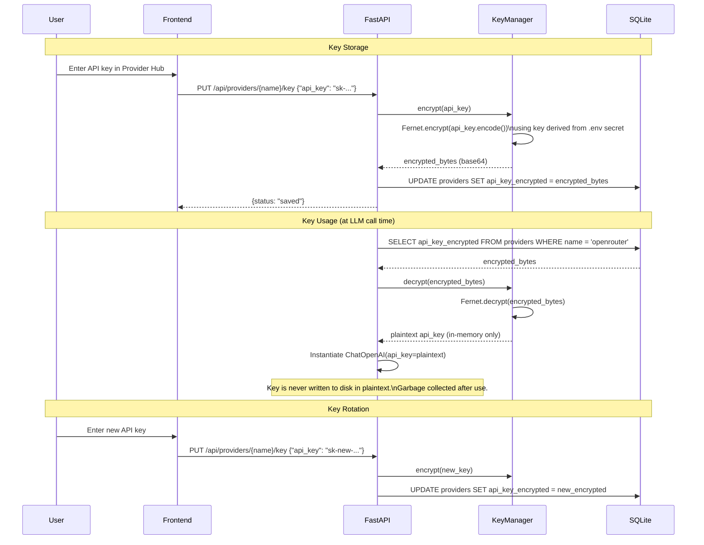

**Key derivation:**

```python
import os
from cryptography.fernet import Fernet
import hashlib
import base64

def get_fernet_key(secret: str) -> bytes:
    """Derive a Fernet key from the .env secret."""
    # Fernet requires exactly 32 url-safe base64-encoded bytes
    key_bytes = hashlib.sha256(secret.encode()).digest()
    return base64.urlsafe_b64encode(key_bytes)

class KeyManager:
    def __init__(self, secret: str):
        self.fernet = Fernet(get_fernet_key(secret))

    def encrypt(self, plaintext: str) -> str:
        return self.fernet.encrypt(plaintext.encode()).decode()

    def decrypt(self, ciphertext: str) -> str:
        return self.fernet.decrypt(ciphertext.encode()).decode()
```

**Secret generation**: On first run, if `API_KEY_ENCRYPTION_SECRET` is not set in `.env`, the application generates a random 32-byte secret using `os.urandom(32)`, writes it to `.env`, and logs a warning.

### File Upload Validation

| Check | Rule | Error |
|-------|------|-------|
| File extension | Allow: `.pdf`, `.md`, `.txt`, `.py`, `.js`, `.ts`, `.rs`, `.go`, `.java`, `.c`, `.cpp`, `.h` | 400: "Unsupported file type" |
| File size | Maximum 100 MB | 413: "File exceeds maximum size" |
| MIME type validation | Verify MIME matches extension (via `python-magic` or `mimetypes`) | 400: "File type mismatch" |
| Filename sanitization | Strip path traversal (`../`, `..\\`), limit to alphanumeric + `._-` | 400: "Invalid filename" |
| Content sniffing | Read first 4 bytes for magic number validation (PDF: `%PDF`, etc.) | 400: "File content does not match declared type" |

**Note on virus scanning**: Virus scanning is not included in the MVP. For production deployments, ClamAV integration via socket can be added as a middleware step. The ingestion pipeline already supports a pre-processing hook where scanning can be inserted.

### Input Sanitization

| Input | Sanitization | Reason |
|-------|-------------|--------|
| Chat messages | Truncate to 10,000 chars max | Prevent context window abuse |
| Collection names | Regex: `^[a-z0-9][a-z0-9_-]*$`, max 100 chars | Prevent injection into Qdrant collection names |
| Qdrant payload filters | Whitelist allowed filter keys: `doc_type`, `source_file`, `page`, `chunk_index` | Prevent arbitrary payload query injection |
| SQL parameters | All queries use parameterized statements (`?` placeholders) | Prevent SQL injection |
| SSE output | JSON-encode all event data | Prevent XSS via event stream |

### CORS Configuration

```python
from fastapi.middleware.cors import CORSMiddleware

app.add_middleware(
    CORSMiddleware,
    allow_origins=[
        "http://localhost:3000",    # Next.js dev
        "http://127.0.0.1:3000",   # alternate localhost
    ],
    allow_credentials=True,
    allow_methods=["GET", "POST", "PUT", "DELETE"],
    allow_headers=["*"],
)
```

For Docker deployment, the `CORS_ORIGINS` environment variable can override these defaults.

### Rate Limiting Strategy

Rate limiting is implemented via an in-memory sliding window counter (no external dependency needed for single-user deployment):

| Endpoint | Limit | Window | Purpose |
|----------|-------|--------|---------|
| `POST /api/chat` | 30 requests | per minute | Prevent runaway query loops |
| `POST /api/collections/{id}/ingest` | 10 requests | per minute | Prevent ingestion flooding |
| `PUT /api/providers/{name}/key` | 5 requests | per minute | Prevent brute-force key testing |
| All other endpoints | 120 requests | per minute | General protection |

Implementation uses FastAPI dependency injection with a `RateLimiter` class.

---

## Performance Targets & Budgets

### Target Hardware

The Embedinator is designed for and tested on the following developer workstation:

| Component | Specification |
|-----------|-------------|
| CPU | Intel Core i7-12700K (12 cores, 20 threads) |
| RAM | 64 GB DDR5 |
| GPU | NVIDIA RTX 4070 Ti (12 GB VRAM) |
| Storage | NVMe SSD |
| OS | Windows 11 Pro |

### End-to-End Latency Budgets

**Chat query (factoid tier):**

| Component | Budget | Notes |
|-----------|--------|-------|
| FastAPI routing + session load | 20 ms | SQLite read |
| Intent classification (LLM) | 200 ms | Ollama, 8B model |
| Query rewriting (LLM) | 300 ms | Structured output |
| Embedding (query) | 50 ms | Ollama nomic-embed-text |
| Qdrant hybrid search | 30 ms | Dense + BM25 + RRF |
| Cross-encoder reranking (top-20) | 150 ms | CPU, ms-marco-MiniLM |
| Parent chunk retrieval | 10 ms | SQLite indexed read |
| Answer generation (LLM) | 500 ms | First token; streaming |
| Groundedness verification (LLM) | 400 ms | Separate LLM call |
| Citation validation (cross-encoder) | 50 ms | 5 citation pairs |
| **Total first-token latency** | **~1.2 seconds** | |
| **Total full response** | **~2-3 seconds** | |

**Chat query (analytical tier):**

| Component | Budget | Notes |
|-----------|--------|-------|
| Query decomposition | 400 ms | 3-5 sub-questions |
| ResearchGraph per sub-question | 1-3 seconds | Multiple tool call iterations |
| MetaReasoningGraph (if triggered) | 1-2 seconds | Cross-encoder + strategy switch |
| Aggregation + verification | 600 ms | Merge + GAV |
| **Total first-token latency** | **~3-5 seconds** | |
| **Total full response** | **~5-10 seconds** | |

### Ingestion Throughput Targets

| Document Type | Size | Target Time | Bottleneck |
|--------------|------|-------------|-----------|
| PDF, 10 pages | ~30 KB | < 3 seconds | Embedding API calls |
| PDF, 50 pages | ~150 KB | < 8 seconds | Embedding API calls |
| PDF, 200 pages | ~600 KB | < 15 seconds | Embedding API calls |
| Markdown, 50 KB | ~50 KB | < 5 seconds | Embedding API calls |
| Code file, 10 KB | ~10 KB | < 2 seconds | Embedding API calls |

### Memory Budgets

| Service | Budget | Notes |
|---------|--------|-------|
| FastAPI backend (idle) | 200-400 MB | Python runtime + loaded models |
| Cross-encoder model | ~200 MB | ms-marco-MiniLM loaded in CPU RAM |
| Per ingestion job | +100-300 MB | Chunk buffer + embedding batches |
| Per chat query | +50-100 MB | LangGraph state + retrieved chunks |
| Qdrant | 500 MB - 2 GB | Depends on total chunk count |
| Ollama (8B model) | 5-8 GB VRAM | GPU offloaded |
| Ollama (embedding model) | 1-2 GB VRAM | Can share with LLM |
| Next.js frontend | 100-200 MB | Node.js runtime |
| **Total (during query)** | **~8-12 GB** | Excluding Ollama model |

### Throughput Targets

| Metric | Target | Notes |
|--------|--------|-------|
| Concurrent chat queries | 3-5 | Limited by Ollama (sequential inference) |
| Ingestion jobs | 1 at a time | Serial by design (single Rust worker) |
| Qdrant queries/second | 100+ | Limited by CPU for cross-encoder |
| SSE events/second | 50-100 | Token streaming rate |
| SQLite writes/second | 1,000+ | WAL mode, batched transactions |

---

## Logging & Observability Specification

### Structured Log Format

All backend logs use JSON Lines format for machine parseability:

```json
{
  "timestamp": "2026-03-03T10:32:15.123Z",
  "level": "INFO",
  "logger": "backend.agent.nodes",
  "message": "Groundedness verification completed",
  "trace_id": "req-abc-123",
  "session_id": "sess-xyz-789",
  "data": {
    "supported_claims": 4,
    "unsupported_claims": 1,
    "contradicted_claims": 0,
    "elapsed_ms": 380
  }
}
```

### Log Levels by Component

| Component | Default Level | Debug Level Enables |
|-----------|--------------|-------------------|
| `backend.api.*` | INFO | Request/response bodies, headers |
| `backend.agent.nodes` | INFO | Full prompt text, LLM raw responses |
| `backend.agent.tools` | INFO | Qdrant query details, chunk text snippets |
| `backend.ingestion.pipeline` | INFO | Per-chunk processing, Rust worker stderr |
| `backend.ingestion.embedder` | INFO | Embedding batch timing, validation failures |
| `backend.retrieval.searcher` | INFO | Search query vectors, score distributions |
| `backend.retrieval.reranker` | WARNING | Per-pair scores (very verbose at INFO) |
| `backend.storage.qdrant_client` | WARNING | Connection events, retry attempts |
| `backend.storage.sqlite_db` | WARNING | Slow query warnings (>100ms) |
| `backend.providers.registry` | INFO | Provider selection, key decryption events |

### Trace ID Propagation

Every HTTP request generates a trace ID (UUID4) in FastAPI middleware. This ID propagates through all function calls:

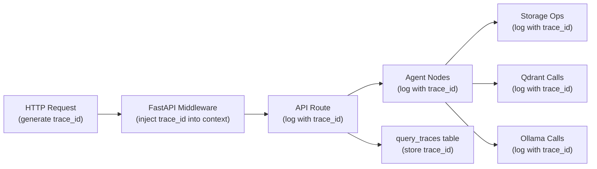

Implementation uses Python `contextvars` for thread-safe trace propagation:

```python
import contextvars

trace_id_var: contextvars.ContextVar[str] = contextvars.ContextVar("trace_id", default="no-trace")

class TraceMiddleware:
    async def __call__(self, request, call_next):
        trace_id = str(uuid4())
        trace_id_var.set(trace_id)
        request.state.trace_id = trace_id
        response = await call_next(request)
        response.headers["X-Trace-ID"] = trace_id
        return response
```

### Metrics to Collect

| Metric | Type | Source | Purpose |
|--------|------|--------|---------|
| `query_latency_ms` | Histogram | API middleware | End-to-end query time |
| `ingestion_latency_ms` | Histogram | Ingestion pipeline | Document processing time |
| `embedding_latency_ms` | Histogram | Embedder | Per-batch embedding time |
| `qdrant_search_latency_ms` | Histogram | Qdrant client | Per-search latency |
| `reranker_latency_ms` | Histogram | Reranker | Cross-encoder inference time |
| `llm_latency_ms` | Histogram | Provider calls | Per-LLM-call latency |
| `confidence_score` | Histogram | Agent nodes | Distribution of confidence scores |
| `meta_reasoning_triggered` | Counter | Agent nodes | Rate of meta-reasoning activation |
| `circuit_breaker_state` | Gauge | Circuit breaker | Current state per service |
| `active_ingestion_jobs` | Gauge | Pipeline | Concurrent ingestion tracking |
| `error_count` | Counter | Error handler | Errors by type and component |
| `cache_hit_rate` | Gauge | SWR/query cache | Frontend cache effectiveness |

### `/observability` Page Data Sources

| Dashboard Element | Data Source | Query |
|-------------------|------------|-------|
| Latency histogram | `query_traces.latency_ms` | `SELECT latency_ms FROM query_traces WHERE created_at > ? ORDER BY created_at DESC LIMIT 1000` |
| Confidence distribution | `query_traces.confidence_score` | `SELECT confidence_score FROM query_traces WHERE confidence_score IS NOT NULL` |
| Meta-reasoning rate | `query_traces.meta_reasoning_triggered` | `SELECT AVG(meta_reasoning_triggered) FROM query_traces WHERE created_at > ?` |
| Service health | `/api/health` endpoint | Real-time ping to Qdrant + Ollama + SQLite |
| Collection stats | `collections` + `documents` | `SELECT c.name, COUNT(d.id), SUM(d.chunk_count) FROM collections c LEFT JOIN documents d ...` |
| Recent traces | `query_traces` | Paginated query with expandable detail |

---

## Testing Strategy

### Test Framework Stack

| Layer | Framework | Plugins |
|-------|-----------|---------|
| Python backend (unit + integration) | `pytest` | `pytest-asyncio`, `pytest-cov` |
| Python HTTP tests | `httpx` | `httpx[asyncio]` via `TestClient` |
| LangGraph integration | `pytest` + LangGraph test utilities | Custom fixtures |
| Frontend unit | `vitest` | `@testing-library/react` |
| Frontend E2E | `playwright` | `@playwright/test` |

### Unit Test Targets

| Module | What to Test | What to Mock |
|--------|-------------|-------------|
| `backend/agent/nodes.py` | Each node function in isolation; correct state reads/writes; error handling fallbacks | LLM calls (`BaseChatModel`), CrossEncoder, SQLiteDB |
| `backend/agent/tools.py` | Tool return types; deduplication via retrieval_keys; filter validation | QdrantStorage, BatchEmbedder |
| `backend/agent/edges.py` | Conditional routing logic; all branch conditions covered | State dictionaries (mock data) |
| `backend/ingestion/pipeline.py` | Full pipeline with mock Rust output; duplicate detection; error accumulation | Rust subprocess (mock NDJSON stdin), QdrantStorage, BatchEmbedder |
| `backend/ingestion/embedder.py` | Batch splitting; validation logic; retry behavior | Ollama HTTP calls |
| `backend/ingestion/chunker.py` | Parent/child size constraints; breadcrumb prepending; sentence boundary detection | None (pure logic) |
| `backend/ingestion/incremental.py` | Hash computation; duplicate detection; re-ingestion logic | SQLiteDB |
| `backend/retrieval/searcher.py` | Hybrid search query construction; multi-collection merge; score normalization | QdrantStorage, BatchEmbedder |
| `backend/retrieval/reranker.py` | Score ordering; top-k truncation; pair scoring | CrossEncoder model (use small test model) |
| `backend/storage/qdrant_client.py` | Collection CRUD; upsert batching; retry/circuit breaker behavior | Qdrant HTTP (use `responses` or `httpx` mock) |
| `backend/storage/sqlite_db.py` | All CRUD operations; concurrent read behavior; migration | In-memory SQLite (`:memory:`) |
| `backend/providers/registry.py` | Model-to-provider resolution; key decryption; fallback handling | Provider instances, KeyManager |
| `backend/config.py` | Default values; env var override; validation | Environment variables |

### Integration Test Scenarios

| Scenario | Components | Fixture Requirements |
|----------|-----------|---------------------|
| Qdrant CRUD cycle | `qdrant_client` + real Qdrant | Docker Qdrant container (test fixture) |
| Ingestion end-to-end | `pipeline` + `chunker` + `embedder` + `qdrant_client` + `sqlite_db` | Small test PDF, real Qdrant + SQLite |
| LangGraph conversation flow | All agent graphs + mock LLM | Mock LLM returning predictable structured output |
| Hybrid search accuracy | `searcher` + `reranker` + Qdrant | Pre-indexed test collection with known-relevant chunks |
| Provider switching | `registry` + `OllamaProvider` | Running Ollama instance |
| Circuit breaker activation | `qdrant_client` with unreachable server | Network mock or stopped Qdrant container |

### E2E Test Scenarios

| Scenario | Steps | Assertions |
|----------|-------|-----------|
| Upload and query | 1. Create collection via UI; 2. Upload test PDF; 3. Wait for ingestion complete; 4. Ask question; 5. Verify streamed answer contains citations | Answer is non-empty; at least 1 citation rendered; confidence indicator visible |
| Collection management | 1. Create collection; 2. Verify appears in list; 3. Delete collection; 4. Verify removed | Collection card appears/disappears; Qdrant collection created/deleted |
| Provider configuration | 1. Navigate to settings; 2. Enter test API key; 3. Verify provider shows as active; 4. Select cloud model; 5. Query with cloud model | Provider status updates; model appears in dropdown; query succeeds |
| Meta-reasoning trigger | 1. Create collection with minimal docs; 2. Ask question outside doc scope; 3. Verify meta-reasoning event in SSE stream | `meta_reasoning` SSE event received; uncertainty message displayed |
| Observability | 1. Run several queries; 2. Navigate to observability; 3. Verify traces appear; 4. Verify latency chart renders | Trace table populated; chart renders; health checks show green |

### Test Fixtures and Factories

```python
# tests/conftest.py

import pytest
import pytest_asyncio
from backend.storage.sqlite_db import SQLiteDB

@pytest_asyncio.fixture
async def db():
    """In-memory SQLite for fast tests."""
    db = SQLiteDB(":memory:")
    await db.initialize()
    yield db

@pytest.fixture
def sample_chunks() -> List[dict]:
    """Pre-built chunk data for testing."""
    return [
        {"text": "WSAA uses certificate-based authentication...", "page": 12, ...},
        {"text": "The token format follows SAML 2.0...", "page": 13, ...},
    ]

@pytest.fixture
def mock_llm():
    """Mock LLM that returns predictable structured output."""
    ...

@pytest.fixture
def mock_qdrant_results():
    """Pre-built Qdrant search results."""
    ...

@pytest_asyncio.fixture
async def qdrant_container():
    """Start Qdrant in Docker for integration tests."""
    # Uses testcontainers-python or manual docker-compose
    ...
```

### Test Directory Structure

```
tests/
  conftest.py                    # Shared fixtures
  unit/
    agent/
      test_nodes.py              # Node function tests
      test_edges.py              # Edge routing tests
      test_tools.py              # Tool execution tests
      test_schemas.py            # Pydantic model tests
    ingestion/
      test_pipeline.py           # Pipeline orchestration
      test_embedder.py           # Embedding + validation
      test_chunker.py            # Chunk splitting logic
      test_incremental.py        # Hash + dedup logic
    retrieval/
      test_searcher.py           # Search query construction
      test_reranker.py           # Reranking logic
      test_score_normalizer.py   # Normalization math
    storage/
      test_sqlite_db.py          # All SQLite operations
      test_qdrant_client.py      # Qdrant client (mocked)
    providers/
      test_registry.py           # Provider resolution
      test_key_manager.py        # Encryption/decryption
  integration/
    test_qdrant_integration.py   # Real Qdrant container
    test_ingestion_e2e.py        # Full pipeline
    test_langgraph_flow.py       # Agent graph execution
    test_hybrid_search.py        # Search accuracy
  e2e/
    test_chat_flow.spec.ts       # Playwright: upload + query
    test_collections.spec.ts     # Playwright: CRUD
    test_observability.spec.ts   # Playwright: dashboard
  fixtures/
    sample.pdf                   # 3-page test PDF
    sample.md                    # Test markdown
    sample.txt                   # Test plain text
```

---

## Project Directory Structure

```
the-embedinator/
  backend/
    api/
      collections.py       # Collection CRUD endpoints
      chat.py              # Chat endpoint + SSE streaming
      models.py            # Ollama model listing proxy
      settings.py          # Settings CRUD
      providers.py         # Provider management endpoints
      traces.py            # Query trace log + health + stats
    agent/
      conversation_graph.py    # Layer 1: ConversationGraph definition
      research_graph.py        # Layer 2: ResearchGraph definition
      meta_reasoning_graph.py  # Layer 3: MetaReasoningGraph definition
      nodes.py                 # All node functions (stateless, pure)
      edges.py                 # All conditional edge functions
      tools.py                 # LangChain tool definitions + implementations
      prompts.py               # All system and user prompts as constants
      schemas.py               # Pydantic models: QueryAnalysis, SubAnswer, Citation
      state.py                 # TypedDict state schemas for all three graphs
    ingestion/
      pipeline.py          # Orchestrator: spawn Rust worker, coordinate flow
      embedder.py          # Ollama embedding calls, ThreadPoolExecutor batching
      chunker.py           # Parent/child splitting, breadcrumb prepending
      incremental.py       # SHA256 hash check, change detection
    retrieval/
      searcher.py          # Qdrant hybrid search execution
      reranker.py          # Cross-encoder reranking (sentence-transformers)
      router.py            # Regex-based collection routing (inherited from GRAVITEA)
      score_normalizer.py  # Per-collection min-max normalization before merge
    storage/
      qdrant_client.py     # Qdrant connection, collection init, upsert, search
      sqlite_db.py         # SQLite connection, all table operations
      parent_store.py      # Parent chunk read/write (SQLite-backed)
    providers/
      base.py             # LLMProvider ABC, EmbeddingProvider ABC
      registry.py         # ProviderRegistry: model name -> provider resolution
      ollama.py           # OllamaProvider (default, no key needed)
      openrouter.py       # OpenRouterProvider (200+ models, one key)
      openai.py           # OpenAIProvider (direct)
      anthropic.py        # AnthropicProvider (direct)
      key_manager.py      # Fernet encryption/decryption for API keys
    errors.py              # Error hierarchy (all custom exceptions)
    config.py              # Pydantic Settings: all env vars, defaults
    main.py                # FastAPI app factory, router registration, lifespan
    middleware.py          # CORS, rate limiting, trace ID injection
  ingestion-worker/
    src/
      main.rs              # CLI entry point, dispatch to parsers
      pdf.rs               # PDF extraction
      markdown.rs          # Markdown parsing and splitting
      text.rs              # Plain text chunking
      heading_tracker.rs   # Heading hierarchy state machine
      types.rs             # Chunk struct, DocType enum, serde impls
    Cargo.toml
  frontend/
    app/
      layout.tsx
      chat/
        page.tsx
      collections/
        page.tsx
      documents/
        [id]/page.tsx
      settings/
        page.tsx
      observability/
        page.tsx
    components/
      ChatPanel.tsx
      ChatInput.tsx
      ChatSidebar.tsx
      CollectionCard.tsx
      CollectionList.tsx
      CreateCollectionDialog.tsx
      DocumentUploader.tsx
      DocumentList.tsx
      ModelSelector.tsx
      CitationTooltip.tsx
      ConfidenceIndicator.tsx
      ProviderHub.tsx
      TraceTable.tsx
      LatencyChart.tsx
      ConfidenceDistribution.tsx
      HealthDashboard.tsx
      CollectionStats.tsx
      Navigation.tsx
    lib/
      api.ts               # Centralized API client
      types.ts             # Shared TypeScript interfaces
    hooks/
      useStreamChat.ts     # Custom hook for SSE chat streaming
      useCollections.ts    # SWR hook for collections
      useModels.ts         # SWR hook for model lists
      useTraces.ts         # SWR hook for traces
    next.config.ts
    package.json
    tailwind.config.ts
    tsconfig.json
  tests/                   # See Testing Strategy section
  data/                    # gitignored — runtime data
    uploads/               # temporary file storage during ingestion
    qdrant_db/             # Qdrant persistence volume
    embedinator.db         # SQLite database file
  docker-compose.yml
  docker-compose.dev.yml
  .env.example
  Makefile
  requirements.txt         # Python dependencies
  README.md
```

---

## Key Design Decisions

### 1. Rust for CPU-Bound Document Parsing

PDF parsing is the most CPU-intensive step in the ingestion pipeline. Python's GIL means that even with threads, PDF parsing and text extraction cannot be parallelized across cores. PyMuPDF and similar libraries add C extension overhead and version fragility.

The Rust worker binary compiles to native code with no GIL, no interpreter overhead, and SIMD-friendly string processing. Benchmarks on 200-page technical PDFs show 5-20x throughput improvement versus equivalent Python code.

The NDJSON streaming interface is the critical design choice: Python begins embedding chunk N over the Ollama API while Rust is still extracting chunk N+5. The two workloads (CPU parsing, network I/O embedding) overlap in time. This is not possible when Python waits for the entire parsed document before beginning embedding.

The binary is an isolated build artifact. It requires no Python environment, no pip install, and produces no import side effects. This simplifies containerization.

### 2. SQLite Over PostgreSQL

The Embedinator is a self-hosted single-user system. PostgreSQL requires a daemon, a credentials file, an init script, and port management. SQLite requires none of these. WAL (Write-Ahead Logging) journal mode allows unlimited concurrent readers with a serialized writer — appropriate for a system where reads (queries, document listing) far outnumber writes (ingestion, settings updates).

A single-file database simplifies backup (`cp embedinator.db backup.db`), portability (copy the file to another machine), and reset (delete the file). The `parent_chunks` table replaces the JSON file store used in the agentic-rag-for-dummies reference, providing indexed access, foreign key relationships, and atomic writes without managing a file system.

The primary constraint of SQLite is that write throughput is bounded by disk I/O on the WAL file. For The Embedinator's workload (ingestion happens sequentially per job; queries are read-only), this is not a limiting factor.

### 3. Three-Level LangGraph for Failure Recovery

Single-loop agentic RAG systems fail silently: the agent exhausts its tool budget, generates a hallucinated or "I don't know" response, and offers the user no path to improvement. The two analyzed source systems both had this failure mode — GRAVITEA had no agent loop at all, and agentic-rag-for-dummies had a two-level loop with a fallback node but no strategy switching.

The MetaReasoningGraph adds a dedicated diagnostic phase. When the ResearchGraph fails to meet confidence threshold, instead of falling back immediately, the system asks: "Why did retrieval fail?" The cross-encoder evaluation gives a quantitative signal: if retrieved chunks have low relevance scores, the problem is query-to-collection routing. If scores are moderate but coherence is low, the problem is filter over-restriction. Each diagnosis maps to a concrete recovery action.

This is the primary architectural differentiator and the feature that makes The Embedinator more robust than either source system.

### 4. Cross-Encoder Reranking

Bi-encoder retrieval (dense vector search + BM25) is designed for speed and recall: it retrieves the top-k candidates from a large corpus in milliseconds. However, bi-encoders score query and chunk independently and then compare their embeddings — they do not model the interaction between query tokens and chunk tokens.

Cross-encoders score the (query, chunk) pair jointly, allowing the model to attend to query-relevant terms within the chunk. This produces significantly more accurate relevance scores. The trade-off is latency: cross-encoders run on CPU and scale linearly with the number of candidates.

The Embedinator applies cross-encoding only to the top-k results from bi-encoder retrieval (typically k=20-50). This preserves the recall advantage of hybrid retrieval while using cross-encoder precision for the final ranking. The cross-encoder is also used inside MetaReasoningGraph to evaluate retrieval quality without requiring an LLM call.

The GRAVITEA scripts included a multi-stage reranker with keyword boosting and score normalization but no cross-encoder. The agentic-rag-for-dummies reference had no reranking stage. Cross-encoder reranking is new in The Embedinator.

### 5. Parent/Child Chunking with Breadcrumbs

Parent/child chunking solves the precision/recall tension in RAG. Small child chunks (500 chars) are embedded and searched — their focused content produces high-precision vector matches. Large parent chunks (2000-4000 chars) are retrieved and passed to the LLM — their surrounding context prevents the LLM from reasoning about a sentence fragment in isolation.

Breadcrumb prepending adds structural metadata to the embedding input. The child chunk's embedding vector encodes not just the raw text, but its position in the document hierarchy ("Chapter 2 > 2.3 Authentication > Token Formats"). This makes retrieval sensitive to document structure, not just lexical content. The breadcrumb is not stored in the Qdrant text payload (to avoid duplicating it in the LLM context), but the `breadcrumb` field is stored separately as a payload filter field.

The combination of parent/child (from agentic-rag-for-dummies) and breadcrumbs (from GRAVITEA) is more powerful than either technique alone. Neither source system combined both.

### 6. Observability from Day One

Without query traces, it is impossible to systematically improve retrieval quality after deployment. The `query_traces` table captures every query, the collections searched, the chunks retrieved with their scores, whether MetaReasoningGraph was triggered, and end-to-end latency. This data directly feeds the `/observability` page.

SQLite rows are zero incremental cost — writing a trace record adds microseconds to a query that already takes seconds. The data provides durable history that survives process restarts. The alternative (logging to stdout) requires a log aggregation pipeline to be useful. The observability page derives actionable insights directly from the SQLite table.

### 7. SSE for Streaming Responses

LangGraph supports `astream_events()` — an async generator that yields events as the graph executes: node starts, tool calls, LLM token streams. FastAPI's `StreamingResponse` with `text/event-stream` content type forwards these events to the browser incrementally.

The Next.js frontend uses the browser-native `EventSource` API or a custom `ReadableStream` consumer to accumulate tokens into the chat message. Citations are injected as separate SSE events (`type: citation`) and rendered as inline tooltips without waiting for the full response to complete.

This architecture eliminates the perceived latency of large responses — the user sees the first token within 200-500ms of submitting a query, regardless of total response length. SSE is simpler than WebSocket for this use case (unidirectional, no handshake complexity) and is supported natively in all modern browsers without a library.

### 8. Multi-Provider LLM Architecture (Local + Cloud)

Ollama is the default — it runs locally, requires no accounts, and keeps all data on the user's machine. However, local inference requires hardware. Not everyone has 32 GB of RAM or a GPU. The Embedinator supports cloud LLM providers as an alternative.

**OpenRouter is the recommended cloud option**: one API key unlocks 200+ models (Claude, GPT, Llama, Mixtral, Gemini, DeepSeek). Pay-as-you-go credits with no monthly commitment. Some models are free with rate limits.

The Provider Hub in the `/settings` page makes key management painless: enter each key once, it is encrypted and stored in SQLite, and all models from that provider appear in the model dropdown automatically.

---

## Inherited Techniques

### From GRAVITEA Personal Scripts (`scripts/qdrant`)

| Technique | Source File | Applied In |
|-----------|-------------|------------|
| Breadcrumb-aware chunking | `rag_common.py` (`HeadingTracker`) | `ingestion-worker/src/heading_tracker.rs` + `backend/ingestion/chunker.py` |
| Cross-model score normalization | `reranker.py` (`normalize_scores()`) | `backend/retrieval/score_normalizer.py` |
| Deterministic UUID5 point IDs | `rag_common.py` (`generate_point_id()`) | `backend/ingestion/pipeline.py` |
| Regex-based collection routing | `query_router.py` | `backend/retrieval/router.py` |
| Paragraph-aware chunking | `rag_common.py` (`chunk_text()`) | `ingestion-worker/src/text.rs` |

The GRAVITEA UUID5 approach is particularly important for incremental ingestion: `uuid5(NAMESPACE, f"{source_file}:{page}:{chunk_index}")` produces the same UUID for the same logical chunk on every run. Qdrant upserts with matching IDs overwrite in place. This means re-ingesting a corrected document requires no delete-then-insert logic.

### From agentic-rag-for-dummies

| Technique | Source File | Applied In |
|-----------|-------------|------------|
| Parent/child chunk hierarchy | `ingestion.py` | `backend/ingestion/chunker.py` |
| Hybrid dense + BM25 retrieval | `retriever.py` | `backend/retrieval/searcher.py` + `backend/storage/qdrant_client.py` |
| Centralized `config.py` | `config.py` | `backend/config.py` |
| `retrieval_keys` Set deduplication | `graph.py` | `backend/agent/state.py` + `backend/agent/research_graph.py` |
| Pydantic structured query rewriting | `graph.py` | `backend/agent/schemas.py` (`QueryAnalysis`) |
| Graceful fallback response node | `graph.py` | `backend/agent/research_graph.py` (`fallback_response`) |

### New in The Embedinator (not in either source)

| Feature | Rationale |
|---------|-----------|
| Rust ingestion worker | CPU-bound PDF parsing with streaming NDJSON output |
| MetaReasoningGraph (Layer 3) | Failure diagnosis and autonomous strategy switching |
| Cross-encoder reranking | Accurate relevance scoring on top-k retrieved candidates |
| SQLite `parent_chunks` table | Replaces JSON file store; indexed, relational, transactional |
| `query_traces` table | Persistent observability for retrieval quality improvement |
| Next.js self-hosted UI | Full-featured chat interface without external SaaS dependency |
| Per-session LLM + embedding config | Users can switch models per conversation |
| Incremental ingestion (hash-based) | Idempotent re-ingestion; change detection without full re-index |
| SSE streaming responses | Sub-500ms first-token latency regardless of response length |
| `/observability` page | Latency charts, collection sizes, trace log with tool call breakdown |
| Grounded Answer Verification | NLI-based claim checking catches hallucinated or unsupported assertions |
| Citation-Chunk Alignment | Cross-encoder validates each citation actually maps to supporting evidence |
| Query-Adaptive Retrieval Depth | Complexity classifier tunes top_k and iterations per query |
| Computed Confidence Scoring | Evidence-based confidence from cross-encoder scores, coverage, and consistency |
| Circuit Breaker + Retry | Graceful degradation on Ollama/Qdrant failures with automatic recovery |
| Embedding Integrity Validation | NaN, zero-vector, and dimension mismatch detection before upsert |
| Multi-Provider Hub | Ollama (local) + OpenRouter/OpenAI/Anthropic/Google with encrypted key storage |

---

## Build Phases Roadmap

### Phase 1: Minimum Viable Product

**Goal**: End-to-end RAG loop working in a browser, all in Python, Qdrant, and Ollama.

- Python backend: FastAPI application with all collection and chat endpoints
- LangGraph: ConversationGraph + ResearchGraph (two layers; MetaReasoningGraph deferred)
- Hybrid retrieval: Qdrant dense + BM25 in a single query call
- Parent/child chunking and breadcrumb prepending in Python (no Rust)
- SQLite: `collections`, `documents`, `ingestion_jobs`, `parent_chunks` tables
- Cross-encoder reranking via `sentence-transformers`
- Circuit breaker + retry on all Ollama/Qdrant calls (`tenacity`)
- Embedding integrity validation (NaN, zero-vector, dimension mismatch detection)
- Query-adaptive retrieval depth (complexity tier to dynamic top_k and iteration limits)
- Next.js: `/chat` and `/collections` pages with file upload and progress polling
- Ollama as default provider for LLM and embeddings
- Provider Hub: Ollama + OpenRouter support from day one (enter key once, pick models from dropdown)
- `providers` SQLite table with encrypted API key storage
- No observability page yet (traces table created but not exposed)

**Deliverable**: A developer can ingest a PDF and ask questions about it through the browser UI. Works locally with Ollama or with cloud models via OpenRouter. Retries on transient failures and adapts retrieval depth to query complexity.

### Phase 2: Performance and Resilience

**Status**: ✅ Delivered — v0.3.0 (2026-04-20)

**Goal**: Replace Python PDF extraction with Rust worker; add MetaReasoningGraph; add observability.

- Rust ingestion worker binary: PDF, Markdown, plain text parsers
- Python pipeline updated to spawn worker subprocess and read NDJSON stream
- Parallel batch embedding with `ThreadPoolExecutor`
- Incremental ingestion: SHA256 hash check in `incremental.py`
- MetaReasoningGraph: three nodes, cross-encoder quality evaluation, strategy switching
- Grounded Answer Verification (GAV) node: NLI-based claim-by-claim checking
- Citation-Chunk Alignment Validation: cross-encoder verification of every inline citation
- Computed confidence scoring (retrieval relevance + coverage + consistency + depth — not LLM self-assessment)
- `/observability` page: latency histogram, collection sizes, recent trace log, confidence distribution
- `query_traces` table fully populated on every chat request
- Structured logging (JSON Lines format) with trace ID propagation

**Deliverable**: Ingestion is 5-20x faster for large PDFs; system recovers from retrieval failures, verifies answer groundedness, and reports meaningful confidence scores.

### Phase 3: Ecosystem and Polish

**Status**: 🔲 In progress — OpenAI/Anthropic/OpenRouter providers delivered in v0.2.0; remaining items tracked in changelog [Unreleased].

**Goal**: Additional provider support, per-document chunk profiles, citation highlighting, caching.

- Additional LLM providers: OpenAI direct, Anthropic direct, Google AI direct (supplement OpenRouter)
- Per-document-type chunk profiles: code documents use smaller chunks with different overlap settings than prose
- LRU cache for identical queries within a session window (avoid redundant Qdrant calls)
- Citation highlighting: map citation chunk back to exact page coordinates in source PDF; display in UI
- `/documents/[id]` page enhancements: per-document chunk count, re-ingest button, status history
- Docker Compose optimized for production-style deployment with volume mounts and restart policies
- Comprehensive test suite: unit, integration, E2E (see Testing Strategy section)

**Deliverable**: System is feature-complete for a production self-hosted deployment.

---

## Dependencies

### Python 3.14 (backend)

| Package | Version | Purpose |
|---------|---------|---------|
| `fastapi` | `>=0.135` | API framework |
| `uvicorn` | `>=0.34` | ASGI server |
| `langgraph` | `>=1.0.10` | Agent graph orchestration |
| `langchain` | `>=1.2.10` | LLM abstraction, tool binding |
| `langchain-community` | `>=1.2` | Ollama integration |
| `langchain-openai` | `>=1.1.10` | OpenAI / OpenRouter integration |
| `langchain-anthropic` | `>=0.3` | Anthropic integration |
| `qdrant-client` | `>=1.17.0` | Qdrant vector database client |
| `sentence-transformers` | `>=5.2.3` | Cross-encoder reranking + embeddings |
| `pydantic` | `>=2.12` | Settings, structured output schemas |
| `pydantic-settings` | `>=2.8` | Environment variable configuration |
| `aiosqlite` | `>=0.21` | Async SQLite access |
| `httpx` | `>=0.28` | Async HTTP (Ollama/provider API calls) |
| `python-multipart` | `>=0.0.20` | File upload parsing |
| `tiktoken` | `>=0.12` | Token counting (approximate for non-GPT models) |
| `tenacity` | `>=9.0` | Retry with exponential backoff + circuit breaker |
| `cryptography` | `>=44.0` | Fernet encryption for stored API keys |
| `structlog` | `>=24.0` | Structured JSON logging |

### Rust 1.93 (ingestion-worker)

| Crate | Version | Purpose |
|-------|---------|---------|
| `serde` | `1` | Serialization framework |
| `serde_json` | `1` | JSON + NDJSON output |
| `pulldown-cmark` | `0.12` | Markdown parsing |
| `pdf-extract` | `0.8` | PDF text extraction |
| `clap` | `4` | CLI argument parsing |
| `regex` | `1` | Text boundary detection |

### JavaScript / Node.js (frontend)

| Package | Version | Purpose |
|---------|---------|---------|
| `next` | `16` | React framework, App Router, Turbopack |
| `react` | `19` | UI component library |
| `typescript` | `5.7` | Type safety |
| `tailwindcss` | `4` | Utility-first CSS |
| `recharts` | `2` | Latency charts on observability page |
| `@radix-ui/react-tooltip` | `1` | Citation tooltip primitives |
| `@radix-ui/react-dialog` | `1` | Modal dialogs |
| `@radix-ui/react-select` | `2` | Dropdown selects |
| `swr` | `2` | Data fetching with cache for API calls |
| `react-dropzone` | `14` | File drag-drop upload |

### Infrastructure

| Service | Version | Purpose |
|---------|---------|---------|
| `qdrant/qdrant` (Docker) | `latest` | Vector database |
| `ollama/ollama` (Docker) | `latest` | LLM and embedding inference |
| SQLite | `3.45+` | Metadata and parent chunk storage |

### Dev / Test Dependencies

| Package | Version | Purpose |
|---------|---------|---------|
| `pytest` | `>=8.0` | Test runner |
| `pytest-asyncio` | `>=0.24` | Async test support |
| `pytest-cov` | `>=6.0` | Coverage reporting |
| `httpx` | `>=0.28` | Test HTTP client |
| `vitest` | `>=3.0` | Frontend unit tests |
| `@playwright/test` | `>=1.50` | Frontend E2E tests |
| `@testing-library/react` | `>=16.0` | Component testing |

---

## Configuration

**File**: `backend/config.py`

```python
from pydantic_settings import BaseSettings, SettingsConfigDict

class Settings(BaseSettings):
    # Server
    host: str = "0.0.0.0"
    port: int = 8000
    log_level: str = "INFO"
    debug: bool = False

    # Qdrant
    qdrant_host: str = "localhost"
    qdrant_port: int = 6333

    # Providers
    ollama_base_url: str = "http://localhost:11434"
    default_provider: str = "ollama"         # "ollama" | "openrouter" | "openai" | "anthropic"
    default_llm_model: str = "llama3.2"
    default_embed_model: str = "nomic-embed-text"
    api_key_encryption_secret: str = ""      # auto-generated on first run if empty

    # SQLite
    sqlite_path: str = "data/embedinator.db"

    # Ingestion
    rust_worker_path: str = "ingestion-worker/target/release/embedinator-worker"
    upload_dir: str = "data/uploads"
    max_upload_size_mb: int = 100
    parent_chunk_size: int = 3000     # chars
    child_chunk_size: int = 500       # chars
    embed_batch_size: int = 16
    embed_max_workers: int = 4
    qdrant_upsert_batch_size: int = 50

    # Agent
    max_iterations: int = 10
    max_tool_calls: int = 8
    confidence_threshold: float = 0.6
    meta_reasoning_max_attempts: int = 2

    # Retrieval
    hybrid_dense_weight: float = 0.7
    hybrid_sparse_weight: float = 0.3
    top_k_retrieval: int = 20
    top_k_rerank: int = 5
    reranker_model: str = "cross-encoder/ms-marco-MiniLM-L-6-v2"

    # Accuracy & Robustness
    groundedness_check_enabled: bool = True
    citation_alignment_threshold: float = 0.3
    circuit_breaker_failure_threshold: int = 5
    circuit_breaker_cooldown_secs: int = 30
    retry_max_attempts: int = 3
    retry_backoff_initial_secs: float = 1.0

    # Rate Limiting
    rate_limit_chat_per_minute: int = 30
    rate_limit_ingest_per_minute: int = 10
    rate_limit_default_per_minute: int = 120

    # CORS
    cors_origins: str = "http://localhost:3000,http://127.0.0.1:3000"

    model_config = SettingsConfigDict(env_file=".env")
```

**File**: `.env.example`

```bash
# ── Ollama ──────────────────────────────────────────────
OLLAMA_BASE_URL=http://localhost:11434
DEFAULT_LLM_MODEL=llama3.2
DEFAULT_EMBED_MODEL=nomic-embed-text

# ── Qdrant ──────────────────────────────────────────────
QDRANT_HOST=localhost
QDRANT_PORT=6333

# ── Backend ─────────────────────────────────────────────
HOST=0.0.0.0
PORT=8000
SQLITE_PATH=data/embedinator.db
LOG_LEVEL=INFO
DEBUG=false

# ── Security ────────────────────────────────────────────
# Auto-generated on first run if empty. Keep this value secret.
API_KEY_ENCRYPTION_SECRET=

# ── Agent Limits ────────────────────────────────────────
MAX_ITERATIONS=10
MAX_TOOL_CALLS=8
CONFIDENCE_THRESHOLD=0.6

# ── Retrieval ───────────────────────────────────────────
RERANKER_MODEL=cross-encoder/ms-marco-MiniLM-L-6-v2
TOP_K_RETRIEVAL=20
TOP_K_RERANK=5

# ── CORS (comma-separated origins) ─────────────────────
CORS_ORIGINS=http://localhost:3000,http://127.0.0.1:3000
```

---

## Docker Strategy

Two modes are supported:

| Mode | Command | Use case |
|---|---|---|
| **Dev** | `make dev` | Iterating — Qdrant + Ollama in Docker, backend + frontend run natively with hot reload |
| **Full Docker** | `docker compose up` | Running the finished system — all services containerized |

Dev mode keeps iteration fast: no Docker rebuilds on code changes, native debuggers work, Rust binary compiled locally.

### docker-compose.yml (Full -- all services)

```yaml
# docker-compose.yml — Full containerized deployment
# Requires: Docker Engine 24+, Docker Compose v2 (no 'version:' field needed)

services:

  # -- Vector database --------------------------------------------------------
  qdrant:
    image: qdrant/qdrant:latest
    restart: unless-stopped
    ports:
      - "6333:6333"   # HTTP API
      - "6334:6334"   # gRPC (optional)
    volumes:
      - ./data/qdrant_db:/qdrant/storage
    healthcheck:
      test: ["CMD", "curl", "-f", "http://localhost:6333/healthz"]
      interval: 10s
      timeout: 5s
      retries: 5
      start_period: 10s

  # -- LLM + Embedding inference ----------------------------------------------
  ollama:
    image: ollama/ollama:latest
    restart: unless-stopped
    ports:
      - "11434:11434"
    volumes:
      - ollama_models:/root/.ollama
    # GPU passthrough — remove this block if no NVIDIA GPU
    deploy:
      resources:
        reservations:
          devices:
            - driver: nvidia
              count: all
              capabilities: [gpu]
    healthcheck:
      test: ["CMD", "curl", "-f", "http://localhost:11434/"]
      interval: 15s
      timeout: 5s
      retries: 5
      start_period: 20s

  # -- Python backend (FastAPI + LangGraph) -----------------------------------
  # Multi-stage build: Stage 1 compiles the Rust worker, Stage 2 is Python runtime
  backend:
    build:
      context: .
      dockerfile: backend/Dockerfile
    restart: unless-stopped
    ports:
      - "8000:8000"
    volumes:
      - ./data:/app/data          # SQLite db, uploads, Qdrant db (if local)
    env_file:
      - .env
    environment:
      # These override .env for Docker networking (service names, not localhost)
      - QDRANT_HOST=qdrant
      - QDRANT_PORT=6333
      - OLLAMA_BASE_URL=http://ollama:11434
    depends_on:
      qdrant:
        condition: service_healthy
      ollama:
        condition: service_healthy
    healthcheck:
      test: ["CMD", "curl", "-f", "http://localhost:8000/api/health"]
      interval: 15s
      timeout: 5s
      retries: 3
      start_period: 15s

  # -- Next.js frontend -------------------------------------------------------
  frontend:
    build:
      context: ./frontend
      dockerfile: Dockerfile
    restart: unless-stopped
    ports:
      - "3000:3000"
    environment:
      # NEXT_PUBLIC_* vars are inlined at build time -- set to host-facing URL
      # so the browser (outside Docker) can reach the backend.
      - NEXT_PUBLIC_API_URL=http://localhost:8000
      # Server-side Next.js calls (SSR/API routes) use the Docker service name
      - INTERNAL_API_URL=http://backend:8000
    depends_on:
      backend:
        condition: service_healthy

volumes:
  ollama_models:     # persists downloaded Ollama models across container restarts
```

### docker-compose.dev.yml (Dev mode -- infrastructure only)

```yaml
# docker-compose.dev.yml
# Run with: docker compose -f docker-compose.dev.yml up
# Then start backend and frontend natively with: make dev

services:

  qdrant:
    image: qdrant/qdrant:latest
    restart: unless-stopped
    ports:
      - "6333:6333"
    volumes:
      - ./data/qdrant_db:/qdrant/storage
    healthcheck:
      test: ["CMD", "curl", "-f", "http://localhost:6333/healthz"]
      interval: 10s
      timeout: 5s
      retries: 5
      start_period: 10s

  ollama:
    image: ollama/ollama:latest
    restart: unless-stopped
    ports:
      - "11434:11434"
    volumes:
      - ollama_models:/root/.ollama
    deploy:
      resources:
        reservations:
          devices:
            - driver: nvidia
              count: all
              capabilities: [gpu]

volumes:
  ollama_models:
```

### backend/Dockerfile (Multi-stage: Rust to Python)

```dockerfile
# -- Stage 1: Compile the Rust ingestion worker --------------------------------
FROM rust:1.93-slim AS rust-builder

WORKDIR /build

# Cache Cargo dependencies before copying source
COPY ingestion-worker/Cargo.toml ingestion-worker/Cargo.lock ./
RUN mkdir src && echo "fn main() {}" > src/main.rs
RUN cargo build --release
RUN rm -f target/release/deps/embedinator_worker*

# Now copy real source and build
COPY ingestion-worker/src ./src
RUN cargo build --release

# -- Stage 2: Python runtime --------------------------------------------------
FROM python:3.14-slim AS runtime

WORKDIR /app

# System deps: curl (healthcheck), libssl (requests), build tools for some Python pkgs
RUN apt-get update && apt-get install -y --no-install-recommends \
    curl \
    libssl-dev \
    && rm -rf /var/lib/apt/lists/*

# Copy compiled Rust binary from Stage 1
COPY --from=rust-builder /build/target/release/embedinator-worker /usr/local/bin/embedinator-worker
RUN chmod +x /usr/local/bin/embedinator-worker

# Install Python dependencies first (layer cached unless requirements.txt changes)
COPY backend/requirements.txt .
RUN pip install --no-cache-dir -r requirements.txt

# Copy backend source
COPY backend/ .

# Runtime data directory (mounted as volume in compose)
RUN mkdir -p /app/data/uploads

EXPOSE 8000

CMD ["uvicorn", "main:app", "--host", "0.0.0.0", "--port", "8000"]
```

### frontend/Dockerfile

```dockerfile
# -- Stage 1: Build Next.js app -----------------------------------------------
FROM node:22-alpine AS builder

WORKDIR /app

COPY package.json package-lock.json ./
RUN npm ci

COPY . .

# Build-time env vars must be provided here (NEXT_PUBLIC_* baked into bundle)
ARG NEXT_PUBLIC_API_URL=http://localhost:8000
ENV NEXT_PUBLIC_API_URL=$NEXT_PUBLIC_API_URL

RUN npm run build

# -- Stage 2: Minimal production runner ---------------------------------------
FROM node:22-alpine AS runner

WORKDIR /app

ENV NODE_ENV=production

# Only copy what's needed to run
COPY --from=builder /app/public ./public
COPY --from=builder /app/.next/standalone ./
COPY --from=builder /app/.next/static ./.next/static

EXPOSE 3000

CMD ["node", "server.js"]
```

> **Note**: The frontend `Dockerfile` uses Next.js standalone output mode. Add `output: 'standalone'` to `next.config.ts` for this to work.

### Makefile Targets

```makefile
.PHONY: setup build-rust dev-infra dev-backend dev-frontend dev up down clean test

# First-time setup: install all toolchain dependencies
setup:
	python -m venv .venv && .venv/bin/pip install -r backend/requirements.txt
	.venv/bin/pip install -r requirements-dev.txt
	cd frontend && npm install
	cargo build --release --manifest-path ingestion-worker/Cargo.toml
	cp .env.example .env

# Compile Rust ingestion worker (native, for dev mode)
build-rust:
	cargo build --release --manifest-path ingestion-worker/Cargo.toml

# Dev mode: start only Qdrant + Ollama in Docker (infrastructure)
dev-infra:
	docker compose -f docker-compose.dev.yml up -d
	@echo "Qdrant: http://localhost:6333  |  Ollama: http://localhost:11434"

# Start Python backend with hot reload
dev-backend:
	PYTHONPATH=backend .venv/bin/uvicorn backend.main:app --reload --host 0.0.0.0 --port 8000

# Start Next.js frontend with hot reload
dev-frontend:
	cd frontend && npm run dev

# Full dev mode: infra in Docker, backend + frontend natively (3 terminals)
dev: dev-infra
	@echo "Run in separate terminals:"
	@echo "  make dev-backend"
	@echo "  make dev-frontend"

# Full Docker deployment: build and start all services
up:
	docker compose up --build

# Stop all Docker services
down:
	docker compose down

# Pull default Ollama models after first start
pull-models:
	curl http://localhost:11434/api/pull -d '{"name":"llama3.2"}'
	curl http://localhost:11434/api/pull -d '{"name":"nomic-embed-text"}'

# Run backend tests
test:
	.venv/bin/pytest tests/ -q --tb=short --no-header

# Run backend tests with coverage
test-cov:
	.venv/bin/pytest tests/ --cov=backend --cov-report=term-missing -q --tb=short

# Run frontend tests
test-frontend:
	cd frontend && npm run test

# Wipe runtime data (keeps model volumes)
clean:
	rm -rf data/uploads/* data/embedinator.db
	find . -name "__pycache__" -type d -exec rm -rf {} +

# Full teardown including Docker volumes (removes downloaded Ollama models)
clean-all: down clean
	docker volume rm the-embedinator_ollama_models || true
```

---

## Implementation Notes for Developers

### LangGraph Interrupt Pattern

The `request_clarification` node uses LangGraph's interrupt mechanism. When triggered, the graph state is checkpointed (serialized to SQLite via a custom checkpointer). The HTTP response returns the clarification question immediately. The next POST to `/api/chat` with the same `session_id` resumes the graph from the checkpoint with the user's answer injected as the interrupt value.

This requires a LangGraph `SqliteSaver` checkpointer configured with the same SQLite connection as the rest of the application.

```python
from langgraph.checkpoint.sqlite.aio import AsyncSqliteSaver

async def create_checkpointer(db_path: str) -> AsyncSqliteSaver:
    """Create a LangGraph checkpointer using the application SQLite database."""
    return AsyncSqliteSaver.from_conn_string(db_path)
```

### Cross-Encoder Integration

The reranker uses `sentence-transformers` `CrossEncoder` class:

```python
from sentence_transformers import CrossEncoder

reranker = CrossEncoder("cross-encoder/ms-marco-MiniLM-L-6-v2")

def rerank(query: str, chunks: List[RetrievedChunk], top_k: int) -> List[RetrievedChunk]:
    pairs = [(query, chunk.text) for chunk in chunks]
    scores = reranker.predict(pairs)
    ranked = sorted(zip(scores, chunks), key=lambda x: x[0], reverse=True)
    return [chunk for _, chunk in ranked[:top_k]]
```

The cross-encoder model runs on CPU. For top-k=20, inference takes approximately 100-300ms on a modern CPU — acceptable latency for a query that already takes 1-5 seconds end-to-end.

### Qdrant Hybrid Search

The Qdrant Python client supports named vectors. Collections are initialized with both a `dense` and `sparse` named vector configuration. The hybrid search call:

```python
from qdrant_client.models import (
    NamedVector, NamedSparseVector, SparseVector, SearchRequest, Prefetch, FusionQuery, Fusion
)

results = client.query_points(
    collection_name=collection_name,
    prefetch=[
        Prefetch(query=dense_vector, using="dense", limit=top_k),
        Prefetch(query=SparseVector(indices=bm25_indices, values=bm25_values), using="sparse", limit=top_k),
    ],
    query=FusionQuery(fusion=Fusion.RRF),  # Reciprocal Rank Fusion
    limit=top_k,
)
```

Score normalization (`score_normalizer.py`) applies per-collection min-max before merging results when multiple collections are searched.

### Rust Worker Subprocess Management

The Python ingestion pipeline spawns the Rust binary as a subprocess and reads its stdout line-by-line:

```python
import subprocess
import json

proc = subprocess.Popen(
    [settings.rust_worker_path, "--file", file_path, "--type", doc_type],
    stdout=subprocess.PIPE,
    stderr=subprocess.PIPE,
    text=True,
)

for line in proc.stdout:
    chunk = json.loads(line.strip())
    # process chunk: split parent/child, embed, upsert

proc.wait()
if proc.returncode != 0:
    error = proc.stderr.read()
    raise RustWorkerError(f"Rust worker failed: {error}")
```

This pattern ensures the Python process never loads the entire document into memory — it processes one chunk at a time as the Rust worker parses the document.

### Dependency Injection Pattern

All node functions and service classes use constructor or parameter injection. The FastAPI `Depends()` system wires everything together at the API layer:

```python
from fastapi import Depends

async def get_db() -> SQLiteDB:
    return app.state.db

async def get_qdrant() -> QdrantStorage:
    return app.state.qdrant

async def get_registry() -> ProviderRegistry:
    return app.state.registry

@app.post("/api/chat")
async def chat(
    request: ChatRequest,
    db: SQLiteDB = Depends(get_db),
    qdrant: QdrantStorage = Depends(get_qdrant),
    registry: ProviderRegistry = Depends(get_registry),
):
    llm = registry.get_provider(request.llm_model)
    embedder = registry.get_embedding_provider(request.embed_model)
    # Build agent graph with injected dependencies
    ...
```

This pattern makes every component independently testable by replacing dependencies with mocks.

### FastAPI Lifespan

The application uses FastAPI's lifespan context manager for startup/shutdown:

```python
from contextlib import asynccontextmanager

@asynccontextmanager
async def lifespan(app: FastAPI):
    # Startup
    settings = Settings()
    app.state.db = SQLiteDB(settings.sqlite_path)
    await app.state.db.initialize()
    app.state.qdrant = QdrantStorage(settings.qdrant_host, settings.qdrant_port)
    app.state.registry = ProviderRegistry(app.state.db, settings)
    app.state.reranker = Reranker(settings.reranker_model)

    yield

    # Shutdown
    # Cleanup resources if needed
```

---

*This document is the authoritative design specification for The Embedinator. All implementation decisions should be traced back to the rationale documented in the Design Decisions section. Deviations from the specified stack or patterns require explicit documentation of the trade-off analysis.*

*Each major section (## heading) is designed to be self-contained. A developer can implement any component by reading the Vision Statement, System Architecture Overview, and the relevant section for their component.*
